# Мебель параметрического каталога

## ProtoID 327 РШ MONO-1

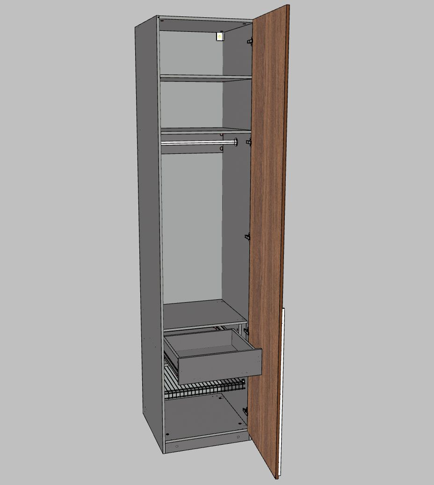

```python
{
        'proto_id': 327,
        'blockbox1': 0,  # Количество ящиков 
        'bxtype': 10199,  # Тип ящика 
        'colorcmmater': 22390,  # Цвет корпуса 
        'colorfsmat1': 22390,  # Цвет фасада Прайм 
        'd': 600,  # Глубина 
        'decofsmatc1': 0,  # MDF Отделка фасада 
        'dpolklarge1': 0,  # Полки в верхнюю нишу 
        'dveshlarge_1': 0,  # Дополнительный комплект вешалок 
        'fasrtype1': 10841,  # Рисунок фасада 
        'h': 2500,  # Высота 
        'hantype': 22588,  # Тип ручки 
        'hpolkdp1': 250,  # Высота нижней ниши 
        'hpolktp1': 1900,  #                                    Высота верхней полки 
        'htwovs1_1': 0,  #                                    От низа до середины первой перемычки 
        'htwovs2_1': 0,  #                                    От верха до середины второй перемычки 
        'htwovs3_1': 0,  #                                    От низа до середины третьей перемычки 
        'ishpolkdp1': 1,  # Ставить нижнюю полку 
        'ishpolktp1': 1,  # Ставить верхнюю полку 
        'n1delh': 0,  # Низ фил выс кол-во делителей 
        'n1delw': 0,  # Низ фил шир кол-во делителей 
        'pants_1': 0,  # Ставить брючницу секция 1 
        'polkstd1': 0,  # Полки в нижнюю нишу 
        'polkstd1h1': 0  # Позиция высоты полки 1 в правой нише
        'polkstd1h2': 0  # Позиция высоты полки 2 в правой нише
        'polkstd1h3': 0  # Позиция высоты полки 3 в правой нише
        'polkstd1h4': 0  # Позиция высоты полки 4 в правой нише
        'polkstd1h5': 0  # Позиция высоты полки 5 в правой нише
        'pusher': 21534,  # Демпфер/Толкатель 
        'sotshelf': 11112,  # Тип сетчатой полки 
        'sotshelf1': 0,  # Полка сетчатая в нижнюю нишу 
        'symmetry': 0,  # Признак симметрии(если Левый) 
        'termangleft': 0,  # Угловой терминал Левый 
        'termangright': 0,  # Угловой терминал Правый 
        'typevs1_1': 1,  # Тип нижней филёнки 
        'typevs2_1': 1,  # Тип средней филёнки 
        'typevs3_1': 1,  # Тип верхней филёнки 
        'veshstd_1': 0,  # Ставить вешалку 
        'w': 400,  # Ширина 
}
```

## DPROTOID_328  РШ MONO-2

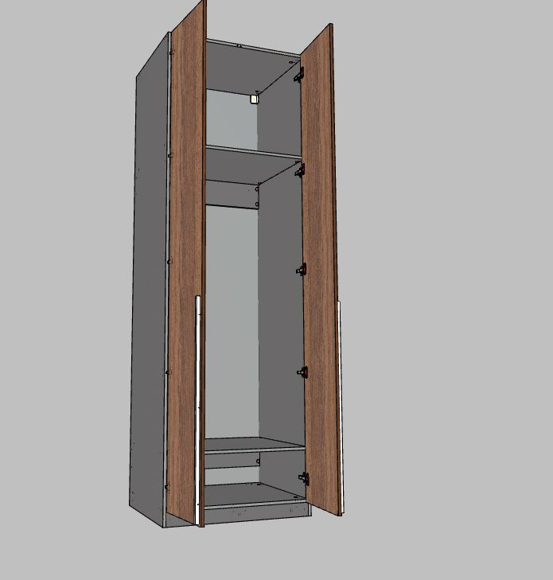

```python
{
        'proto_id': 328,
        'blockbox1': 0,  # Количество ящиков 
        'bxtype': 10199,  # Тип ящика 
        'colorcmmater': 22390,  # Цвет корпуса 
        'colorfsmat1': 22390,  # Цвет фасада Прайм 
        'd': 600,  # Глубина 
        'decofsmatc1': 0,  # MDF Отделка фасада 
        'dpolklarge1': 0,  # Полки в верхнюю нишу 
        'dveshlarge_1': 0,  # Дополнительный комплект вешалок 
        'fasrtype1': 10841,  # Рисунок фасада 
        'h': 2500,  # Высота 
        'hantype': 22588,  # Тип ручки 
        'hpolkdp1': 250,  # Высота нижней ниши 
        'hpolktp1': 1900,  #                                    Высота верхней полки 
        'htwovs1_1': 0,  #                                    От низа до середины первой перемычки 
        'htwovs2_1': 0,  #                                    От верха до середины второй перемычки 
        'htwovs3_1': 0,  #                                    От низа до середины третьей перемычки 
        'ishpolkdp1': 1,  # Ставить нижнюю полку 
        'ishpolktp1': 1,  # Ставить верхнюю полку 
        'n1delh': 0,  # Низ фил выс кол-во делителей 
        'n1delw': 0,  # Низ фил шир кол-во делителей 
        'pants_1': 0,  # Ставить брючницу секция 1 
        'polkstd1': 0,  # Полки в нижнюю нишу 
        'polkstd1h1': 0  # Позиция высоты полки 1 в правой нише
        'polkstd1h2': 0  # Позиция высоты полки 2 в правой нише
        'polkstd1h3': 0  # Позиция высоты полки 3 в правой нише
        'polkstd1h4': 0  # Позиция высоты полки 4 в правой нише
        'polkstd1h5': 0  # Позиция высоты полки 5 в правой нише
        'pusher': 21534,  # Демпфер/Толкатель 
        'sotshelf': 11112,  # Тип сетчатой полки 
        'sotshelf1': 0,  # Полка сетчатая в нижнюю нишу 
        'symmetry': 0,  # Признак симметрии(если Левый) 
        'termangleft': 0,  # Угловой терминал Левый 
        'termangright': 0,  # Угловой терминал Правый 
        'typevs1_1': 1,  # Тип нижней филёнки 
        'typevs2_1': 1,  # Тип средней филёнки 
        'typevs3_1': 1,  # Тип верхней филёнки 
        'veshstd_1': 0,  # Ставить вешалку 
        'w': 800,  # Ширина 
}
```

## DPROTOID_329  РШ DUO-2

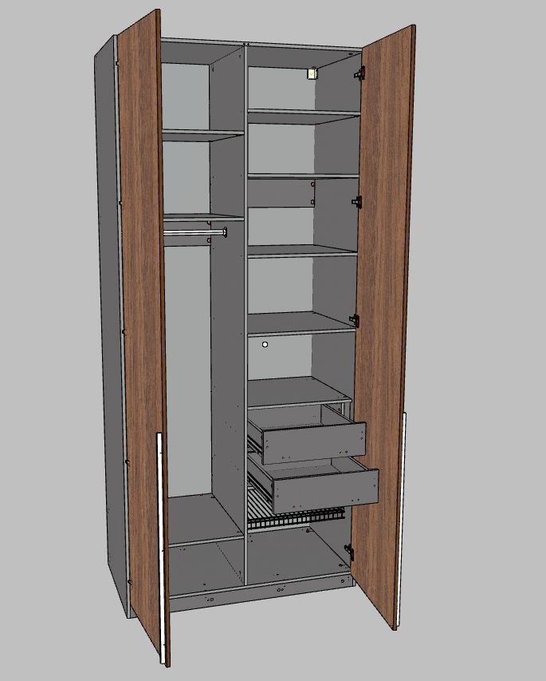

```python
{
        'proto_id': 329,
        'blockbox1': 0,  # Количество ящиков секция 1
        'blockbox2': 0,  # Количество ящиков секция 2
        'bxtype': 10199,  # Тип ящика 
        'colorcmmater': 22390,  # Цвет корпуса 
        'colorfsmat1': 22390,  # Цвет фасада Прайм секция 1
        'colorfsmat2': 22390,  # Цвет фасада Прайм секция 2
        'd': 650,  # Глубина 
        'decofsmatc1': 0,  # MDF Отделка фасада секция 1
        'decofsmatc2': 0,  # MDF Отделка фасада секция 2
        'doubledoor1': 0,  # Двойная дверь справа 
        'doubledoor2': 0,  # Двойная дверь слева 
        'dpolklarge1': 0,  # Полки в верхнюю нишу секция 1
        'dpolklarge2': 0,  # Полки в верхнюю нишу секция 2
        'dveshlarge_1': 0,  # Дополнительный комплект вешалок секция 1
        'dveshlarge_2': 0,  # Дополнительный комплект вешалок секция 2
        'fasrtype1': 10841,  # Рисунок фасада секция 1
        'fasrtype2': 10841,  # Рисунок фасада секция 2
        'h': 2500,  # Высота 
        'hantype': 22588,  # Тип ручки 
        'hcok': 70,  # Высота цоколя 
        'hpolkdp1': 250,  # Высота нижней ниши секция 1
        'hpolkdp2': 250,  # Высота нижней ниши секция 2
        'hpolktp1': 1900,  #                                    Высота верхней полки секция 1
        'hpolktp2': 1900,  #                                    Высота верхней полки секция 2
        'htwovs1_1': 0,  #                                    От низа до середины первой перемычки секция 1
        'htwovs1_2': 0,  #                                    От низа до середины первой перемычки секция 2
        'htwovs2_1': 0,  #                                    От верха до середины второй перемычки секция 1
        'htwovs2_2': 0,  #                                    От верха до середины второй перемычки секция 2
        'htwovs3_1': 0,  #                                    От низа до середины третьей перемычки секция 1
        'htwovs3_2': 0,  #                                    От низа до середины третьей перемычки секция 2
        'ishpolkdp1': 1,  # Ставить нижнюю полку секция 1
        'ishpolkdp2': 1,  # Ставить нижнюю полку секция 2
        'ishpolktp1': 1,  # Ставить верхнюю полку секция 1
        'ishpolktp2': 1,  # Ставить верхнюю полку секция 2
        'pants_1': 0,  # Ставить брючницу секция 1 
        'pants_2': 0,  # Ставить брючницу секция 2 
        'polkstd1': 0,  # Полки в нижнюю нишу  секция 1
        'polkstd2': 0,  # Полки в нижнюю нишу секция 2 
        'polkstd1h1': 0  # Позиция высоты полки 1 в правой нише
        'polkstd1h2': 0  # Позиция высоты полки 2 в правой нише
        'polkstd1h3': 0  # Позиция высоты полки 3 в правой нише
        'polkstd1h4': 0  # Позиция высоты полки 4 в правой нише
        'polkstd1h5': 0  # Позиция высоты полки 5 в правой нише
        'polkstd2h1': 0  # Позиция высоты полки 1 в левой нише
        'polkstd2h2': 0  # Позиция высоты полки 2 в левой нише
        'polkstd2h3': 0  # Позиция высоты полки 3 в левой нише
        'polkstd2h4': 0  # Позиция высоты полки 4 в левой нише
        'polkstd2h5': 0  # Позиция высоты полки 5 в левой нише
        'pusher': 21534,  # Демпфер/Толкатель 
        'sotshelf1': 0,  # Полка сетчатая в нижнюю нишу секция 1
        'sotshelf2': 0,  # Полка сетчатая в нижнюю нишу секция 2
        'termangleft': 0,  # Угловой терминал Левый 
        'termangright': 0,  # Угловой терминал Правый 
        'typevs1_1': 1,  # Тип нижней филёнки секция 1
        'typevs1_2': 1,  # Тип нижней филёнки секция 2 
        'typevs2_1': 1,  # Тип средней филёнки секция 1
        'typevs2_2': 1,  # Тип средней филёнки секция 2 
        'typevs3_1': 1,  # Тип верхней филёнки секция 1
        'typevs3_2': 1,  # Тип верхней филёнки 
        'veshstd_1': 0,  # Ставить вешалку секция 1
        'veshstd_2': 0,  # Ставить вешалку секция 2 
        'w': 1400,  # Ширина 
}
```


## DPROTOID_330  РШ DUO-3 левый

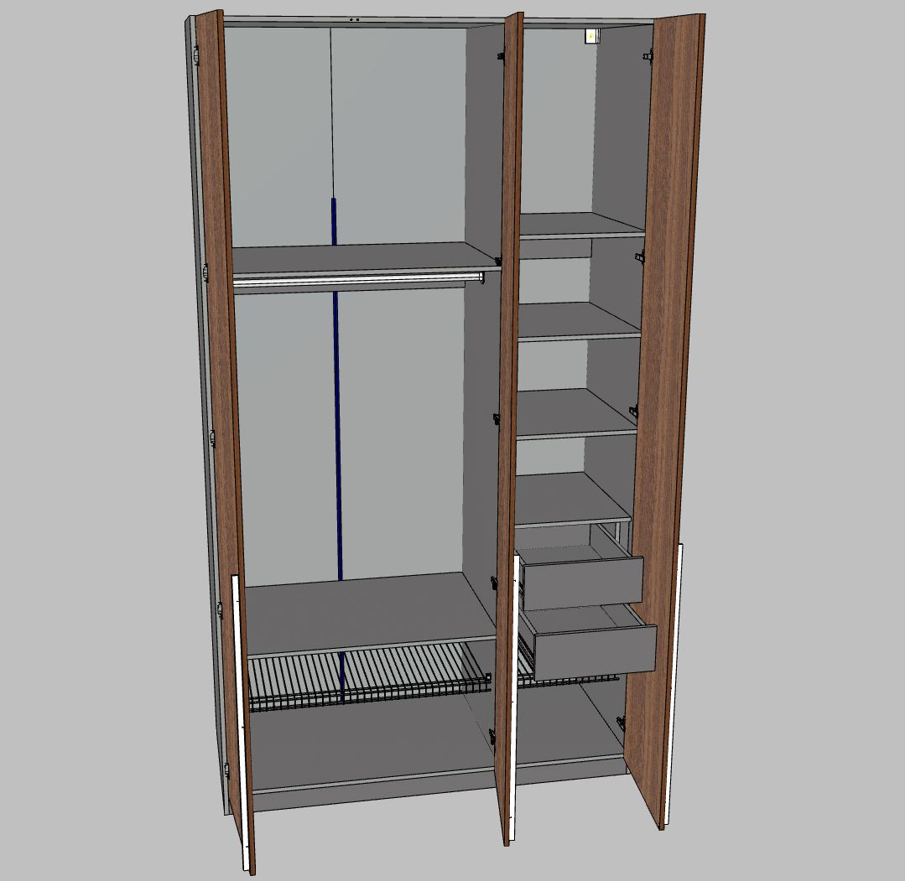

```python
{
        'proto_id': 330,
        'blockbox1': 0,  # Количество ящиков секция 1
        'blockbox2': 0,  # Количество ящиков секция 2
        'bxtype': 10199,  # Тип ящика 
        'colorcmmater': 22390,  # Цвет корпуса 
        'colorfsmat1': 22390,  # Цвет фасада Прайм секция 1
        'colorfsmat2': 22390,  # Цвет фасада Прайм секция 2
        'd': 650,  # Глубина 
        'decofsmatc1': 0,  # MDF Отделка фасада секция 1
        'decofsmatc2': 0,  # MDF Отделка фасада секция 2
        'doubledoor1': 0,  # Двойная дверь справа 
        'doubledoor2': 0,  # Двойная дверь слева 
        'dpolklarge1': 0,  # Полки в верхнюю нишу секция 1
        'dpolklarge2': 0,  # Полки в верхнюю нишу секция 2
        'dveshlarge_1': 0,  # Дополнительный комплект вешалок секция 1
        'dveshlarge_2': 0,  # Дополнительный комплект вешалок секция 2
        'fasrtype1': 10841,  # Рисунок фасада секция 1
        'fasrtype2': 10841,  # Рисунок фасада секция 2
        'h': 2500,  # Высота 
        'hantype': 22588,  # Тип ручки 
        'hcok': 70,  # Высота цоколя 
        'hpolkdp1': 250,  # Высота нижней ниши секция 1
        'hpolkdp2': 250,  # Высота нижней ниши секция 2
        'hpolktp1': 1900,  #                                    Высота верхней полки секция 1
        'hpolktp2': 1900,  #                                    Высота верхней полки секция 2
        'htwovs1_1': 0,  #                                    От низа до середины первой перемычки секция 1
        'htwovs1_2': 0,  #                                    От низа до середины первой перемычки секция 2
        'htwovs2_1': 0,  #                                    От верха до середины второй перемычки секция 1
        'htwovs2_2': 0,  #                                    От верха до середины второй перемычки секция 2
        'htwovs3_1': 0,  #                                    От низа до середины третьей перемычки секция 1
        'htwovs3_2': 0,  #                                    От низа до середины третьей перемычки секция 2
        'ishpolkdp1': 1,  # Ставить нижнюю полку секция 1
        'ishpolkdp2': 1,  # Ставить нижнюю полку секция 2
        'ishpolktp1': 1,  # Ставить верхнюю полку секция 1
        'ishpolktp2': 1,  # Ставить верхнюю полку секция 2
        'pants_1': 0,  # Ставить брючницу секция 1 
        'pants_2': 0,  # Ставить брючницу секция 2 
        'polkstd1': 0,  # Полки в нижнюю нишу  секция 1
        'polkstd2': 0,  # Полки в нижнюю нишу секция 2 
        'polkstd1h1': 0  # Позиция высоты полки 1 в правой нише
        'polkstd1h2': 0  # Позиция высоты полки 2 в правой нише
        'polkstd1h3': 0  # Позиция высоты полки 3 в правой нише
        'polkstd1h4': 0  # Позиция высоты полки 4 в правой нише
        'polkstd1h5': 0  # Позиция высоты полки 5 в правой нише
        'polkstd2h1': 0  # Позиция высоты полки 1 в левой нише
        'polkstd2h2': 0  # Позиция высоты полки 2 в левой нише
        'polkstd2h3': 0  # Позиция высоты полки 3 в левой нише
        'polkstd2h4': 0  # Позиция высоты полки 4 в левой нише
        'polkstd2h5': 0  # Позиция высоты полки 5 в левой нише
        'pusher': 21534,  # Демпфер/Толкатель 
        'sotshelf1': 0,  # Полка сетчатая в нижнюю нишу секция 1
        'sotshelf2': 0,  # Полка сетчатая в нижнюю нишу секция 2
        'termangleft': 0,  # Угловой терминал Левый 
        'termangright': 0,  # Угловой терминал Правый 
        'typevs1_1': 1,  # Тип нижней филёнки секция 1
        'typevs1_2': 1,  # Тип нижней филёнки секция 2 
        'typevs2_1': 1,  # Тип средней филёнки секция 1
        'typevs2_2': 1,  # Тип средней филёнки секция 2 
        'typevs3_1': 1,  # Тип верхней филёнки секция 1
        'typevs3_2': 1,  # Тип верхней филёнки 
        'veshstd_1': 0,  # Ставить вешалку секция 1
        'veshstd_2': 0,  # Ставить вешалку секция 2 
        'w': 1400,  # Ширина 
}
```

## DPROTOID_331  РШ DUO-3 правый

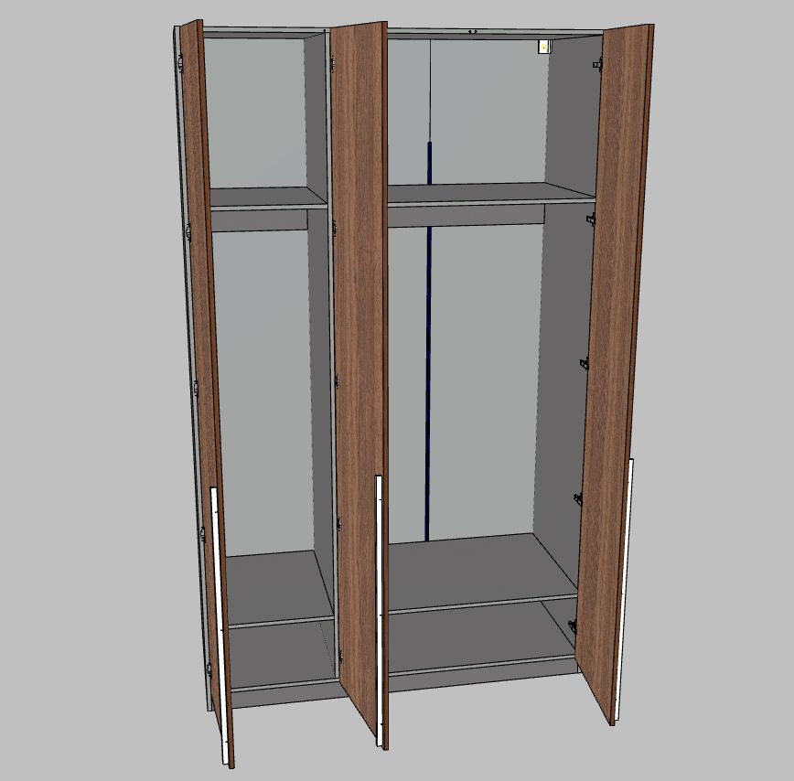

```python
{
        'proto_id': 331,
        'blockbox1': 0,  # Количество ящиков секция 1
        'blockbox2': 0,  # Количество ящиков секция 2
        'bxtype': 10199,  # Тип ящика 
        'colorcmmater': 22390,  # Цвет корпуса 
        'colorfsmat1': 22390,  # Цвет фасада Прайм секция 1
        'colorfsmat2': 22390,  # Цвет фасада Прайм секция 2
        'd': 650,  # Глубина 
        'decofsmatc1': 0,  # MDF Отделка фасада секция 1
        'decofsmatc2': 0,  # MDF Отделка фасада секция 2
        'doubledoor1': 0,  # Двойная дверь справа 
        'doubledoor2': 0,  # Двойная дверь слева 
        'dpolklarge1': 0,  # Полки в верхнюю нишу секция 1
        'dpolklarge2': 0,  # Полки в верхнюю нишу секция 2
        'dveshlarge_1': 0,  # Дополнительный комплект вешалок секция 1
        'dveshlarge_2': 0,  # Дополнительный комплект вешалок секция 2
        'fasrtype1': 10841,  # Рисунок фасада секция 1
        'fasrtype2': 10841,  # Рисунок фасада секция 2
        'h': 2500,  # Высота 
        'hantype': 22588,  # Тип ручки 
        'hcok': 70,  # Высота цоколя 
        'hpolkdp1': 250,  # Высота нижней ниши секция 1
        'hpolkdp2': 250,  # Высота нижней ниши секция 2
        'hpolktp1': 1900,  #                                    Высота верхней полки секция 1
        'hpolktp2': 1900,  #                                    Высота верхней полки секция 2
        'htwovs1_1': 0,  #                                    От низа до середины первой перемычки секция 1
        'htwovs1_2': 0,  #                                    От низа до середины первой перемычки секция 2
        'htwovs2_1': 0,  #                                    От верха до середины второй перемычки секция 1
        'htwovs2_2': 0,  #                                    От верха до середины второй перемычки секция 2
        'htwovs3_1': 0,  #                                    От низа до середины третьей перемычки секция 1
        'htwovs3_2': 0,  #                                    От низа до середины третьей перемычки секция 2
        'ishpolkdp1': 1,  # Ставить нижнюю полку секция 1
        'ishpolkdp2': 1,  # Ставить нижнюю полку секция 2
        'ishpolktp1': 1,  # Ставить верхнюю полку секция 1
        'ishpolktp2': 1,  # Ставить верхнюю полку секция 2
        'pants_1': 0,  # Ставить брючницу секция 1 
        'pants_2': 0,  # Ставить брючницу секция 2 
        'polkstd1': 0,  # Полки в нижнюю нишу  секция 1
        'polkstd2': 0,  # Полки в нижнюю нишу секция 2 
        'polkstd1h1': 0  # Позиция высоты полки 1 в правой нише
        'polkstd1h2': 0  # Позиция высоты полки 2 в правой нише
        'polkstd1h3': 0  # Позиция высоты полки 3 в правой нише
        'polkstd1h4': 0  # Позиция высоты полки 4 в правой нише
        'polkstd1h5': 0  # Позиция высоты полки 5 в правой нише
        'polkstd2h1': 0  # Позиция высоты полки 1 в левой нише
        'polkstd2h2': 0  # Позиция высоты полки 2 в левой нише
        'polkstd2h3': 0  # Позиция высоты полки 3 в левой нише
        'polkstd2h4': 0  # Позиция высоты полки 4 в левой нише
        'polkstd2h5': 0  # Позиция высоты полки 5 в левой нише
        'pusher': 21534,  # Демпфер/Толкатель 
        'sotshelf1': 0,  # Полка сетчатая в нижнюю нишу секция 1
        'sotshelf2': 0,  # Полка сетчатая в нижнюю нишу секция 2
        'termangleft': 0,  # Угловой терминал Левый 
        'termangright': 0,  # Угловой терминал Правый 
        'typevs1_1': 1,  # Тип нижней филёнки секция 1
        'typevs1_2': 1,  # Тип нижней филёнки секция 2 
        'typevs2_1': 1,  # Тип средней филёнки секция 1
        'typevs2_2': 1,  # Тип средней филёнки секция 2 
        'typevs3_1': 1,  # Тип верхней филёнки секция 1
        'typevs3_2': 1,  # Тип верхней филёнки 
        'veshstd_1': 0,  # Ставить вешалку секция 1
        'veshstd_2': 0,  # Ставить вешалку секция 2 
        'w': 1400,  # Ширина 
}
```

## DPROTOID_332  РШ DUO-4


```python
{
        'proto_id': 332,
        'blockbox1': 0,  # Количество ящиков секция 1
        'blockbox2': 0,  # Количество ящиков секция 2
        'bxtype': 10199,  # Тип ящика 
        'colorcmmater': 22390,  # Цвет корпуса 
        'colorfsmat1': 22390,  # Цвет фасада Прайм секция 1
        'colorfsmat2': 22390,  # Цвет фасада Прайм секция 2
        'd': 650,  # Глубина 
        'decofsmatc1': 0,  # MDF Отделка фасада секция 1
        'decofsmatc2': 0,  # MDF Отделка фасада секция 2
        'doubledoor1': 0,  # Двойная дверь справа 
        'doubledoor2': 0,  # Двойная дверь слева 
        'dpolklarge1': 0,  # Полки в верхнюю нишу секция 1
        'dpolklarge2': 0,  # Полки в верхнюю нишу секция 2
        'dveshlarge_1': 0,  # Дополнительный комплект вешалок секция 1
        'dveshlarge_2': 0,  # Дополнительный комплект вешалок секция 2
        'fasrtype1': 10841,  # Рисунок фасада секция 1
        'fasrtype2': 10841,  # Рисунок фасада секция 2
        'h': 2500,  # Высота 
        'hantype': 22588,  # Тип ручки 
        'hcok': 70,  # Высота цоколя 
        'hpolkdp1': 250,  # Высота нижней ниши секция 1
        'hpolkdp2': 250,  # Высота нижней ниши секция 2
        'hpolktp1': 1900,  #                                    Высота верхней полки секция 1
        'hpolktp2': 1900,  #                                    Высота верхней полки секция 2
        'htwovs1_1': 0,  #                                    От низа до середины первой перемычки секция 1
        'htwovs1_2': 0,  #                                    От низа до середины первой перемычки секция 2
        'htwovs2_1': 0,  #                                    От верха до середины второй перемычки секция 1
        'htwovs2_2': 0,  #                                    От верха до середины второй перемычки секция 2
        'htwovs3_1': 0,  #                                    От низа до середины третьей перемычки секция 1
        'htwovs3_2': 0,  #                                    От низа до середины третьей перемычки секция 2
        'ishpolkdp1': 1,  # Ставить нижнюю полку секция 1
        'ishpolkdp2': 1,  # Ставить нижнюю полку секция 2
        'ishpolktp1': 1,  # Ставить верхнюю полку секция 1
        'ishpolktp2': 1,  # Ставить верхнюю полку секция 2
        'pants_1': 0,  # Ставить брючницу секция 1 
        'pants_2': 0,  # Ставить брючницу секция 2 
        'polkstd1': 0,  # Полки в нижнюю нишу  секция 1
        'polkstd2': 0,  # Полки в нижнюю нишу секция 2 
        'polkstd1h1': 0  # Позиция высоты полки 1 в правой нише
        'polkstd1h2': 0  # Позиция высоты полки 2 в правой нише
        'polkstd1h3': 0  # Позиция высоты полки 3 в правой нише
        'polkstd1h4': 0  # Позиция высоты полки 4 в правой нише
        'polkstd1h5': 0  # Позиция высоты полки 5 в правой нише
        'polkstd2h1': 0  # Позиция высоты полки 1 в левой нише
        'polkstd2h2': 0  # Позиция высоты полки 2 в левой нише
        'polkstd2h3': 0  # Позиция высоты полки 3 в левой нише
        'polkstd2h4': 0  # Позиция высоты полки 4 в левой нише
        'polkstd2h5': 0  # Позиция высоты полки 5 в левой нише
        'pusher': 21534,  # Демпфер/Толкатель 
        'sotshelf1': 0,  # Полка сетчатая в нижнюю нишу секция 1
        'sotshelf2': 0,  # Полка сетчатая в нижнюю нишу секция 2
        'termangleft': 0,  # Угловой терминал Левый 
        'termangright': 0,  # Угловой терминал Правый 
        'typevs1_1': 1,  # Тип нижней филёнки секция 1
        'typevs1_2': 1,  # Тип нижней филёнки секция 2 
        'typevs2_1': 1,  # Тип средней филёнки секция 1
        'typevs2_2': 1,  # Тип средней филёнки секция 2 
        'typevs3_1': 1,  # Тип верхней филёнки секция 1
        'typevs3_2': 1,  # Тип верхней филёнки 
        'veshstd_1': 0,  # Ставить вешалку секция 1
        'veshstd_2': 0,  # Ставить вешалку секция 2 
        'w': 800,  # Ширина 
}
```

## DPROTOID_333  РШ TRIO-3

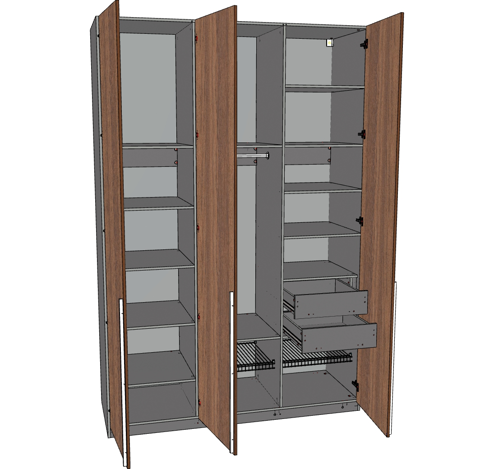

```python
{
    'proto_id': 333,
    'blockbox1': 0,  # Количество ящиков справа
    'blockbox2': 0,  # Количество ящиков в центре
    'blockbox3': 0,  # Количество ящиков слева
    'bxtype': 10199,  # Тип ящика 
    'colorcmmater': 23352,  # Цвет корпуса 
    'colorfsmat1': 22390,  # Цвет фасада Прайм справа
    'colorfsmat2': 22390,  # Цвет фасада Прайм в центре
    'colorfsmat3': 22390,  # Цвет фасада Прайм слева
    'd': 650,  # Глубина 
    'decofsmatc1': 0,  # MDF Отделка фасада справа
    'decofsmatc2': 0,  # MDF Отделка фасада в центре
    'decofsmatc3': 0,  # MDF Отделка фасада слева
    'dpolklarge1': 0,  # Полки в верхнюю нишу справа 
    'dpolklarge2': 0,  # Полки в верхнюю нишу в центре 
    'dpolklarge3': 0,  # Полки в верхнюю нишу слева 
    'dveshlarge_1': 0,  # Дополнительный комплект вешалок справа 
    'dveshlarge_2': 0,  # Дополнительный комплект вешалок в центре 
    'dveshlarge_3': 0,  # Дополнительный комплект вешалок слева 
    'fasrtype1': 10841,  # Рисунок фасада справа 
    'fasrtype2': 10841,  # Рисунок фасада в центре 
    'fasrtype3': 10841,  # Рисунок фасада слева 
    'h': 2500,  # Высота 
    'hantype': 22588,  # Тип ручки 
    'hcok': 70,  # Высота цоколя 
    'hpolkdp1': 250,  # Высота нижней ниши справа
    'hpolkdp2': 250,  # Высота нижней ниши в центре
    'hpolkdp3': 250,  # Высота нижней ниши слева
    'hpolktp1': 1900,  # Высота верхней полки справа
    'hpolktp2': 1900,  # Высота верхней полки в центре
    'hpolktp3': 1900,  # Высота верхней полки слева
    'htwovs1_1': 0,  # От низа до середины первой перемычки справа 
    'htwovs1_2': 0,  # От низа до середины первой перемычки в центре 
    'htwovs1_3': 0,  # От низа до середины первой перемычки слева 
    'htwovs2_1': 0,  # От верха до середины второй перемычки справа
    'htwovs2_2': 0,  # От верха до середины второй перемычки в центре
    'htwovs2_3': 0,  # От верха до середины второй перемычки слева
    'htwovs3_1': 0,  # От низа до середины третьей перемычки справа
    'htwovs3_2': 0,  # От низа до середины третьей перемычки в центре
    'htwovs3_3': 0,  # От низа до середины третьей перемычки слева
    ~'idpants': 11004,  # Id Бокового держателя брюк~ 
    'ishpolkdp1': 1,  # Ставить нижнюю полку справа 
    'ishpolkdp2': 1,  # Ставить нижнюю полку в центре 
    'ishpolkdp3': 1,  # Ставить нижнюю полку слева 
    'ishpolktp1': 1,  # Ставить верхнюю полку справа 
    'ishpolktp2': 1,  # Ставить верхнюю полку в центре 
    'ishpolktp3': 1,  # Ставить верхнюю полку слева 
    'n1delh_1': 0,  # Низ фил выс кол-во делителей 
    'n1delh_2': 0,  # Низ фил выс кол-во делителей 
    'n1delh_3': 0,  # Низ фил выс кол-во делителей 
    'n1delw_1': 0,  # Низ фил шир кол-во делителей 
    'n1delw_2': 0,  # Низ фил шир кол-во делителей 
    'n1delw_3': 0,  # Низ фил шир кол-во делителей 
    'p_type2': 28237,  # Тип петли второй двери(для двойной) 
    'pants_1': 0,  # Ставить брючницу секция 1 справа
    'pants_2': 0,  # Ставить брючницу секция 1 в центре
    'pants_3': 0,  # Ставить брючницу секция 1 слева
    'polkstd1': 0,  # Полки в среднюю(нижнюю) нишу справа 
    'polkstd1h1': 0,  # Позиция высоты полки 1 справа
    'polkstd1h2': 0,  # Позиция высоты полки 2 справа
    'polkstd1h3': 0,  # Позиция высоты полки 3 справа
    'polkstd1h4': 0,  # Позиция высоты полки 4 справа
    'polkstd1h5': 0,  # Позиция высоты полки 5 справа
    'polkstd2': 0,  # Полки в среднюю(нижнюю) нишу посередине 
    'polkstd2h1': 0,  #  Позиция высоты полки 1 посередине
    'polkstd2h2': 0,  #  Позиция высоты полки 2 посередине
    'polkstd2h3': 0,  #  Позиция высоты полки 3 посередине
    'polkstd2h4': 0,  #  Позиция высоты полки 4 посередине
    'polkstd2h5': 0,  #  Позиция высоты полки 5 посередине
    'polkstd3': 0,  # Полки в среднюю(нижнюю) нишу слева (штуки)
    'polkstd3h1': 0,  # Позиция высоты полки 1 слева
    'polkstd3h2': 0,  # Позиция высоты полки 2 слева
    'polkstd3h3': 0,  # Позиция высоты полки 3 слева
    'polkstd3h4': 0,  # Позиция высоты полки 4 слева
    'polkstd3h5': 0,  # Позиция высоты полки 5 слева
    'sotshelf1': 0,  # Полка сетчатая в нижнюю нишу справа
    'sotshelf2': 0,  # Полка сетчатая в нижнюю нишу в центре
    'sotshelf3': 0,  # Полка сетчатая в нижнюю нишу слева
    'termangleft': 0,  # Угловой терминал Левый 
    'termangright': 0,  # Угловой терминал Правый 
    'typevs1_1': 1,  # Тип нижней филёнки справа 
    'typevs1_2': 1,  # Тип нижней филёнки в центре 
    'typevs1_3': 1,  # Тип нижней филёнки слева 
    'typevs2_1': 1,  # Тип средней филёнки справа 
    'typevs2_2': 1,  # Тип средней филёнки в центре 
    'typevs2_3': 1,  # Тип средней филёнки слева 
    'typevs3_1': 1,  # Тип верхней филёнки справа
    'typevs3_2': 1,  # Тип верхней филёнки в центре
    'typevs3_3': 1,  # Тип верхней филёнки слева
    'veshstd_1': 0,  # Ставить вешалку справа
    'veshstd_2': 0,  # Ставить вешалку в центре
    'veshstd_3': 0,  # Ставить вешалку слева
    'w': 1800,  # Ширина 
}
```

## DPROTOID_334  РШ TRIO-4

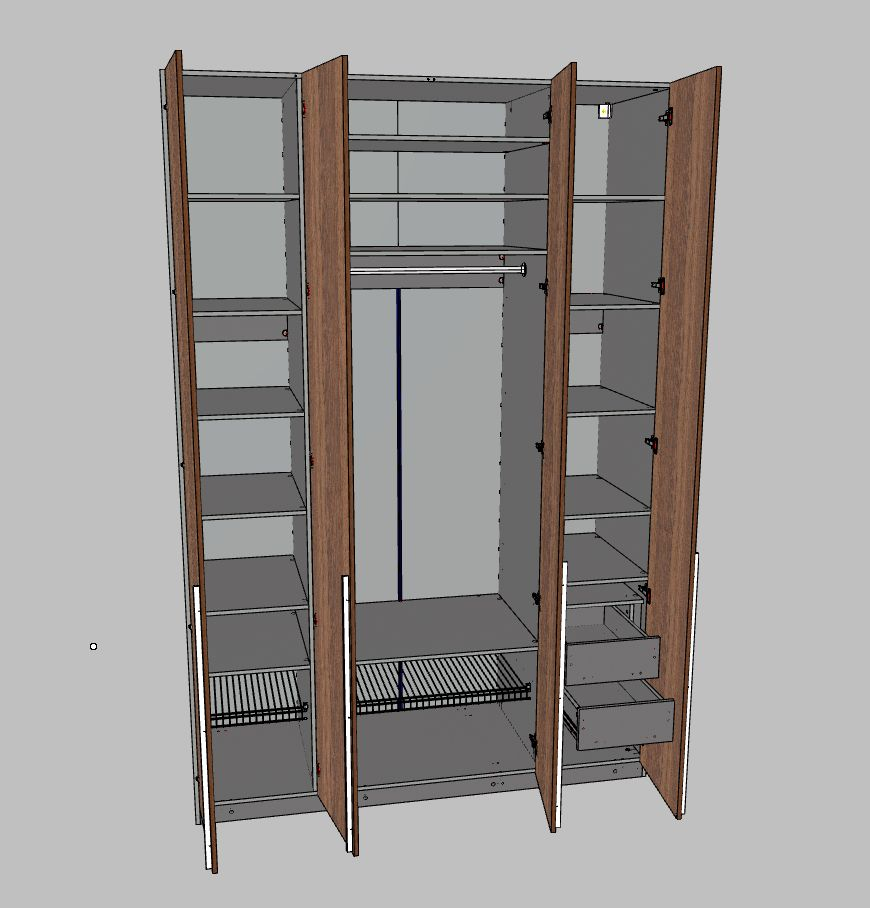

```python
{
    'proto_id': 334,
    'blockbox1': 0,  # Количество ящиков справа
    'blockbox2': 0,  # Количество ящиков в центре
    'blockbox3': 0,  # Количество ящиков слева
    'bxtype': 10199,  # Тип ящика 
    'colorcmmater': 23352,  # Цвет корпуса 
    'colorfsmat1': 22390,  # Цвет фасада Прайм справа
    'colorfsmat2': 22390,  # Цвет фасада Прайм в центре
    'colorfsmat3': 22390,  # Цвет фасада Прайм слева
    'd': 650,  # Глубина 
    'decofsmatc1': 0,  # MDF Отделка фасада справа
    'decofsmatc2': 0,  # MDF Отделка фасада в центре
    'decofsmatc3': 0,  # MDF Отделка фасада слева
    'dpolklarge1': 0,  # Полки в верхнюю нишу справа 
    'dpolklarge2': 0,  # Полки в верхнюю нишу в центре 
    'dpolklarge3': 0,  # Полки в верхнюю нишу слева 
    'dveshlarge_1': 0,  # Дополнительный комплект вешалок справа 
    'dveshlarge_2': 0,  # Дополнительный комплект вешалок в центре 
    'dveshlarge_3': 0,  # Дополнительный комплект вешалок слева 
    'fasrtype1': 10841,  # Рисунок фасада справа 
    'fasrtype2': 10841,  # Рисунок фасада в центре 
    'fasrtype3': 10841,  # Рисунок фасада слева 
    'h': 2500,  # Высота 
    'hantype': 22588,  # Тип ручки 
    'hcok': 70,  # Высота цоколя 
    'hpolkdp1': 250,  # Высота нижней ниши справа
    'hpolkdp2': 250,  # Высота нижней ниши в центре
    'hpolkdp3': 250,  # Высота нижней ниши слева
    'hpolktp1': 1900,  # Высота верхней полки справа
    'hpolktp2': 1900,  # Высота верхней полки в центре
    'hpolktp3': 1900,  # Высота верхней полки слева
    'htwovs1_1': 0,  # От низа до середины первой перемычки справа 
    'htwovs1_2': 0,  # От низа до середины первой перемычки в центре 
    'htwovs1_3': 0,  # От низа до середины первой перемычки слева 
    'htwovs2_1': 0,  # От верха до середины второй перемычки справа
    'htwovs2_2': 0,  # От верха до середины второй перемычки в центре
    'htwovs2_3': 0,  # От верха до середины второй перемычки слева
    'htwovs3_1': 0,  # От низа до середины третьей перемычки справа
    'htwovs3_2': 0,  # От низа до середины третьей перемычки в центре
    'htwovs3_3': 0,  # От низа до середины третьей перемычки слева
    ~'idpants': 11004,  # Id Бокового держателя брюк~ 
    'ishpolkdp1': 1,  # Ставить нижнюю полку справа 
    'ishpolkdp2': 1,  # Ставить нижнюю полку в центре 
    'ishpolkdp3': 1,  # Ставить нижнюю полку слева 
    'ishpolktp1': 1,  # Ставить верхнюю полку справа 
    'ishpolktp2': 1,  # Ставить верхнюю полку в центре 
    'ishpolktp3': 1,  # Ставить верхнюю полку слева 
    'n1delh_1': 0,  # Низ фил выс кол-во делителей 
    'n1delh_2': 0,  # Низ фил выс кол-во делителей 
    'n1delh_3': 0,  # Низ фил выс кол-во делителей 
    'n1delw_1': 0,  # Низ фил шир кол-во делителей 
    'n1delw_2': 0,  # Низ фил шир кол-во делителей 
    'n1delw_3': 0,  # Низ фил шир кол-во делителей 
    'p_type2': 28237,  # Тип петли второй двери(для двойной) 
    'pants_1': 0,  # Ставить брючницу секция 1 справа
    'pants_2': 0,  # Ставить брючницу секция 1 в центре
    'pants_3': 0,  # Ставить брючницу секция 1 слева
    'polkstd1': 0,  # Полки в среднюю(нижнюю) нишу справа 
    'polkstd1h1': 0,  # Позиция высоты полки 1 справа
    'polkstd1h2': 0,  # Позиция высоты полки 2 справа
    'polkstd1h3': 0,  # Позиция высоты полки 3 справа
    'polkstd1h4': 0,  # Позиция высоты полки 4 справа
    'polkstd1h5': 0,  # Позиция высоты полки 5 справа
    'polkstd2': 0,  # Полки в среднюю(нижнюю) нишу посередине 
    'polkstd2h1': 0,  #  Позиция высоты полки 1 посередине
    'polkstd2h2': 0,  #  Позиция высоты полки 2 посередине
    'polkstd2h3': 0,  #  Позиция высоты полки 3 посередине
    'polkstd2h4': 0,  #  Позиция высоты полки 4 посередине
    'polkstd2h5': 0,  #  Позиция высоты полки 5 посередине
    'polkstd3': 0,  # Полки в среднюю(нижнюю) нишу слева (штуки)
    'polkstd3h1': 0,  # Позиция высоты полки 1 слева
    'polkstd3h2': 0,  # Позиция высоты полки 2 слева
    'polkstd3h3': 0,  # Позиция высоты полки 3 слева
    'polkstd3h4': 0,  # Позиция высоты полки 4 слева
    'polkstd3h5': 0,  # Позиция высоты полки 5 слева
    'sotshelf1': 0,  # Полка сетчатая в нижнюю нишу справа
    'sotshelf2': 0,  # Полка сетчатая в нижнюю нишу в центре
    'sotshelf3': 0,  # Полка сетчатая в нижнюю нишу слева
    'termangleft': 0,  # Угловой терминал Левый 
    'termangright': 0,  # Угловой терминал Правый 
    'typevs1_1': 1,  # Тип нижней филёнки справа 
    'typevs1_2': 1,  # Тип нижней филёнки в центре 
    'typevs1_3': 1,  # Тип нижней филёнки слева 
    'typevs2_1': 1,  # Тип средней филёнки справа 
    'typevs2_2': 1,  # Тип средней филёнки в центре 
    'typevs2_3': 1,  # Тип средней филёнки слева 
    'typevs3_1': 1,  # Тип верхней филёнки справа
    'typevs3_2': 1,  # Тип верхней филёнки в центре
    'typevs3_3': 1,  # Тип верхней филёнки слева
    'veshstd_1': 0,  # Ставить вешалку справа
    'veshstd_2': 0,  # Ставить вешалку в центре
    'veshstd_3': 0,  # Ставить вешалку слева
    'w': 1800,  # Ширина 

}
```

## DPROTOID_335  РШ TRIO-5

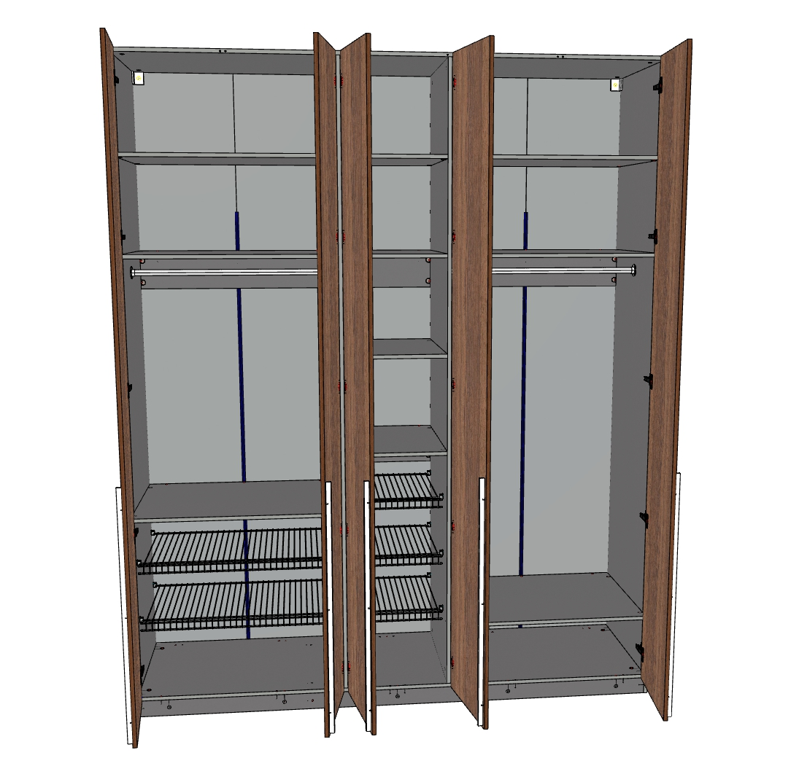

```python
{
}
```

## DPROTOID_336  РШ TRIO-6

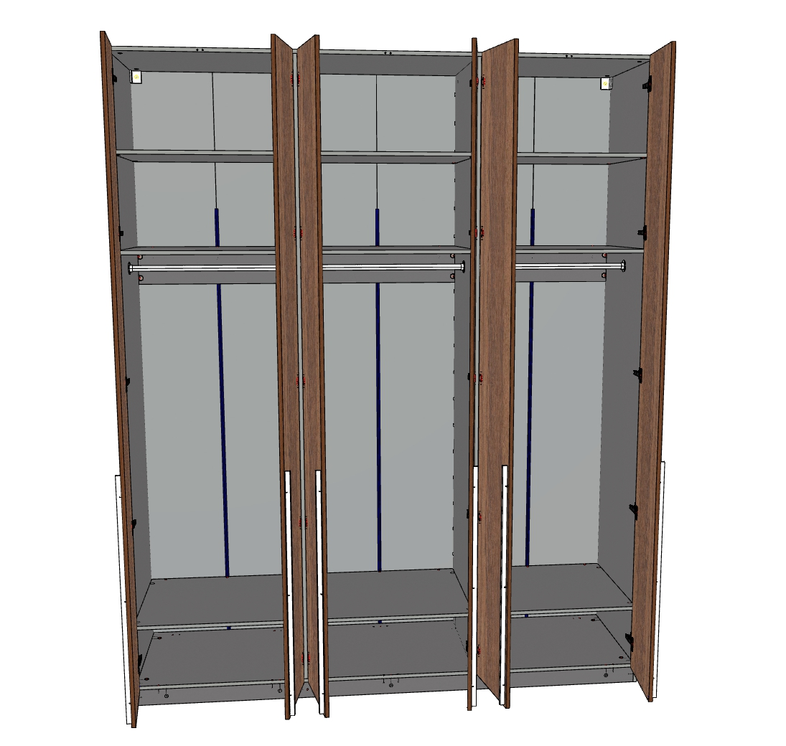

```python
{
}
```


## ProtoID 311 Терминал

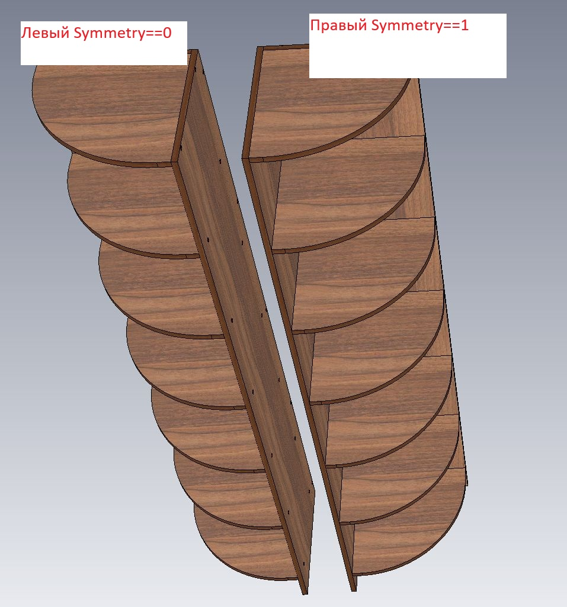

```python
{
    'proto_id': 311,                                                                                     
    'band': 6793,  # Тип кромки корпуса                               
    'colorcmmater': 22390,  # Цвет корпуса                            
    'count': 5,  #                                    Число полок                                        
    'd': 413,  # Глубина                                              
    'h': 2058,  # Высота                                              
    'hcok': 100,  # Высота цоколя                                     
    'prmater': 0,  # Материал                                         
    'rshcomplect': 11165,  # Набор для РШ (ключ инструкци    крепежи) 
    'symmetry': 1,  # Признак симметрии 0- Левый 1-правый                        |
    'w': 400,  # Ширина                                               
}
```

## Антресоли

| Параметры                       | MONO-1   | MONO-2   | DUO-2    | DUO-3   левый | DUO-3   правый | DUO-4     | TRIO-3   | TRIO-4    | TRIO-5    | TRIO-6    |
| :------------------------------ | :------- | :------- | :------- | :------------ | :------------- | :-------- | :------- | :-------- | :-------- | :-------- |
| Количество секций по ширине, шт | 1        | 1        | 2        | 2             | 2              | 2         | 3        | 3         | 3         | 3         |
| Количество                      |          |          |          |               |                |           |          |           |           |           |
| фасадов, шт                     | 1        | 2        | 2        | 3             | 3              | 4         | 3        | 4         | 5         | 6         |
| Ширина корпуса ШК, мм           | 250-600  | 500-1000 | 500-1200 | 750-1500      | 750-1500       | 1000-2000 | 750-1800 | 1000-2000 | 1250-2500 | 1500-2790 |
| Глубина корпуса                 |          |          |          |               |                |           |          |           |           |           |
| ГК, мм                          | 150-800  | 150-800  | 150-800  | 150-800       | 150-800        | 150-800   | 150-800  | 150-800   | 150-800   | 150-800   |
| Высота корпуса                  |          |          |          |               |                |           |          |           |           |           |
| ВК, мм                          | 400-1200 | 400-1200 | 400-1200 | 400-1200      | 400-1200       | 400-1200  | 400-1200 | 400-1200  | 400-1200  | 400-1200  |

### ProtoId 400  РШ Антресоль MONO-1

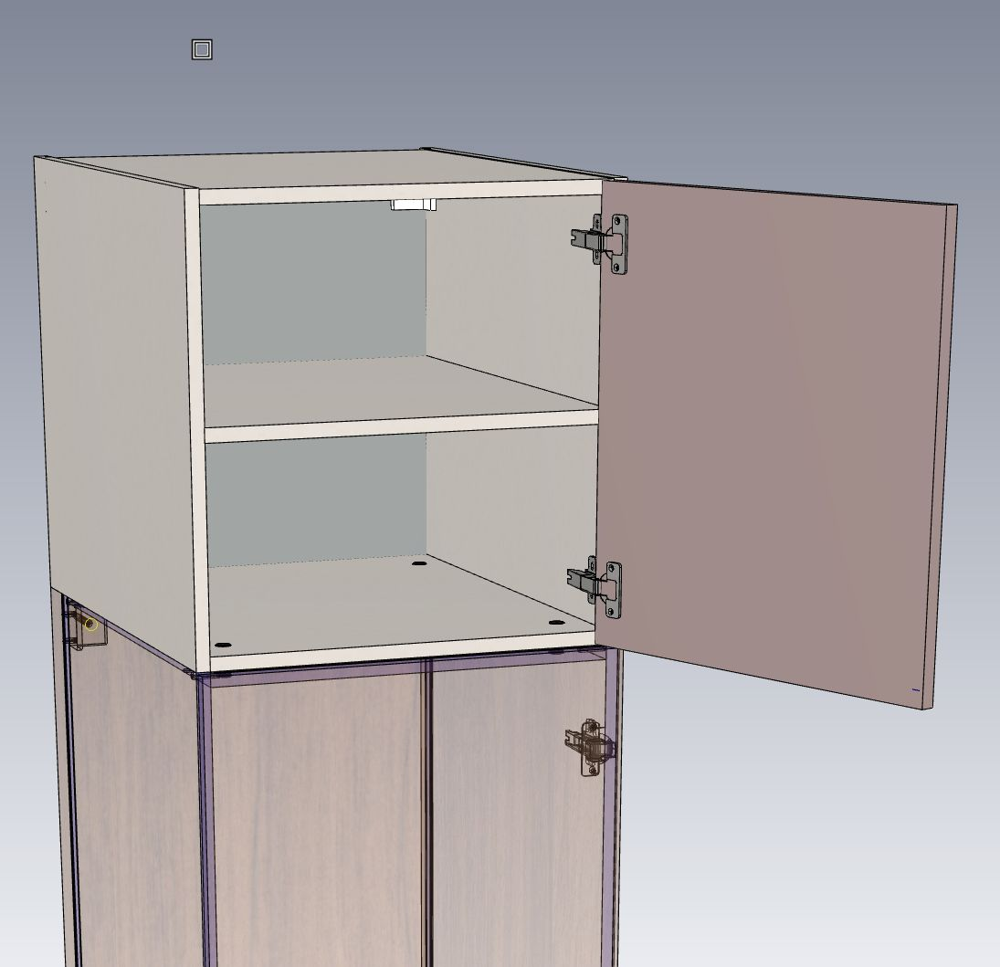

```python
{    
    'proto_id': 400,
    'colorcmmater': param_randomize(dYAD.colorcmmater),  # Цвет корпуса
    'colorfsmat1': param_randomize(dYAD.colorcmmater),  # Цвет фасада Прайм
    'd': random.choice(range(150, 800)),  # Глубина
    'decofsmatc1': 0.0,  # MDF Отделка фасада
    'fasrtype1': 10841.0,  # Рисунок фасада
    'h': random.choice(range(400, 1200)),  # Высота
    'hantype': 24459.0,  # Тип ручки
    'pusher': 21534,  # Демпфер/Толкатель для "без ручки" Hettich 16904
    'n1delh_1': 0,  # Низ фил выс кол-во делителей
    'openside1': 1.0,  # Открывание двери
    'polkstd1': 0.0,  # Полки в нишу
    'polkstd1h1': 0  # Позиция высоты полки 1 в правой нише
    'polkstd1h2': 0  # Позиция высоты полки 2 в правой нише
    'polkstd1h3': 0  # Позиция высоты полки 3 в правой нише
    'polkstd1h4': 0  # Позиция высоты полки 4 в правой нише
    'polkstd1h5': 0  # Позиция высоты полки 5 в правой нише
    'w': random.choice(range(250, 600)),  # Ширина
}
```

### ProtoId 401  РШ Антресоль MONO-2

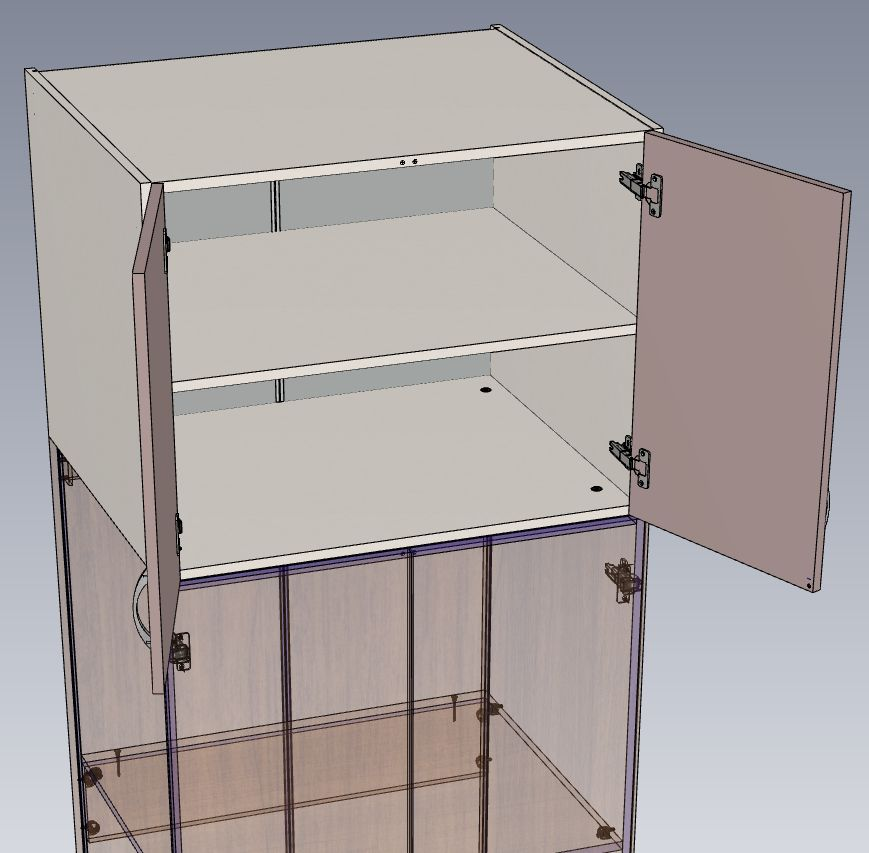

```python
{
    'proto_id': 401,
    'colorcmmater': param_randomize(dYAD.colorcmmater),  # Цвет корпуса
    'colorfsmat1': param_randomize(dYAD.colorcmmater),  # Цвет фасада Прайм
    'd': random.choice(range(150, 800)),  # Глубина
    'decofsmatc1': 0.0,  # MDF Отделка фасада
    'fasrtype1': 10841.0,  # Рисунок фасада
    'h': random.choice(range(400, 1200)),  # Высота
    'hantype': 24459.0,  # Тип ручки
    'polkstd1': 0.0,  # Полки в нишу
    'polkstd1h1': 0  # Позиция высоты полки 1 в правой нише
    'polkstd1h2': 0  # Позиция высоты полки 2 в правой нише
    'polkstd1h3': 0  # Позиция высоты полки 3 в правой нише
    'polkstd1h4': 0  # Позиция высоты полки 4 в правой нише
    'polkstd1h5': 0  # Позиция высоты полки 5 в правой нише
    'w': random.choice(range(500, 1000)),  # Ширина
    'pusher': 21534,  # Демпфер/Толкатель для "без ручки" Hettich 16904
    'n1delh_1': 0,  # Низ фил выс кол-во делителей
}
```

### ProtoId 402 РШ Антресоль DUO-2

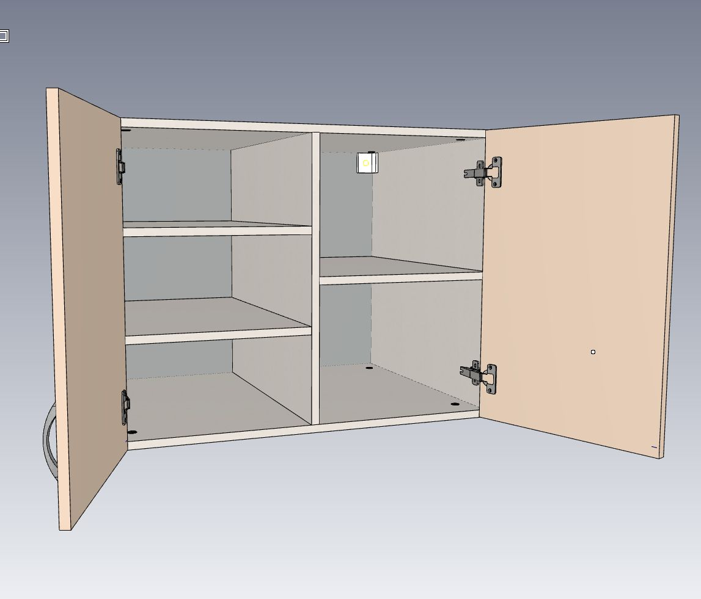

```python
{
    'proto_id': 402,
    'colorcmmater': param_randomize(dYAD.colorcmmater),  # Цвет корпуса
    'colorfsmat1': param_randomize(dYAD.colorcmmater),  # Цвет фасада Прайм
    'colorfsmat2': param_randomize(dYAD.colorcmmater),  # Цвет фасада Прайм
    'd': random.choice(range(150, 800)),  # Глубина
    'decofsmatc1': 0.0,  # MDF Отделка фасада
    'decofsmatc2': 0.0,  # MDF Отделка фасада
    'fasrtype1': 10841.0,  # Рисунок фасада
    'fasrtype2': 10841.0,  # Рисунок фасада
    'h': random.choice(range(400, 1200)),  # Высота
    'hantype': 24459.0,  # Тип ручки
    'polkstd1': 0.0,  # Полки в нишу справа
    'polkstd2': 0.0,  # Полки в нишу слева
    'polkstd1h1': 0  # Позиция высоты полки 1 в правой нише
    'polkstd1h2': 0  # Позиция высоты полки 2 в правой нише
    'polkstd1h3': 0  # Позиция высоты полки 3 в правой нише
    'polkstd1h4': 0  # Позиция высоты полки 4 в правой нише
    'polkstd1h5': 0  # Позиция высоты полки 5 в правой нише
    'polkstd2h1': 0  # Позиция высоты полки 1 в левой нише
    'polkstd2h2': 0  # Позиция высоты полки 2 в левой нише
    'polkstd2h3': 0  # Позиция высоты полки 3 в левой нише
    'polkstd2h4': 0  # Позиция высоты полки 4 в левой нише
    'polkstd2h5': 0  # Позиция высоты полки 5 в левой нише
    'w': random.choice(range(500, 1200)),  # Ширина
    'pusher': 21534,  # Демпфер/Толкатель для "без ручки" Hettich 16904
    'n1delh_1': 0,  # Низ фил выс кол-во делителей 
    'n1delh_2': 0,  # Низ фил выс кол-во делителей   
}
```

### ProtoId 403 РШ Антресоль DUO-3 левый

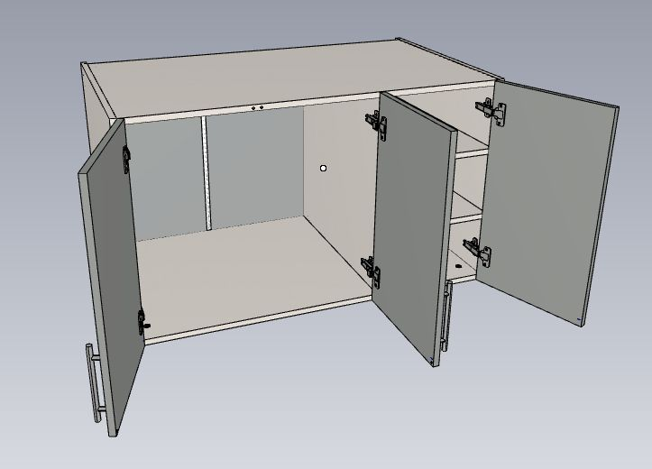

```python
{
    'proto_id': 403,
    'colorcmmater': param_randomize(dYAD.colorcmmater),  # Цвет корпуса
    'colorfsmat1': param_randomize(dYAD.colorcmmater),  # Цвет фасада Прайм
    'colorfsmat2': param_randomize(dYAD.colorcmmater),  # Цвет фасада Прайм
    'd': 500,        # Глубина
    'decofsmatc1': 0.0,  # MDF Отделка фасада
    'decofsmatc2': 0.0,  # MDF Отделка фасада
    'fasrtype1': 10841.0,  # Рисунок фасада
    'fasrtype2': 10841.0,  # Рисунок фасада
    'h': random.choice(range(400, 1200)),  # Высота
    'hantype': 24459.0,  # Тип ручки
    'polkstd1': 0.0,  # Полки в нишу справа
    'polkstd2': 0.0,  # Полки в нишу слева
    'polkstd1h1': 0,  # Позиция высоты полки 1 в правой нише
    'polkstd1h2': 0,  # Позиция высоты полки 2 в правой нише
    'polkstd1h3': 0,  # Позиция высоты полки 3 в правой нише
    'polkstd1h4': 0,  # Позиция высоты полки 4 в правой нише
    'polkstd1h5': 0,  # Позиция высоты полки 5 в правой нише
    'polkstd2h1': 0,  # Позиция высоты полки 1 в левой нише
    'polkstd2h2': 0,  # Позиция высоты полки 2 в левой нише
    'polkstd2h3': 0,  # Позиция высоты полки 3 в левой нише
    'polkstd2h4': 0,  # Позиция высоты полки 4 в левой нише
    'polkstd2h5': 0,  # Позиция высоты полки 5 в левой нише
    'w': 1000,        # Ширина
    'pusher': 21534,  # Демпфер/Толкатель для "без ручки" Hettich 16904
    'n1delh_1': 0,  # Низ фил выс кол-во делителей 
    'n1delh_2': 0,  # Низ фил выс кол-во делителей
}
```

### ProtoId 404 РШ Антресоль DUO-3 правый

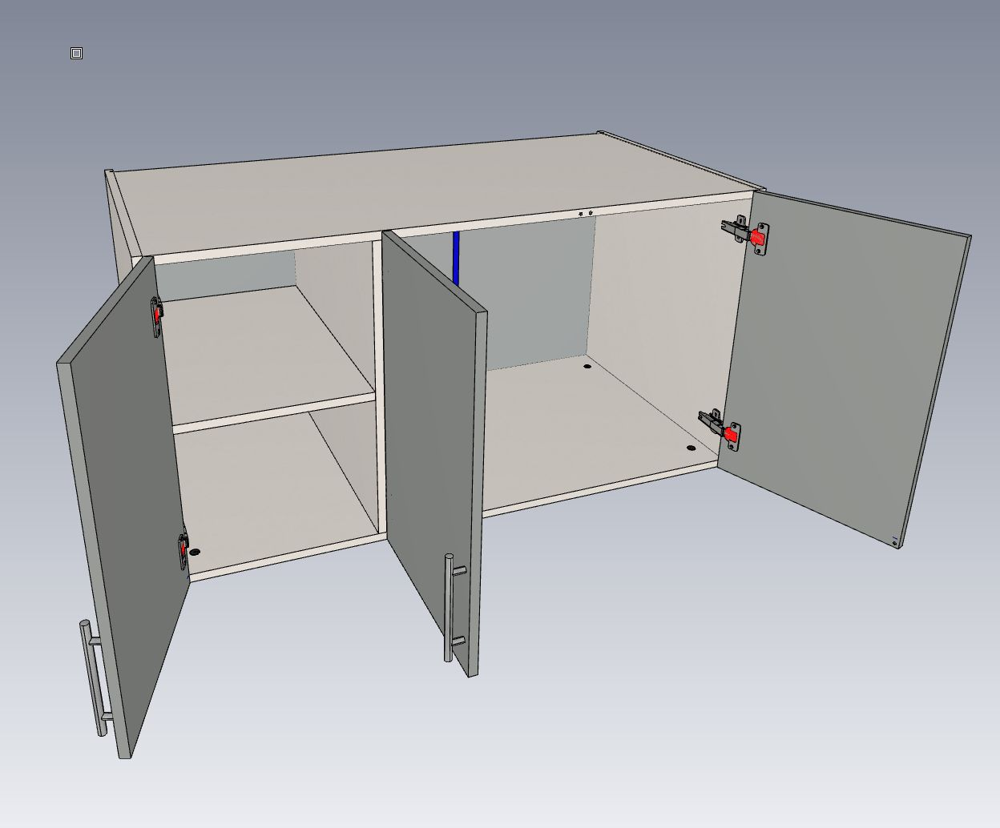

```python
{
    'proto_id': 404,
    'colorcmmater': param_randomize(dYAD.colorcmmater),  # Цвет корпуса
    'colorfsmat1': param_randomize(dYAD.colorcmmater),  # Цвет фасада Прайм
    'colorfsmat2': param_randomize(dYAD.colorcmmater),  # Цвет фасада Прайм
    'd': random.choice(range(150, 800)),  # Глубина
    'decofsmatc1': 0.0,  # MDF Отделка фасада
    'decofsmatc2': 0.0,  # MDF Отделка фасада
    'fasrtype1': 10841.0,  # Рисунок фасада
    'fasrtype2': 10841.0,  # Рисунок фасада
    'h': random.choice(range(400, 1200)),  # Высота
    'hantype': 24459.0,  # Тип ручки
    'polkstd1': 0.0,  # Полки в нишу справа
    'polkstd2': 0.0,  # Полки в нишу слева
    'polkstd1h1': 0  # Позиция высоты полки 1 в правой нише
    'polkstd1h2': 0  # Позиция высоты полки 2 в правой нише
    'polkstd1h3': 0  # Позиция высоты полки 3 в правой нише
    'polkstd1h4': 0  # Позиция высоты полки 4 в правой нише
    'polkstd1h5': 0  # Позиция высоты полки 5 в правой нише
    'polkstd2h1': 0  # Позиция высоты полки 1 в левой нише
    'polkstd2h2': 0  # Позиция высоты полки 2 в левой нише
    'polkstd2h3': 0  # Позиция высоты полки 3 в левой нише
    'polkstd2h4': 0  # Позиция высоты полки 4 в левой нише
    'polkstd2h5': 0  # Позиция высоты полки 5 в левой нише
    'w': random.choice(range(500, 1500)),  # Ширина
    'pusher': 21534,  # Демпфер/Толкатель для "без ручки" Hettich 16904
    'n1delh_1': 0,  # Низ фил выс кол-во делителей 
    'n1delh_2': 0,  # Низ фил выс кол-во делителей
}
```

### ProtoId 405 РШ Антресоль DUO-4

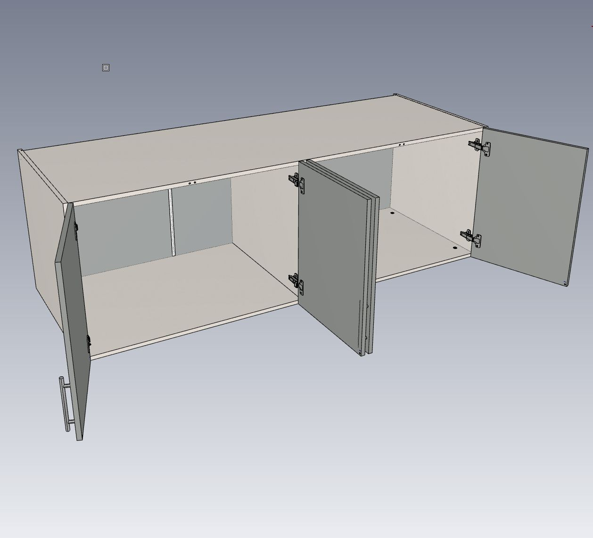

```python
{
    'proto_id': 405,
    'colorcmmater': param_randomize(dYAD.colorcmmater),  # Цвет корпуса
    'colorfsmat1': param_randomize(dYAD.colorcmmater),  # Цвет фасада Прайм
    'colorfsmat2': param_randomize(dYAD.colorcmmater),  # Цвет фасада Прайм
    'd': random.choice(range(150, 800)),  # Глубина
    'decofsmatc1': 0.0,  # MDF Отделка фасада
    'decofsmatc2': 0.0,  # MDF Отделка фасада
    'fasrtype1': 10841.0,  # Рисунок фасада
    'fasrtype2': 10841.0,  # Рисунок фасада
    'h': random.choice(range(400, 1200)),  # Высота
    'hantype': 24459.0,  # Тип ручки
    'polkstd1': 0.0,  # Полки в нишу справа
    'polkstd2': 0.0,  # Полки в нишу слева
    'polkstd1h1': 0  # Позиция высоты полки 1 в правой нише
    'polkstd1h2': 0  # Позиция высоты полки 2 в правой нише
    'polkstd1h3': 0  # Позиция высоты полки 3 в правой нише
    'polkstd1h4': 0  # Позиция высоты полки 4 в правой нише
    'polkstd1h5': 0  # Позиция высоты полки 5 в правой нише
    'polkstd2h1': 0  # Позиция высоты полки 1 в левой нише
    'polkstd2h2': 0  # Позиция высоты полки 2 в левой нише
    'polkstd2h3': 0  # Позиция высоты полки 3 в левой нише
    'polkstd2h4': 0  # Позиция высоты полки 4 в левой нише
    'polkstd2h5': 0  # Позиция высоты полки 5 в левой нише
    'w': random.choice(range(1000, 2000)),  # Ширина
    'pusher': 21534,  # Демпфер/Толкатель для "без ручки" Hettich 16904
    'n1delh_1': 0,  # Низ фил выс кол-во делителей 
    'n1delh_2': 0,  # Низ фил выс кол-во делителей
}
```

### ProtoId 406 РШ Антресоль TRIO-3

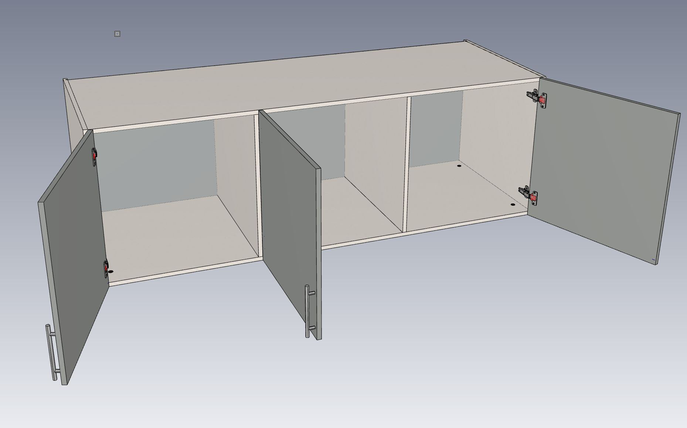

```python
{
    'proto_id': 406,
    'colorcmmater': param_randomize(dYAD.colorcmmater),  # Цвет корпуса
    'colorfsmat1': param_randomize(dYAD.colorcmmater),  # Цвет фасада Прайм
    'colorfsmat2': param_randomize(dYAD.colorcmmater),  # Цвет фасада Прайм
    'colorfsmat3': param_randomize(dYAD.colorcmmater),  # Цвет фасада Прайм
    'd': random.choice(range(150, 800)),  # Глубина
    'decofsmatc1': 0.0,  # MDF Отделка фасада справа
    'decofsmatc2': 0.0,  # MDF Отделка фасада середина
    'decofsmatc3': 0.0,  # MDF Отделка фасада слева
    'fasrtype1': 10841.0,  # Рисунок фасада справа
    'fasrtype2': 10841.0,  # Рисунок фасада середина
    'fasrtype3': 10841.0,  # Рисунок фасада слева
    'h': random.choice(range(400, 1200)),  # Высота
    'hantype': 24459.0,  # Тип ручки
    'polkstd1': 0.0,  # Полки в нишу справа
    'polkstd2': 0.0,  # Полки в нишу середина
    'polkstd3': 0.0,  # Полки в нишу слева
    'polkstd1h1': 0  # Позиция высоты полки 1 в правой нише
    'polkstd1h2': 0  # Позиция высоты полки 2 в правой нише
    'polkstd1h3': 0  # Позиция высоты полки 3 в правой нише
    'polkstd1h4': 0  # Позиция высоты полки 4 в правой нише
    'polkstd1h5': 0  # Позиция высоты полки 5 в правой нише
    'polkstd2h1': 0  # Позиция высоты полки 1 в средней нише
    'polkstd2h2': 0  # Позиция высоты полки 2 в средней нише
    'polkstd2h3': 0  # Позиция высоты полки 3 в средней нише
    'polkstd2h4': 0  # Позиция высоты полки 4 в средней нише
    'polkstd2h5': 0  # Позиция высоты полки 5 в средней нише
    'polkstd3h1': 0  # Позиция высоты полки 1 в левой нише
    'polkstd3h2': 0  # Позиция высоты полки 2 в левой нише
    'polkstd3h3': 0  # Позиция высоты полки 3 в левой нише
    'polkstd3h4': 0  # Позиция высоты полки 4 в левой нише
    'polkstd3h5': 0  # Позиция высоты полки 5 в левой нише
    'w': random.choice(range(750, 1800)),  # Ширина
    'pusher': 21534,  # Демпфер/Толкатель для "без ручки" Hettich 16904
    'n1delh_1': 0,  # Низ фил выс кол-во делителей 
    'n1delh_2': 0,  # Низ фил выс кол-во делителей   
    'n1delh_3': 0,  # Низ фил выс кол-во делителей
}
```

### ProtoId 407  РШ Антресоль TRIO-4

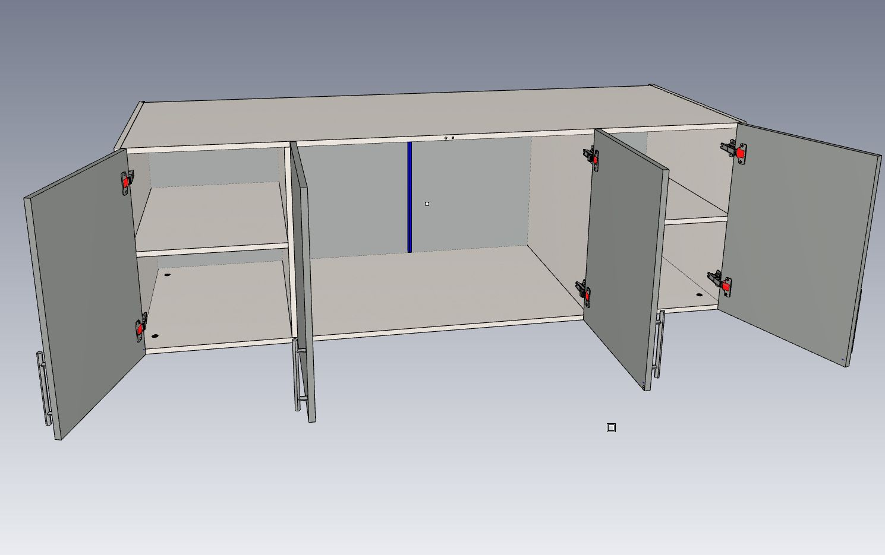

```python
{
    'proto_id': 407,
    'colorcmmater': param_randomize(dYAD.colorcmmater),  # Цвет корпуса
    'colorfsmat1': param_randomize(dYAD.colorcmmater),  # Цвет фасада Прайм
    'colorfsmat2': param_randomize(dYAD.colorcmmater),  # Цвет фасада Прайм
    'colorfsmat3': param_randomize(dYAD.colorcmmater),  # Цвет фасада Прайм
    'd': random.choice(range(150, 800)),  # Глубина
    'decofsmatc1': 0.0,  # MDF Отделка фасада справа
    'decofsmatc2': 0.0,  # MDF Отделка фасада середина
    'decofsmatc3': 0.0,  # MDF Отделка фасада слева
    'fasrtype1': 10841.0,  # Рисунок фасада справа
    'fasrtype2': 10841.0,  # Рисунок фасада середина
    'fasrtype3': 10841.0,  # Рисунок фасада слева
    'h': random.choice(range(400, 1200)),  # Высота
    'hantype': 24459.0,  # Тип ручки
    'polkstd1': 0.0,  # Полки в нишу справа
    'polkstd2': 0.0,  # Полки в нишу середина
    'polkstd3': 0.0,  # Полки в нишу слева
    'polkstd1h1': 0  # Позиция высоты полки 1 в правой нише
    'polkstd1h2': 0  # Позиция высоты полки 2 в правой нише
    'polkstd1h3': 0  # Позиция высоты полки 3 в правой нише
    'polkstd1h4': 0  # Позиция высоты полки 4 в правой нише
    'polkstd1h5': 0  # Позиция высоты полки 5 в правой нише
    'polkstd2h1': 0  # Позиция высоты полки 1 в средней нише
    'polkstd2h2': 0  # Позиция высоты полки 2 в средней нише
    'polkstd2h3': 0  # Позиция высоты полки 3 в средней нише
    'polkstd2h4': 0  # Позиция высоты полки 4 в средней нише
    'polkstd2h5': 0  # Позиция высоты полки 5 в средней нише
    'polkstd3h1': 0  # Позиция высоты полки 1 в левой нише
    'polkstd3h2': 0  # Позиция высоты полки 2 в левой нише
    'polkstd3h3': 0  # Позиция высоты полки 3 в левой нише
    'polkstd3h4': 0  # Позиция высоты полки 4 в левой нише
    'polkstd3h5': 0  # Позиция высоты полки 5 в левой нише
    'w': random.choice(range(1000, 2000)),  # Ширина
    'pusher': 21534,  # Демпфер/Толкатель для "без ручки" Hettich 16904
    'n1delh_1': 0,  # Низ фил выс кол-во делителей 
    'n1delh_2': 0,  # Низ фил выс кол-во делителей   
    'n1delh_3': 0,  # Низ фил выс кол-во делителей   
}
```

### ProtoId 408  РШ Антресоль TRIO-5

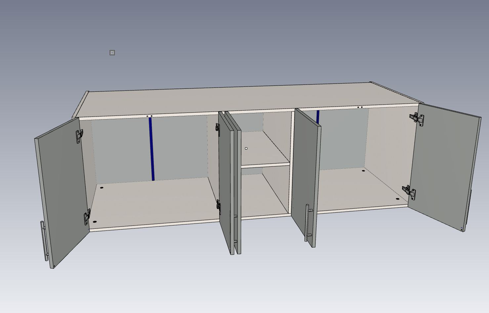

```python
{
    'proto_id': 408,
    'colorcmmater': param_randomize(dYAD.colorcmmater),  # Цвет корпуса
    'colorfsmat1': param_randomize(dYAD.colorcmmater),  # Цвет фасада Прайм
    'colorfsmat2': param_randomize(dYAD.colorcmmater),  # Цвет фасада Прайм
    'colorfsmat3': param_randomize(dYAD.colorcmmater),  # Цвет фасада Прайм
    'd': random.choice(range(150, 800)),  # Глубина
    'decofsmatc1': 0.0,  # MDF Отделка фасада справа
    'decofsmatc2': 0.0,  # MDF Отделка фасада середина
    'decofsmatc3': 0.0,  # MDF Отделка фасада слева
    'fasrtype1': 10841.0,  # Рисунок фасада справа
    'fasrtype2': 10841.0,  # Рисунок фасада середина
    'fasrtype3': 10841.0,  # Рисунок фасада слева
    'h': random.choice(range(400, 1200)),  # Высота
    'hantype': 24459.0,  # Тип ручки
    'polkstd1': 0.0,  # Полки в нишу справа
    'polkstd2': 0.0,  # Полки в нишу середина
    'polkstd3': 0.0,  # Полки в нишу слева
    'polkstd1h1': 0  # Позиция высоты полки 1 в правой нише
    'polkstd1h2': 0  # Позиция высоты полки 2 в правой нише
    'polkstd1h3': 0  # Позиция высоты полки 3 в правой нише
    'polkstd1h4': 0  # Позиция высоты полки 4 в правой нише
    'polkstd1h5': 0  # Позиция высоты полки 5 в правой нише
    'polkstd2h1': 0  # Позиция высоты полки 1 в средней нише
    'polkstd2h2': 0  # Позиция высоты полки 2 в средней нише
    'polkstd2h3': 0  # Позиция высоты полки 3 в средней нише
    'polkstd2h4': 0  # Позиция высоты полки 4 в средней нише
    'polkstd2h5': 0  # Позиция высоты полки 5 в средней нише
    'polkstd3h1': 0  # Позиция высоты полки 1 в левой нише
    'polkstd3h2': 0  # Позиция высоты полки 2 в левой нише
    'polkstd3h3': 0  # Позиция высоты полки 3 в левой нише
    'polkstd3h4': 0  # Позиция высоты полки 4 в левой нише
    'polkstd3h5': 0  # Позиция высоты полки 5 в левой нише
    'w': random.choice(range(1250, 2500)),  # Ширина
    'pusher': 21534,  # Демпфер/Толкатель для "без ручки" Hettich 16904
    'n1delh_1': 0,  # Низ фил выс кол-во делителей 
    'n1delh_2': 0,  # Низ фил выс кол-во делителей   
    'n1delh_3': 0,  # Низ фил выс кол-во делителей   
}
```

### ProtoId 409  РШ Антресоль TRIO-6

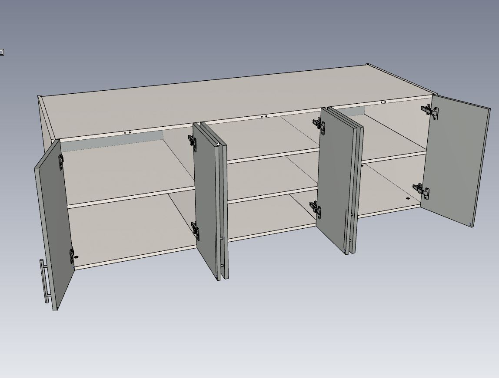

```python
{
    'proto_id': 409,
    'colorcmmater': param_randomize(dYAD.colorcmmater),  # Цвет корпуса
    'colorfsmat1': param_randomize(dYAD.colorcmmater),  # Цвет фасада Прайм
    'colorfsmat2': param_randomize(dYAD.colorcmmater),  # Цвет фасада Прайм
    'colorfsmat3': param_randomize(dYAD.colorcmmater),  # Цвет фасада Прайм
    'd': random.choice(range(150, 800)),  # Глубина
    'decofsmatc1': 0.0,  # MDF Отделка фасада справа
    'decofsmatc2': 0.0,  # MDF Отделка фасада середина
    'decofsmatc3': 0.0,  # MDF Отделка фасада слева
    'fasrtype1': 10841.0,  # Рисунок фасада справа
    'fasrtype2': 10841.0,  # Рисунок фасада середина
    'fasrtype3': 10841.0,  # Рисунок фасада слева
    'h': random.choice(range(400, 1200)),  # Высота
    'hantype': 24459.0,  # Тип ручки
    'polkstd1': 0.0,  # Полки в нишу справа
    'polkstd2': 0.0,  # Полки в нишу середина
    'polkstd3': 0.0,  # Полки в нишу слева
    'polkstd1h1': 0  # Позиция высоты полки 1 в правой нише
    'polkstd1h2': 0  # Позиция высоты полки 2 в правой нише
    'polkstd1h3': 0  # Позиция высоты полки 3 в правой нише
    'polkstd1h4': 0  # Позиция высоты полки 4 в правой нише
    'polkstd1h5': 0  # Позиция высоты полки 5 в правой нише
    'polkstd2h1': 0  # Позиция высоты полки 1 в средней нише
    'polkstd2h2': 0  # Позиция высоты полки 2 в средней нише
    'polkstd2h3': 0  # Позиция высоты полки 3 в средней нише
    'polkstd2h4': 0  # Позиция высоты полки 4 в средней нише
    'polkstd2h5': 0  # Позиция высоты полки 5 в средней нише
    'polkstd3h1': 0  # Позиция высоты полки 1 в левой нише
    'polkstd3h2': 0  # Позиция высоты полки 2 в левой нише
    'polkstd3h3': 0  # Позиция высоты полки 3 в левой нише
    'polkstd3h4': 0  # Позиция высоты полки 4 в левой нише
    'polkstd3h5': 0  # Позиция высоты полки 5 в левой нише
    'w': random.choice(range(1500, 2790)),  # Ширина
    'pusher': 21534,  # Демпфер/Толкатель для "без ручки" Hettich 16904
    'n1delh_1': 0,  # Низ фил выс кол-во делителей 
    'n1delh_2': 0,  # Низ фил выс кол-во делителей   
    'n1delh_3': 0,  # Низ фил выс кол-во делителей   
}
```

## Комоды

  | Параметры                       | MONO-1   | DUO-2 левый | DUO-2 правый | TRIO-3    |
  | :------------------------------ | :------- | :---------- | :----------- | :-------- |
  | Количество секций по ширине, шт | 1        | 2           | 2            | 3         |
  | Количество                      |          |             |              |           |
  | фасадов по ширине, шт           | 1        | 2           | 2            | 3         |
  | Ширина корпуса           ШК, мм | 500-800  | 800-1200    | 800-1200     | 1200-1600 |
  | Глубина корпуса                 |          |             |              |           |
  | ГК, мм*                         | 300-800  | 300-800     | 300-800      | 300-800   |
  | Высота корпуса                  |          |             |              |           |
  | ВК, мм                          | 600-1100 | 600-1100    | 600-1100     | 600-1100  |

Зависимость числа ящиков от высоты корпуса

  | Высота корпуса комода, мм | Кол-во ящиков, шт |
  | :------------------------ | :---------------- |
  |                           |                   |
  | 600 - 614                 | 2                 |
  | 600 - 878                 | 3                 |
  | 662 - 1008                | 4                 |
  | 806 - 1100                | 5                 |

## ProtoId 422 РШ Комод MONO-1

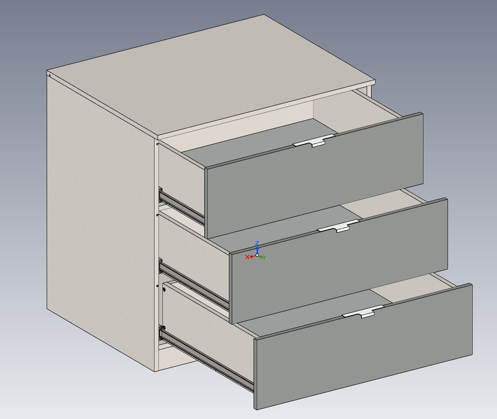

```python
{
    'proto_id': 422,
    'blockbox1': 3,  # Количество ящиков
    'bxtype': 10804,  # Тип ящика
    'colorcmmater': 22390,  # Цвет корпуса
    'colorfsmat1': 22390,  # Цвет фасада Прайм
    'd': 600,  # Глубина
    'decofsmatc1': 0,  # MDF Отделка фасада
    'fasrtype1': 10841,  # Рисунок фасада
    'h': 600,  # Высота
    'hantype': 24459,  # Тип ручки
    'hcok': 70,  # Высота цоколя
    'w': 500,  # Ширина
    'pusher': 21534,  # Демпфер/Толкатель для "без ручки" Hettich 16904
}
```

### ProtoId 423 РШ Комод DUO-2 левый

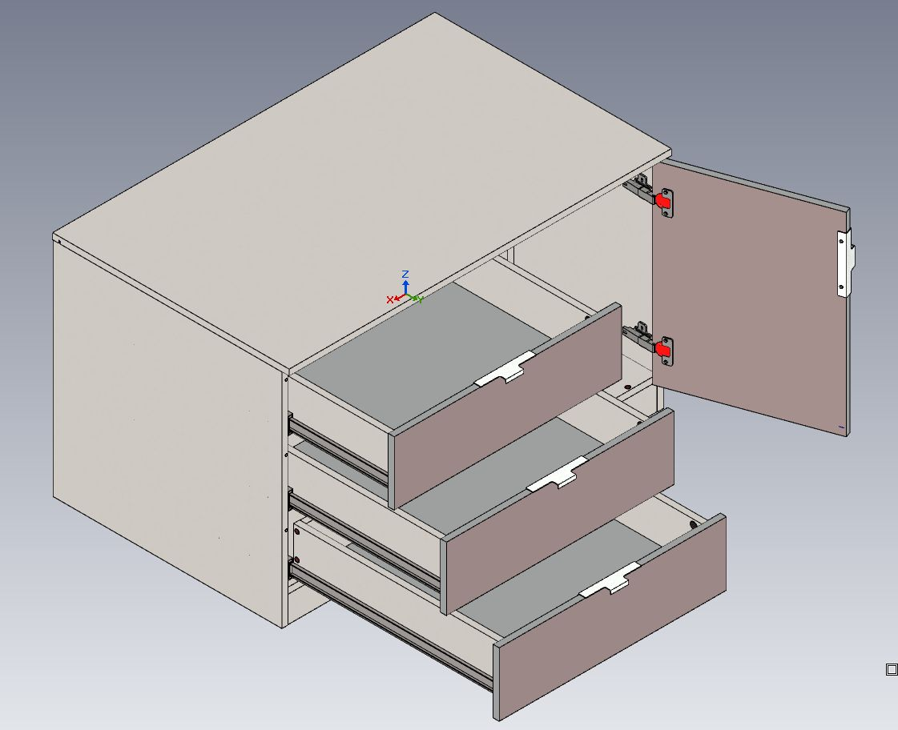

```python
{
    'proto_id': 423,
    'blockbox1': 0,  # Количество ящиков
    'blockbox2': 3,  # Количество ящиков
    'bxtype': 10804,  # Тип ящика
    'colorcmmater': 22390,  # Цвет корпуса
    'colorfsmat1': 22390,  # Цвет фасада Прайм
    'colorfsmat2': 22390,  # Цвет фасада Прайм
    'd': 600,  # Глубина
    'decofsmatc1': 0,  # MDF Отделка фасада
    'decofsmatc2': 0,  # MDF Отделка фасада
    'fasrtype1': 10841,  # Рисунок фасада
    'fasrtype2': 10841,  # Рисунок фасада
    'h': 600,  # Высота
    'hantype': 24459,  # Тип ручки
    'hcok': 70,  # Высота цоколя
    'polkstd1': 0,  # Полки в нишу справа (щтуки)
    'polkstd1h1': 0  # Позиция высоты полки 1 в правой нише
    'polkstd1h2': 0  # Позиция высоты полки 2 в правой нише
    'polkstd1h3': 0  # Позиция высоты полки 3 в правой нише
    'polkstd1h4': 0  # Позиция высоты полки 4 в правой нише
    'polkstd1h5': 0  # Позиция высоты полки 5 в правой нише
    'shshelves_1': 0,  # Число обувных полок справа 
    ~'shshelves_2': 0,  # Число обувных полок секция 2 ~
    ~'shshelves_3': 0,  # Число обувных полок секция 3 ~
    'w': 900,  # Ширина
    'pusher': 21534,  # Демпфер/Толкатель для "без ручки" Hettich 16904
    'n1delh_1': 0,  # Низ фил выс кол-во делителей 
    'n1delh_2': 0,  # Низ фил выс кол-во делителей   
}
```

### ProtoId 424 РШ Комод DUO-2 правый

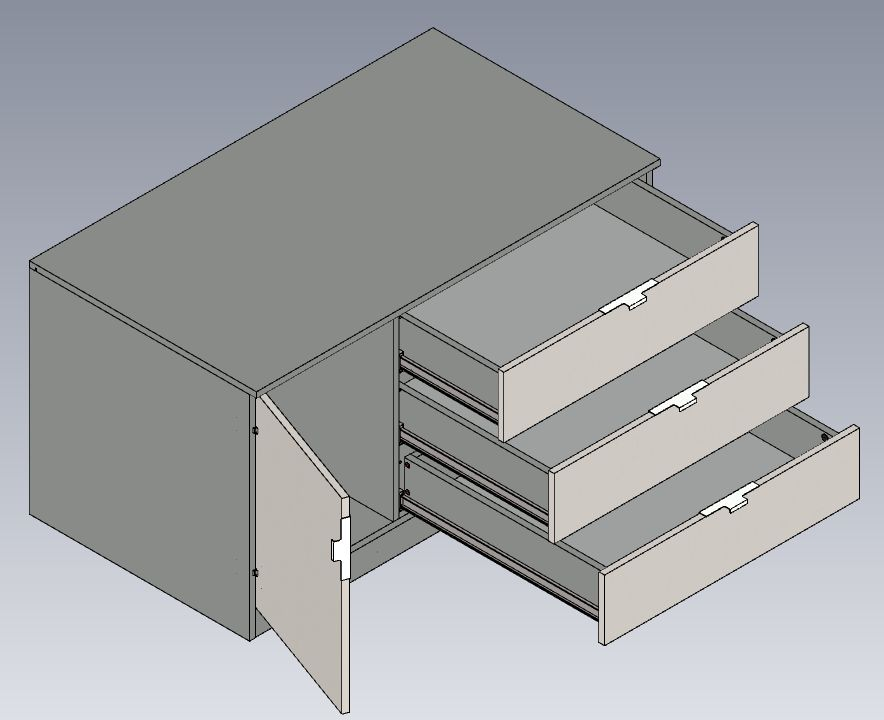

```python
{
    'proto_id': 424,
    'blockbox1': 3,  # Количество ящиков
    'blockbox2': 0,  # Количество ящиков
    'bxtype': 10804,  # Тип ящика
    'colorcmmater': 22390,  # Цвет корпуса
    'colorfsmat1': 22390,  # Цвет фасада Прайм
    'colorfsmat2': 22390,  # Цвет фасада Прайм
    'd': 600,  # Глубина
    'decofsmatc1': 0,  # MDF Отделка фасада
    'decofsmatc2': 0,  # MDF Отделка фасада
    'fasrtype1': 10841,  # Рисунок фасада
    'fasrtype2': 10841,  # Рисунок фасада
    'h': 600,  # Высота
    'hantype': 24459,  # Тип ручки
    'hcok': 70,  # Высота цоколя
    'polkstd2': 0,  # Полки в левую нишу (штуки)
   ' polkstd2h1': 0  # Позиция высоты полки 1 в левой нише
    'polkstd2h2': 0  # Позиция высоты полки 2 в левой нише
    'polkstd2h3': 0  # Позиция высоты полки 3 в левой нише
    'polkstd2h4': 0  # Позиция высоты полки 4 в левой нише
    'polkstd2h5': 0  # Позиция высоты полки 5 в левой нише
    ~'shshelves_1': 0,  # Число обувных полок справа ~
    'shshelves_2': 0,  # Число обувных полок секция 2 
    ~'shshelves_3': 0,  # Число обувных полок секция 3 ~
    'w': 900,  # Ширина
    'pusher': 21534,  # Демпфер/Толкатель для "без ручки" Hettich 16904
    'n1delh_1': 0,  # Низ фил выс кол-во делителей 
    'n1delh_2': 0,  # Низ фил выс кол-во делителей   
}
```

### ProtoId 425 РШ Комод TRIO-3

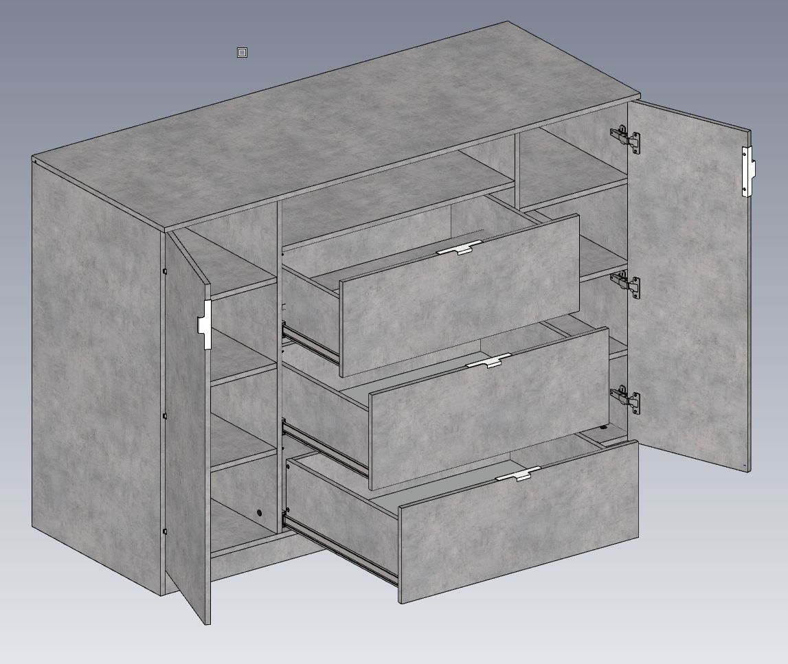

```python
{
    'proto_id': 425,
    'blockbox1': 0,  # Количество ящиков
    'blockbox2': 0,  # Количество ящиков
    'blockbox3': 0,  # Количество ящиков
    'bxtype': 10804,  # Тип ящика
    'colorcmmater': 22390,  # Цвет корпуса
    'colorfsmat1': 22390,  # Цвет фасада Прайм
    'colorfsmat2': 22390,  # Цвет фасада Прайм
    'colorfsmat3': 22390,  # Цвет фасада Прайм
    'd': 600,  # Глубина
    'decofsmatc1': 0,  # MDF Отделка фасада
    'decofsmatc2': 0,  # MDF Отделка фасада
    'decofsmatc3': 0,  # MDF Отделка фасада
    'fasrtype1': 10841,  # Рисунок фасада
    'fasrtype2': 10841,  # Рисунок фасада
    'fasrtype3': 10841,  # Рисунок фасада
    'h': 600,  # Высота
    'hantype': 24459,  # Тип ручки
    'hcok': 70,  # Высота цоколя
    'polkstd1': 0,  # количество полок в нишу справа
    ~'polkstd2': 0,  # Полки в нишу посередине всегда 0 передавать не надо~
    'polkstd3': 0,  # количество полок в нишу слева
    'polkstd1h1': 0  # Позиция высоты полки 1 в правой нише
    'polkstd1h2': 0  # Позиция высоты полки 2 в правой нише
    'polkstd1h3': 0  # Позиция высоты полки 3 в правой нише
    'polkstd1h4': 0  # Позиция высоты полки 4 в правой нише
    'polkstd1h5': 0  # Позиция высоты полки 5 в правой нише
    'polkstd3h1': 0  # Позиция высоты полки 1 в левой нише
    'polkstd3h2': 0  # Позиция высоты полки 2 в левой нише
    'polkstd3h3': 0  # Позиция высоты полки 3 в левой нише
    'polkstd3h4': 0  # Позиция высоты полки 4 в левой нише
    'polkstd3h5': 0  # Позиция высоты полки 5 в левой нише
    'shshelves_1': 0,  # Число обувных полок справа 
    ~'shshelves_2': 0,  # Число обувных полок секция 2 ~
    'shshelves_3': 0,  # Число обувных полок секция 3 
    'w': 1300,  # Ширина
    'pusher': 21534,  # Демпфер/Толкатель для "без ручки" Hettich 16904
    'n1delh_1': 0,  # Низ фил выс кол-во делителей 
    'n1delh_2': 0,  # Низ фил выс кол-во делителей   
    'n1delh_3': 0,  # Низ фил выс кол-во делителей
}
```

## РШ Обувницы

  | Параметры                        | обувница MONO-1 с одним механизмом | обувница MONO-1 с двумя механизмами | обувница   MONO-1 с одним механизмом и ящиком | обувница MONO-1 с двумя механизмами и ящиком |
  | :------------------------------- | :--------------------------------- | :---------------------------------- | :-------------------------------------------- | :------------------------------------------- |
  | Количество секций по ширине, шт  | 1                                  | 1                                   | 1                                             | 1                                            |
  | Количество фасадов по ширине, шт | 1                                  | 1                                   | 1                                             | 1                                            |
  | Количество цвета/дизайна фасадов | 1                                  | 1                                   | 2                                             | 2                                            |
  | Ширина корпуса ШК, мм            | 500-800                            | 500-800                             | 500-800                                       | 500-800                                      |
  | Глубина корпуса  ГК, мм          | 320                                | 320                                 | 320                                           | 320                                          |
  | Высота корпуса  ВК, мм           | 447-507                            | 805-925                             | 590-650                                       | 948-1068                                     |

### ProtoId 427 РШ Обувница MONO-1-1

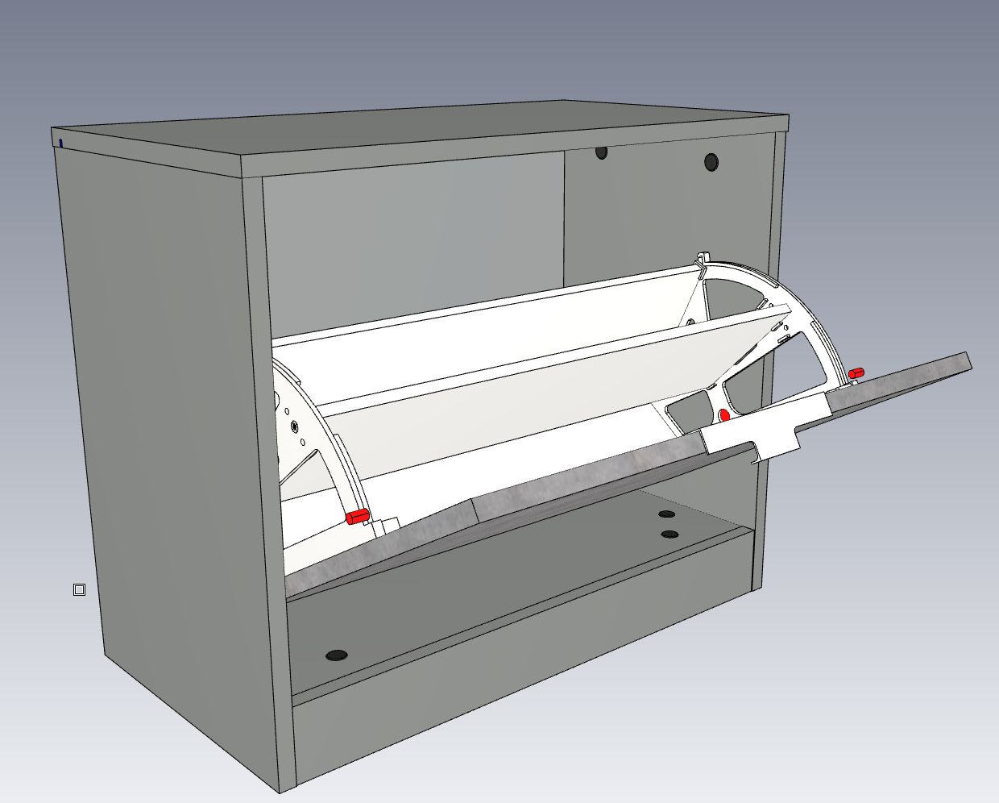

```python
{
    'proto_id': 427,
    'colorcmmater': 22393,  # Цвет корпуса 
    'colorfsmat1': 22378,  # Цвет фасада Прайм 
    'd': 320,  # Глубина 
    'decofsmatc1': 0,  # MDF Отделка фасада 
    'fasrtype1': 10841,  # Рисунок фасада 
    'h': 500,  # Высота 
    'hantype': 24459,  # Тип ручки 
    'hcok': 70,  # Высота цоколя 
    'w': 600,  # Ширина 
}
```

### ProtoId 428 РШ Обувница MONO-1-2

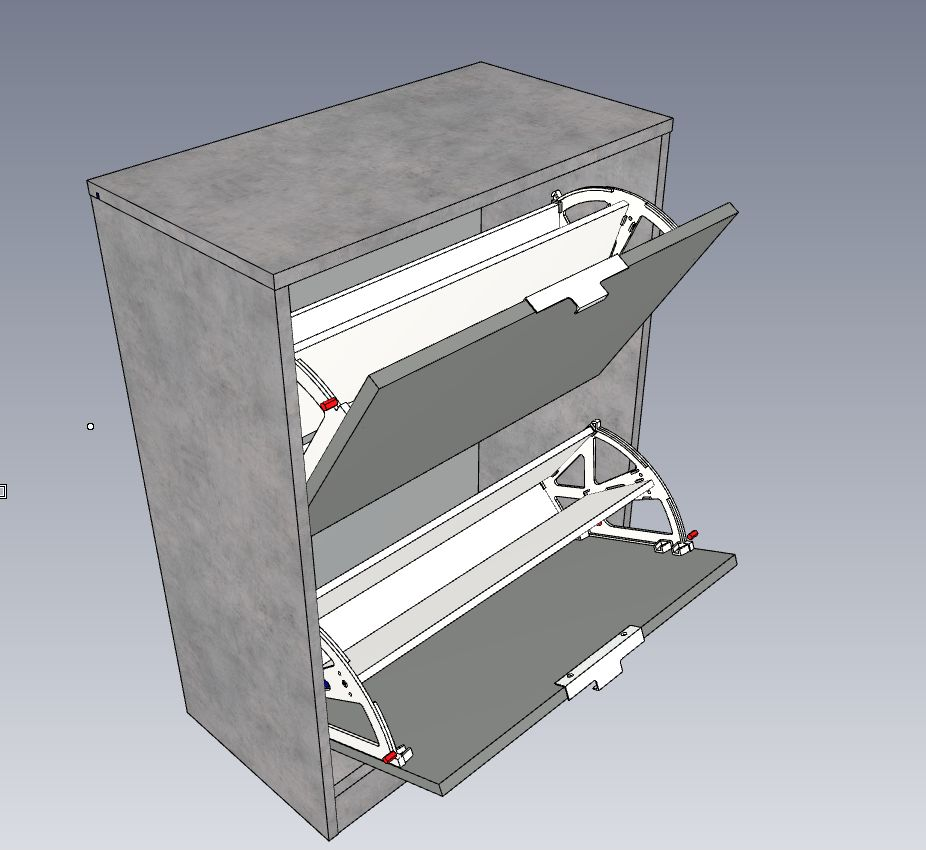

```python
{
    'proto_id': 428,
    'colorcmmater': 22378,  # Цвет корпуса 
    'colorfsmat1': 22393,  # Цвет фасада Прайм 
    'd': 320,  # Глубина 
    'decofsmatc1': 0,  # MDF Отделка фасада 
    'fasrtype1': 10841,  # Рисунок фасада 
    'h': 808,  # Высота 

    'hantype': 24459,  # Тип ручки 
    'hcok': 70,  # Высота цоколя 
    'w': 600,  # Ширина 
}
```

### ProtoId 429 РШ Обувница MONO-1-1-ящик

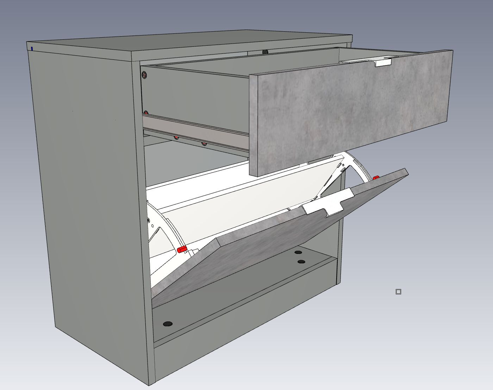

```python
{
    'proto_id': 429,
    'colorcmmater': 22378,  # Цвет корпуса 
    'colorfsmat1': 22393,  # Цвет фасада Прайм 
    'colorfsmat2': 22393,  # Цвет фасада Прайм 
    'd': 320,  # Глубина 
    'decofsmatc1': 0,  # MDF Отделка фасада 
    'decofsmatc2': 0,  # MDF Отделка фасада 
    'fasrtype1': 10841,  # Рисунок фасада 
    'fasrtype2': 10841,  # Рисунок фасада 
    'h': 808,  # Высота 

    'hantype': 24459,  # Тип ручки 
    'hcok': 70,  # Высота цоколя 
    'w': 600,  # Ширина 
}
```

### ProtoId 430  РШ Обувница MONO-1-2-ящик

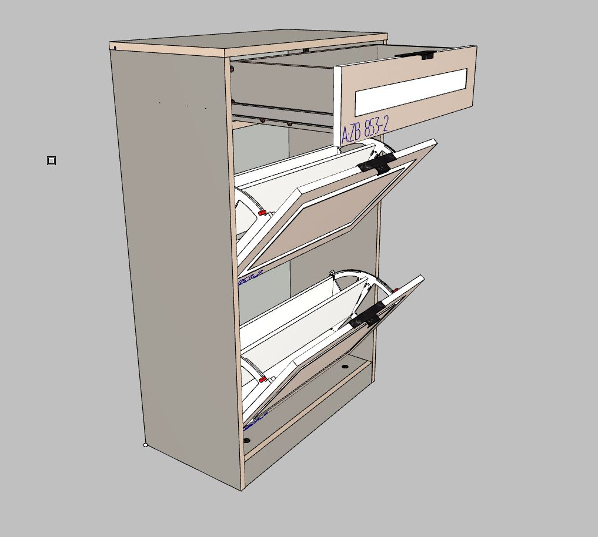

```python
{
    'proto_id': 430,
    'colorcmmater': 22378,  # Цвет корпуса 
    'colorfsmat1': 22393,  # Цвет фасада нижнего ящика только для Прайм 
    'colorfsmat2': 22393,  # Цвет фасада среднего ящика только для Прайм 
    'colorfsmat3': 22393,  # Цвет фасада верхнего ящика только для Прайм 
    'd': 320,  # Глубина 
    'decofsmatc1': 0,  # MDF Отделка фасада нижнего ящика
    'decofsmatc2': 0,  # MDF Отделка фасада сред
    'decofsmatc3': 0,  # MDF Отделка фасада верхнего ящика
    'fasrtype1': 10841,  # Рисунок фасада нижнего ящика
    'fasrtype2': 10841,  # Рисунок фасада среднего ящика
    'fasrtype3': 10841,  # Рисунок фасада верхнего ящика
    'h': 808,  # Высота 

    'hantype': 24459,  # Тип ручки 
    'hcok': 70,  # Высота цоколя 
    'w': 600,  # Ширина 
}
```

## Тумбы

| Параметры                       | MONO-1   | MONO-2   | DUO-2    | DUO-3 левый | DUO-3 правый |
| :------------------------------ | :------- | :------- | :------- | :---------- | :----------- |
| Количество секций по ширине, шт | 1        | 1        | 2        | 2           | 2            |
| Количество                      |          |          |          |             |              |
| фасадов, шт                     | 1        | 2        | 2        | 3           | 3            |
| Ширина корпуса ШК, мм           | 300-600  | 600-900  | 800-1200 | 1000-1500   | 1000-1500    |
| Глубина корпуса                 |          |          |          |             |              |
| ГК, мм*                         | 150-800  | 150-800  | 150-800  | 150-800     | 150-800      |
| Высота корпуса                  |          |          |          |             |              |
| ВК, мм                          | 370-1100 | 370-1100 | 370-1100 | 370-100     | 370-1100     |

:::{tip}
17/09/2025

1.Добавлены параметры **СЕТОК** вместо полок. Если число сеток больше 0, то ставим сетки.

- 'sotshelf1':  Полка сетчатая в нижнюю нишу
- 'sotshelf2':  Полка сетчатая в нижнюю нишу

2.Добавлены параметры мягких сидений

- 'seat_bk_gap': 0      Отступ сзади мягкого  - сиденья
- 'seatfabrics ': 21746    Ткань для мягкого  - сидения
- 'softseats': 0          Тип мягкого сидения

Типы мягких сидений:

| TValue                   | IValue |
| :----------------------- | :----- |
| Нет                      | 0      |
| Сидушка Corner мягкая    | 10731  |
| Сидушка Portofino мягкая | 10733  |

Ткани для сидений:

| TValue           | IValue |
| :--------------- | :----- |
| Велюр Velutto 03 | 21746  |
| Велюр Velutto 08 | 21751  |
| Велюр Velutto 11 | 21752  |
| Велюр Velutto 17 | 21756  |
| Велюр Velutto 23 | 21760  |
| Велюр Velutto 53 | 21773  |
| Нет              | 0      |

3.Добавлен тип фасада **НЕТ**. Передаваемое значение в `fasrtype1``fasrtype2` = 0 . Если Фасада во всех секциях **НЕТ**, то свес вместо 20 всего 1 мм.

4.Минимальный размер коруса стал 370 мм.

5. 06.02.2026 добавлены Mono-1 Mono-2

6. Исправлены максимальные габариты ширины и высоты

7. TODO: Добавить кастомные позиции полок по высоте. по аналогии со шкафами в СУ
:::

### ProtoId 454  РШ Тумба MONO-2

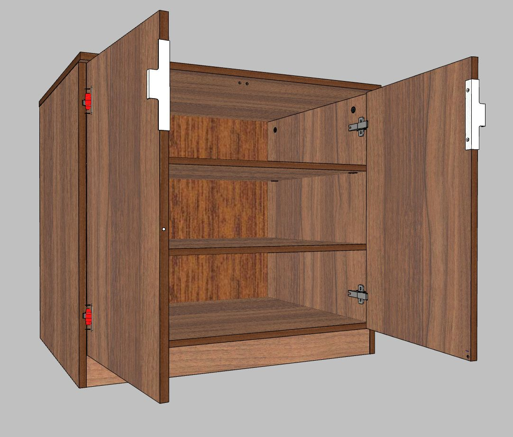

```python
{
    'proto_id': 454,
    'colorcmmater': 22390,  # Цвет корпуса 
    'colorfsmat1': 22390,  # Цвет фасада Прайм 
    'd': 600,  # Глубина 
    'fasrtype1': 10841,  # Рисунок фасада 
    'h': 440,  # Высота 
    'hantype': 24459,  # Тип ручки 
    'hcok': 70,  # Высота цоколя 
    'polkstd1': 0,  # Полки в нишу 
    'polkstd1h1': 0  # Позиция высоты полки 1 
    'polkstd1h2': 0  # Позиция высоты полки 2 
    'polkstd1h3': 0  # Позиция высоты полки 3 
    'polkstd1h4': 0  # Позиция высоты полки 4 
    'polkstd1h5': 0  # Позиция высоты полки 5 
    'seat_bk_gap': 0,  # Отступ сзади мягкого сиденья 
    'seatfabrics ': 21746,  # Ткань для мягкого сидения 
    'softseats': 0,  # Тип мягкого сидения 
    'sotshelf1': 0,  # Полка сетчатая в нижнюю нишу 
    'w': 800,  # Ширина 
    'pusher': 21534,  # Демпфер/Толкатель для "без ручки" Hettich 16904
    'n1delh_1': 0,  # Низ фил выс кол-во делителей 
}
```

### ProtoId 455  РШ Тумба MONO-1

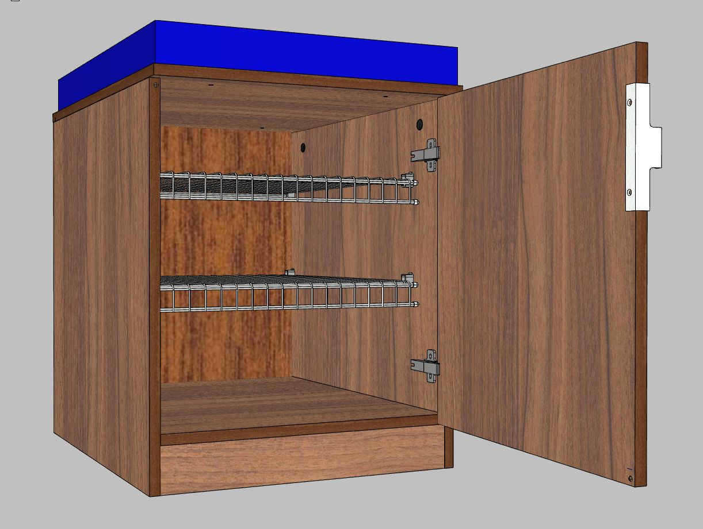

```python
{
    'proto_id': 455,
    'colorcmmater': 22390,  # Цвет корпуса 
    'colorfsmat1': 22390,  # Цвет фасада Прайм 
    'd': 500,  # Глубина 
    'fasrtype1': 10841,  # Рисунок фасада 
    'h': 640,  # Высота 
    'hantype': 24459,  # Тип ручки 
    'hcok': 70,  # Высота цоколя 
    'polkstd1': 0,  # Полки в нишу 
    'polkstd1h1': 0  # Позиция высоты полки 1 
    'polkstd1h2': 0  # Позиция высоты полки 2 
    'polkstd1h3': 0  # Позиция высоты полки 3 
    'polkstd1h4': 0  # Позиция высоты полки 4 
    'polkstd1h5': 0  # Позиция высоты полки 5
    'seat_bk_gap': 16,  # Отступ сзади мягкого сиденья 
    'seatfabrics ': 21746,  # Ткань для мягкого сидения 
    'softseats': 10731,  # Тип мягкого сидения 
    'sotshelf1': 2,  # Полка сетчатая в нижнюю нишу 
    'w': 800,  # Ширина 
    'pusher': 21534,  # Демпфер/Толкатель для "без ручки" Hettich 16904
    'n1delh_1': 0,  # Низ фил выс кол-во делителей 
}
```


### ProtoId 431  РШ Тумба DUO-2

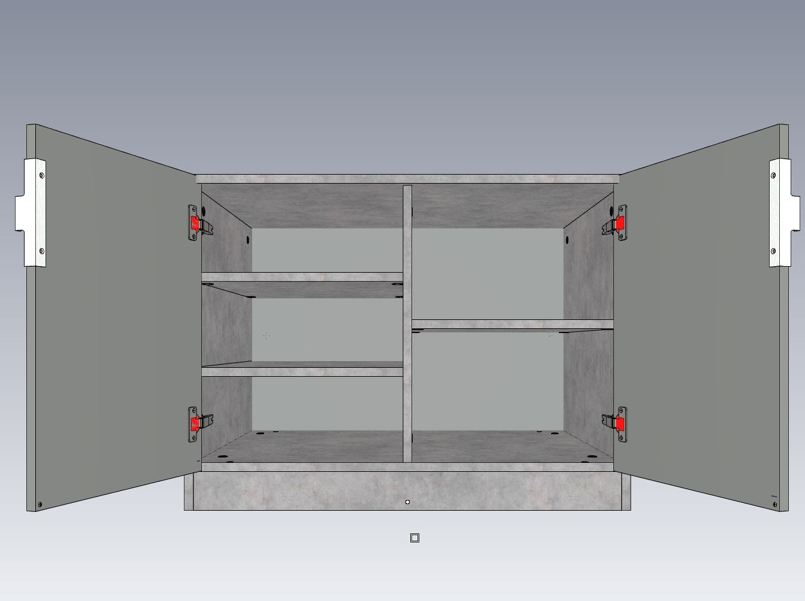

```python
{
    'proto_id': 431,
    'colorcmmater': 22390,  # Цвет корпуса 
    'colorfsmat1': 22390,  # Цвет фасада Прайм 
    'colorfsmat2': 22390,  # Цвет фасада Прайм 
    'd': 600,  # Глубина 
    'fasrtype1': 10841,  # Рисунок фасада 
    'fasrtype2': 10841,  # Рисунок фасада 
    'h': 440,  # Высота 
    'hantype': 24459,  # Тип ручки 
    'hcok': 70,  # Высота цоколя 
    'polkstd1': 0,  # Полки в нишу справа
    'polkstd2': 0,  # Полки в нишу слева
    'polkstd1h1': 0  # Позиция высоты полки 1 в правой нише
    'polkstd1h2': 0  # Позиция высоты полки 2 в правой нише
    'polkstd1h3': 0  # Позиция высоты полки 3 в правой нише
    'polkstd1h4': 0  # Позиция высоты полки 4 в правой нише
    'polkstd1h5': 0  # Позиция высоты полки 5 в правой нише
    'polkstd2h1': 0  # Позиция высоты полки 1 в левой нише
    'polkstd2h2': 0  # Позиция высоты полки 2 в левой нише
    'polkstd2h3': 0  # Позиция высоты полки 3 в левой нише
    'polkstd2h4': 0  # Позиция высоты полки 4 в левой нише
    'polkstd2h5': 0  # Позиция высоты полки 5 в левой нише
    'seat_bk_gap': 0,  # Отступ сзади мягкого сиденья 
    'seatfabrics ': 21746,  # Ткань для мягкого сидения 
    'softseats': 0,  # Тип мягкого сидения 
    'sotshelf1': 0,  # Полка сетчатая в нижнюю нишу 
    'sotshelf2': 0,  # Полка сетчатая в нижнюю нишу 
    'w': 800,  # Ширина 
    'pusher': 21534,  # Демпфер/Толкатель для "без ручки" Hettich 16904
    'n1delh_1': 0,  # Низ фил выс кол-во делителей 
    'n1delh_2': 0,  # Низ фил выс кол-во делителей   
}
```

### ProtoId 432 РШ Тумба DUO-3 левый

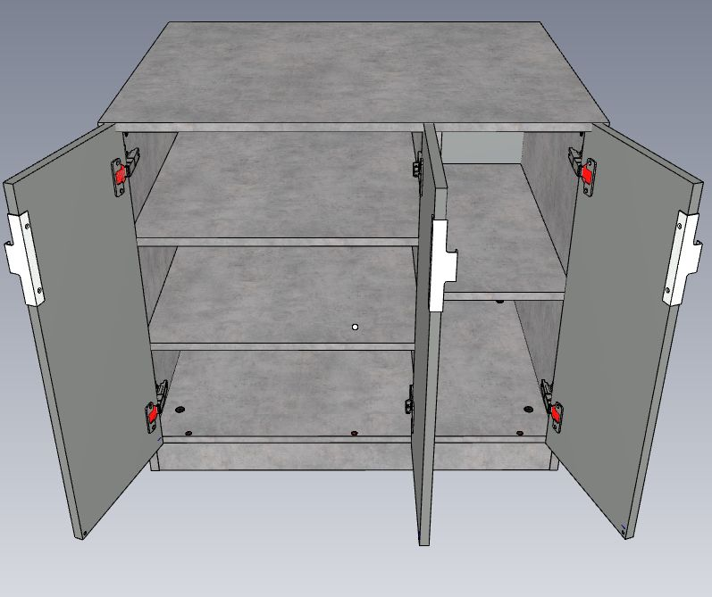

```python
{
    'proto_id': 432,
    'colorcmmater': 22390,  # Цвет корпуса 
    'colorfsmat1': 22390,  # Цвет фасада Прайм 
    'colorfsmat2': 22390,  # Цвет фасада Прайм 
    'd': 600,  # Глубина 
    'fasrtype1': 10841,  # Рисунок фасада 
    'fasrtype2': 10841,  # Рисунок фасада 
    'h': 440,  # Высота 
    'hantype': 24459,  # Тип ручки 
    'hcok': 70,  # Высота цоколя 
    'polkstd1': 0,  # количество полок в нишу справа 
    'polkstd2': 0,  # количество полок в нишу слева
    'polkstd1h1': 0  # Позиция высоты полки 1 в правой нише
    'polkstd1h2': 0  # Позиция высоты полки 2 в правой нише
    'polkstd1h3': 0  # Позиция высоты полки 3 в правой нише
    'polkstd1h4': 0  # Позиция высоты полки 4 в правой нише
    'polkstd1h5': 0  # Позиция высоты полки 5 в правой нише
    'polkstd2h1': 0  # Позиция высоты полки 1 в левой нише
    'polkstd2h2': 0  # Позиция высоты полки 2 в левой нише
    'polkstd2h3': 0  # Позиция высоты полки 3 в левой нише
    'polkstd2h4': 0  # Позиция высоты полки 4 в левой нише
    'polkstd2h5': 0  # Позиция высоты полки 5 в левой нише
    'seat_bk_gap': 0,  # Отступ сзади мягкого сиденья 
    'seatfabrics ': 21746,  # Ткань для мягкого сидения 
    'softseats': 0,  # Тип мягкого сидения 
    'sotshelf1': 0,  # Полка сетчатая в нижнюю нишу 
    'sotshelf2': 0,  # Полка сетчатая в нижнюю нишу 
    'w': 800,  # Ширина 
    'pusher': 21534,  # Демпфер/Толкатель для "без ручки" Hettich 16904
    'n1delh_1': 0,  # Низ фил выс кол-во делителей 
    'n1delh_2': 0,  # Низ фил выс кол-во делителей   
}
```

### ProtoId 433  РШ Тумба DUO-3 правый

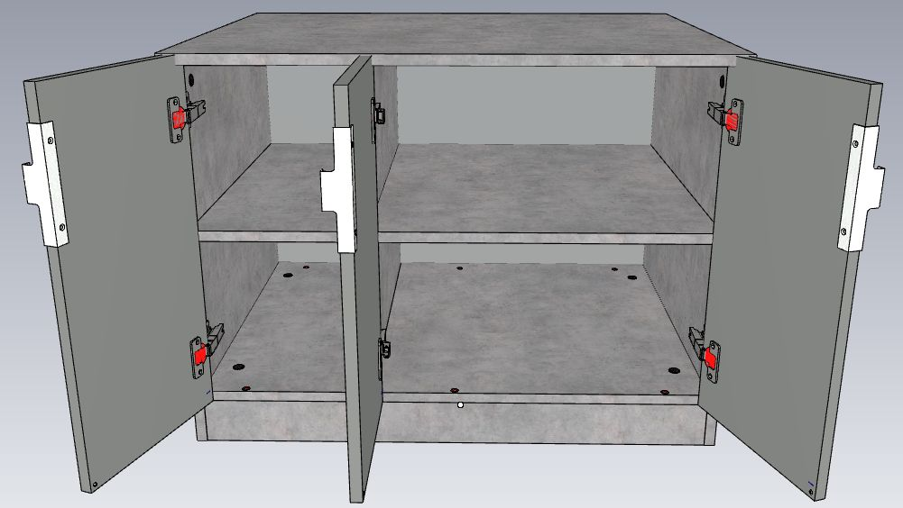

```python
{
    'proto_id': 433,
    'colorcmmater': 22390,  # Цвет корпуса 
    'colorfsmat1': 22390,  # Цвет фасада Прайм 
    'colorfsmat2': 22390,  # Цвет фасада Прайм 
    'd': 600,  # Глубина 
    'fasrtype1': 10841,  # Рисунок фасада 
    'fasrtype2': 10841,  # Рисунок фасада 
    'h': 440,  # Высота 
    'hantype': 24459,  # Тип ручки 
    'hcok': 70,  # Высота цоколя 
    'polkstd1': 0,  # количество полок в нишу справа 
    'polkstd2': 0,  # количество полок в нишу слева
    'polkstd1h1': 0  # Позиция высоты полки 1 в правой нише
    'polkstd1h2': 0  # Позиция высоты полки 2 в правой нише
    'polkstd1h3': 0  # Позиция высоты полки 3 в правой нише
    'polkstd1h4': 0  # Позиция высоты полки 4 в правой нише
    'polkstd1h5': 0  # Позиция высоты полки 5 в правой нише
    'polkstd2h1': 0  # Позиция высоты полки 1 в левой нише
    'polkstd2h2': 0  # Позиция высоты полки 2 в левой нише
    'polkstd2h3': 0  # Позиция высоты полки 3 в левой нише
    'polkstd2h4': 0  # Позиция высоты полки 4 в левой нише
    'polkstd2h5': 0  # Позиция высоты полки 5 в левой нише
    'seat_bk_gap': 0,  # Отступ сзади мягкого сиденья 
    'seatfabrics ': 21746,  # Ткань для мягкого сидения 
    'softseats': 0,  # Тип мягкого сидения 
    'sotshelf1': 0,  # Полка сетчатая в нижнюю нишу 
    'sotshelf2': 0,  # Полка сетчатая в нижнюю нишу 
    'w': 800,  # Ширина 
    'pusher': 21534,  # Демпфер/Толкатель для "без ручки" Hettich 16904
    'n1delh_1': 0,  # Низ фил выс кол-во делителей 
    'n1delh_2': 0,  # Низ фил выс кол-во делителей   
}
```

### ProtoId 456 РШ Тумба MONO-1 навесная с ящиками

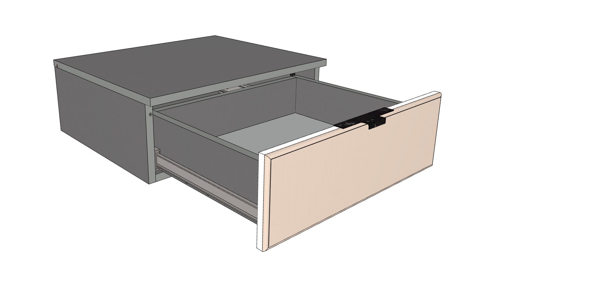

```python
{
'blockbox1': 1,  # random.choice(range(0, 5))         Количество ящиков 
'bxtype': 10804,  # param_randomize(475)               Тип ящика 
'colorcmmater': 22390,  # param_randomize(440)               Цвет корпуса 
'colorfsmat1': 22390,  # param_randomize(440)               Цвет фасада Прайм 
'd': 400,  # random.choice(range(280, 550))     Глубина 
'decofsmatc1': 0,  # param_randomize(454)               MDF Отделка фасада 
'fasrtype1': 10841,  # param_randomize(446)               Рисунок фасада 
'h': 180,  # random.choice(range(150, 600))     Высота 
'hantype': 24459,  # param_randomize(23)                Тип ручки 
'naves': 11787,  # param_randomize(490)               Тип навески 
'w': 500,  # random.choice(range(330, 800))     Ширина 
}
```

### ProtoId 457 РШ Тумба DUO-2 навесная с ящиками

Состоит из двух секций которые могут быть заполнены ящиуками или полками каждая. В случае заполнения полками секция закрывается распашной дверкой

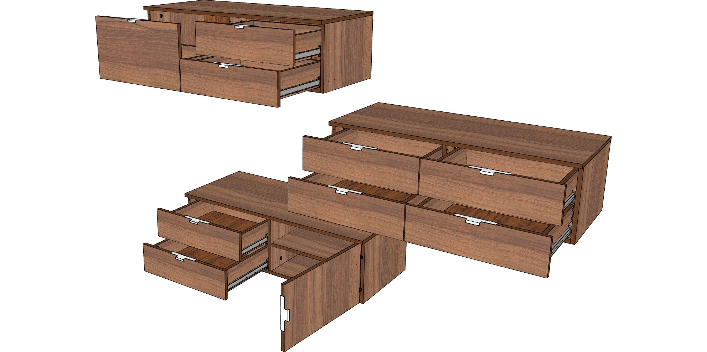

```python
{
'proto_id': 457,
'blockbox1': 1,  # random.choice(range(0, 5))         Количество ящиков 
'blockbox2': 1,  # random.choice(range(0, 5))         Количество ящиков 
'bxtype': 10804,  # param_randomize(475)               Тип ящика 
'colorcmmater': 22390,  # param_randomize(440)               Цвет корпуса 
'colorfsmat1': 22390,  # param_randomize(440)               Цвет фасада Прайм 
'colorfsmat2': 22390,  # param_randomize(440)               Цвет фасада Прайм 
'd': 400,  # random.choice(range(280, 550))     Глубина 
'decofsmatc1': 0,  # param_randomize(454)               MDF Отделка фасада 
'decofsmatc2': 0,  # param_randomize(454)               MDF Отделка фасада 
'fasrtype1': 10841,  # param_randomize(446)               Рисунок фасада 
'fasrtype2': 10841,  # param_randomize(446)               Рисунок фасада 
'h': 180,  # random.choice(range(150, 600))     Высота 
'hantype': 24459,  # param_randomize(23)                Тип ручки 
'naves': 11787,  # param_randomize(490)               Тип навески 
'pusher': 21534,  # param_randomize(127)               Демпфер/Толкатель 
'w': 1000,  # random.choice(range(700, 1200))    Ширина 
}
```

### ProtoId 458 РШ Тумба MONO-1 навесная с полками

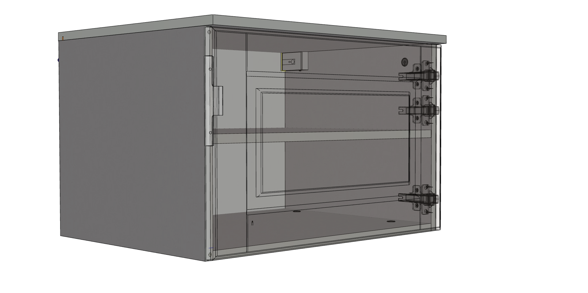

```python
{
    'proto_id': 458,
    'colorcmmater': 22390,  # param_randomize(440)               Цвет корпуса 
    'colorfsmat1': 22390,  # param_randomize(440)               Цвет фасада Прайм 
    'd': 400,  # random.choice(range(150, 550))     Глубина 
    'decofsmatc1': 0,  # param_randomize(454)               MDF Отделка фасада 
    'fasrtype1': 10841,  # param_randomize(446)               Рисунок фасада 
    'h': 440,  # random.choice(range(300, 1350))    Высота 
    'hantype': 24459,  # param_randomize(23)                Тип ручки 
    'naves': 11787,  # param_randomize(490)               Тип навески     '
    'openside1': 1,  # param_randomize(28)                Открывание двери  
    'polkstd1': 1,  # random.choice(range(0, 5))         Полки в нишу 
    'pusher': 21534,  # param_randomize(127)               Демпфер/Толкатель 
    'w': 500,  # random.choice(range(350, 600))     Ширина 
}
```

### ProtoId 459 РШ Тумба MONO-2 навесная с полками

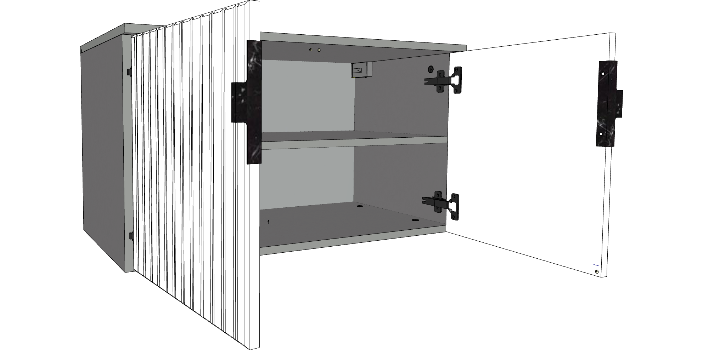

```python
{
    'proto_id': 459,
    'colorcmmater': 22390,  # param_randomize(440)               Цвет корпуса 
    'colorfsmat1': 22390,  # param_randomize(440)               Цвет фасада Прайм 
    'd': 400,  # random.choice(range(150, 550))     Глубина 
    'decofsmatc1': 0,  # param_randomize(454)               MDF Отделка фасада 
    'fasrtype1': 10841,  # param_randomize(446)               Рисунок фасада 
    'h': 440,  # random.choice(range(300, 1350))    Высота 
    'hantype': 24459,  # param_randomize(23)                Тип ручки 
    'naves': 11787,  # param_randomize(490)               Тип навески     '
    'openside1': 1,  # param_randomize(28)                Открывание двери  
    'polkstd1': 1,  # random.choice(range(0, 5))         Полки в нишу 
    'pusher': 21534,  # param_randomize(127)               Демпфер/Толкатель 
    'w': 500,  # random.choice(range(350, 600))     Ширина 
}
```

### ProtoId 460 РШ Тумба DUO-2 навесная с полками


```python
{
    'proto_id': 460,
    'colorcmmater': 22390,  # param_randomize(440)               Цвет корпуса 
    'colorfsmat1': 22390,  # param_randomize(440)               Цвет фасада Прайм 
    'colorfsmat2': 22390,  # param_randomize(440)               Цвет фасада Прайм 
    'd': 400,  # random.choice(range(150, 550))     Глубина 
    'decofsmatc1': 0,  # param_randomize(454)               MDF Отделка фасада 
    'decofsmatc2': 0,  # param_randomize(454)               MDF Отделка фасада 
    'fasrtype1': 10841,  # param_randomize(446)               Рисунок фасада 
    'fasrtype2': 10841,  # param_randomize(446)               Рисунок фасада 
    'h': 440,  # random.choice(range(300, 1350))    Высота 
    'hantype': 24459,  # param_randomize(23)                Тип ручки 
    'naves': 11787,  # param_randomize(490)               Тип навески     '
    'polkstd1': 1,  # random.choice(range(0, 5))         Полки в нишу 
    'polkstd2': 1,  # random.choice(range(0, 5))         Полки в нишу
    'pusher': 21534,  # param_randomize(127)               Демпфер/Толкатель 
    'w': 800,  # random.choice(range(350, 600))     Ширина 
}
```

## Панели

Стеновые панели характеризуют три основных параметра:

- **w** - ширина
- **h** - высота
- **colorcmmater** - цвет материала

для панели с крючками добавляются три параметра:

- **id_mensola** - id менсолы в зависимости от выбраного цвета
- **n_hoock** - количество крючков
- **id_fixnaves** - id крепежа для навеса

### ProtoId 434  РШ Панель с зеркалом

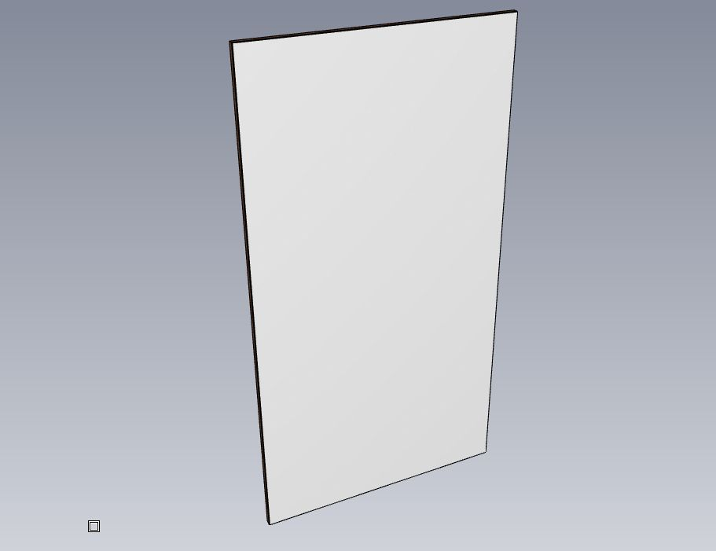

```python
{
    'proto_id': 434,
    'colorcmmater': 22390,  # Цвет корпуса 
    'cutsize_mirr': 1,  #                                    Подрез зеркала по стороне 
    'd': 16,  #                                    Глубина 
    'h': 1500,  # Высота 
    'id_fixkruk': 11236,  # Крепеж в коробку крюк с дюбелем 
    'id_fixnaves': 11234,  # Id Типа крепежа для навеса 
    'id_mirband': 16473,  # Кромка зеркала 
    'id_mirror': 5251,  # Материал зеркала 
    'w': 800,  # Ширина 
}
```

### ProtoId 435  РШ Панель ЛДСП с крючками

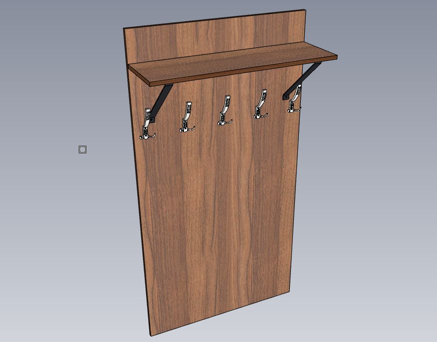

```python
{
    'proto_id': 435,
    'colorcmmater': 22390,  # Цвет корпуса 
    'd': 266,  # Глубина 
    'h': 1500,  # Высота 
    'id_fixkruk': 11236,  # Крепеж в коробку крюк с дюбелем 
    'id_fixnaves': 11234,  # Id Типа крепежа для навеса 
    'id_hoock': 24567,  # ID крючка для одежды
    'id_hoock2': 24568,  # ID крючка 2 ряда для одежды 
    'id_mensola': 24572,  # Менсола для полки 
    'n_hoock': 3,  # Количество крючков 
    'n_hoock2': 1,  # Количество крючков 2 ряда для одежды 
    'w': 800,  # Ширина 
}
```

### ProtoId 452  РШ Панель вешалки с мягкими валиками

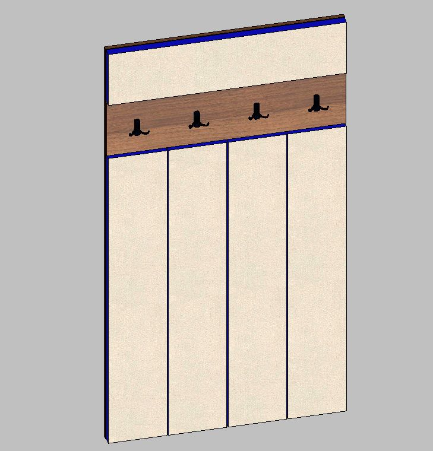

```python
{
    'proto_id': 452,
    'colorcmmater': 22390,  # Цвет корпуса 
    'h': 1500,  # Высота 
    'id_hoock': 24567,  # ID крючка для одежды 
    'id_hoock2': 24568,  # ID крючка 2 ряда для одежды 
    'n_hoock': 3,  # Количество крючков 
    'n_hoock2': 1,  # Количество крючков 2 ряда для одежды 
    'seatfabrics': 21746,  # Ткань для обивки валика 
    'w': 800,  # Ширина 
    'zpos_panhook': 800,  #                                    Положение панели для крючков  
}
```

