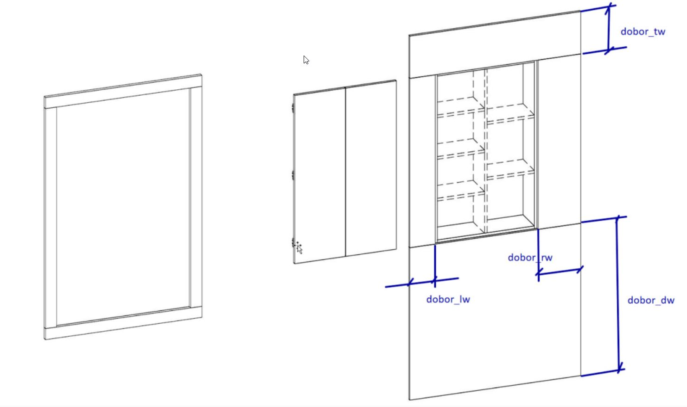

# Шкафы для санузлов

| ProtoID | ProtoName                                           |
| :------ | :-------------------------------------------------- |
| 438     | РШ СУ MONO-1 Шкаф в нишу над инсталляцией           |
| 439     | РШ СУ MONO-2 Шкаф в нишу над инсталляцией           |
| 440     | РШ СУ MONO-1 Корпусной Шкаф в нишу над инсталляцией |
| 441     | РШ СУ MONO-2 Корпусной Шкаф в нишу над инсталляцией |
| 442     | РШ СУ DUO-2 Корпусной Шкаф в нишу над инсталляцией  |
| 443     | РШ СУ MONO-1 Навесной шкаф                          |
| 444     | РШ СУ MONO-2 Навесной шкаф                          |
| 445     | РШ СУ DUO-2 Навесной шкаф                           |
| 446     | РШ СУ MONO-1 Напольный шкаф                         |
| 447     | РШ СУ MONO-2 Напольный шкаф                         |
| 448     | РШ СУ DUO-2 Напольный шкаф                          |

:::{tip}
Каждый тип предназначен для определённой цели и имеет по три модели корпуса: **MONO-1**, **MONO-2** и **DUO-2**.
Шкафы, встраиваемые в нишу над инсталляцией только две модели:  **MONO-1**, **MONO-2**

:::

**MONO-х** – односекционная тумба, цифра в конце названия модели указывает на количество фасадов в тумбе.
**DUO-х** – двухсекционная тумба, цифра в конце названия модели указывает на количество фасадов в тумбе.

## Доборы (дополнительные параметры)

*Шкафы, встраиваемые в нишу над инсталляцией* и *корпусные шкафы, встраиваемые в нишу над инсталляцией* дополнительно комплектуются доборами. Ширина доборов варьируется от 41 до 1200мм. В некоторых случаях доборы могут использоваться в качестве стеновых панелей.

:::{tip}
Доборы - из материала корпуса.

В качестве стеновых - значит, что могут быть разной ширины и закрыть стену.

4 добора. Надо передать только ширину.
если ширина 0, то не ставить. Но при этом минимальный габарит 41 мм
:::



## Шкафы, встраиваемые в нишу над инсталляцией

| Параметры                       | MONO-1   | MONO-2   |
| :------------------------------ | :------- | :------- |
| Количество секций по ширине, шт | 1        | 1        |
| Количество                      | 1        | 2        |
| фасадов, шт                     |          |          |
| Ширина корпуса ШК, мм           | 250-550  | 500-1100 |
| Глубина корпуса                 | 80-300   | 80-300   |
| ГК, мм                          |          |          |
| Высота корпуса                  | 600-1800 | 600-1800 |
| ВК, мм                          |          |          |

### ProtoId 438 РШ СУ MONO-1 Шкаф в нишу над инсталляцией

```
    'proto_id': 438,
    'colorcmmater': 22390,  # param_randomize(440)               Цвет корпуса 
    'colorfsmat1': 22390,  # param_randomize(440)               Цвет фасада Прайм 
    'd': 80,  # random.choice(range(80, 300))      Глубина 
    'decofsmatc1': 0,  # param_randomize(454)               MDF Отделка фасада 
    'dobor_dw': 0,  #                                    Размер добора снизу 
    'dobor_lw': 0,  #                                    Размер добора слева 
    'dobor_rw': 0,  #                                    Размер добора справа 
    'dobor_tw': 0,  #                                    Размер добора сверху 

    'fasrtype1': 10841,  # param_randomize(446)               Рисунок фасада 
    'h': 600,  # random.choice(range(600, 1800))    Высота 
    'hantype': 24459,  # param_randomize(23)                Тип ручки 

    'htwovs1_1': 0,  #                                    От низа до середины первой перемычки 
    'htwovs2_1': 0,  #                                    От верха до середины второй перемычки 
    'htwovs3_1': 0,  #                                    От низа до середины третьей перемычки 

    'n1delh': 0,  # param_randomize(367)               Низ фил выс кол-во делителей 
    'n1delh_1': 0,  # param_randomize(367)               Низ фил выс кол-во делителей 
    'n1delw': 0,  # param_randomize(368)               Низ фил шир кол-во делителей 
    'n1delw_1': 0,  # param_randomize(368)               Низ фил шир кол-во делителей 

    'openside1': 1,  # param_randomize(28)                Открывание двери 

    'polkstd1': 0,  # random.choice(range(0, 5))         Полки в нишу 
    'polkstd1d1': 100,  #                                    Глубина полки 1 
    'polkstd1d2': 100,  #                                    Глубина полки 2 
    'polkstd1d3': 100,  #                                    Глубина полки 3 
    'polkstd1d4': 100,  #                                    Глубина полки 4 
    'polkstd1d5': 100,  #                                    Глубина полки 5 
    'polkstd1h1': 0,  #                                    Позиция высоты полки 1 
    'polkstd1h2': 0,  #                                    Позиция высоты полки 2 
    'polkstd1h3': 0,  #                                    Позиция высоты полки 3 
    'polkstd1h4': 0,  #                                    Позиция высоты полки 4 
    'polkstd1h5': 0,  #                                    Позиция высоты полки 5 
    'polkstd1w1': 0,  #                                    Ширина полки 1 
    'polkstd1w2': 0,  #                                    Ширина полки 2 
    'polkstd1w3': 0,  #                                    Ширина полки 3 
    'polkstd1w4': 0,  #                                    Ширина полки 4 
    'polkstd1w5': 0,  #                                    Ширина полки 5 
    'poshinge21': 1,  #                                    Сдвиг верхней или левой петли 
    'poshinge22': 0,  #                                    Сдвиг нижней или правой петли 

    'pusher': 21534,  # param_randomize(127)               Демпфер/Толкатель 
    
    'typevs1_1': 1,  # param_randomize(455)               Тип нижней филёнки 
    'typevs2_1': 1,  # param_randomize(455)               Тип средней филёнки 
    'typevs3_1': 1,  # param_randomize(455)               Тип верхней филёнки 
    'w': 500,  # random.choice(range(250, 550))     Ширина 
```

### ProtoId 439 РШ СУ MONO-2 Шкаф в нишу над инсталляцией

## Корпусные шкафы, встраиваемые в нишу над инсталляцией

| Параметры                       | MONO-1   | MONO-2   | DUO-2    |
| :------------------------------ | :------- | :------- | :------- |
| Количество секций по ширине, шт | 1        | 1        | 2        |
| Количество                      | 1        | 2        | 2        |
| фасадов, шт                     |          |          |          |
| Ширина корпуса ШК, мм           | 250-550  | 500-1100 | 500-1100 |
| Глубина корпуса                 | 130-350  | 130-350  | 130-350  |
| ГК, мм                          |          |          |          |
| Высота корпуса                  | 600-1800 | 600-1800 | 600-1800 |
| ВК, мм                          |          |          |          |

### ProtoId 440 РШ СУ MONO-1 Корпусной Шкаф в нишу над инсталляцией

### ProtoId 441 РШ СУ MONO-2 Корпусной Шкаф в нишу над инсталляцией

### ProtoId 442 РШ СУ DUO-2 Корпусной Шкаф в нишу над инсталляцией

## Навесные шкафы

| Параметры                       | MONO-1   | MONO-2   | DUO-2    |
| :------------------------------ | :------- | :------- | :------- |
| Количество секций по ширине, шт | 1        | 1        | 2        |
| Количество                      | 1        | 2        | 2        |
| фасадов, шт                     |          |          |          |
| Ширина корпуса ШК, мм           | 250-550  | 500-1100 | 500-1100 |
| Глубина корпуса                 | 130-350  | 130-350  | 130-350  |
| ГК, мм                          |          |          |          |
| Высота корпуса                  | 400-1200 | 400-1200 | 400-1200 |
| ВК, мм                          |          |          |          |

### ProtoId 443 РШ СУ MONO-1 Навесной шкаф

### ProtoId 444 РШ СУ MONO-2 Навесной шкаф

### ProtoId 445 РШ СУ DUO-2 Навесной шкаф

## Напольные шкафы

| Параметры                       | MONO-1   | MONO-2   | DUO-2    |
| :------------------------------ | :------- | :------- | :------- |
| Количество секций по ширине, шт | 1        | 1        | 2        |
| Количество                      | 1        | 2        | 2        |
| фасадов, шт                     |          |          |          |
| Ширина корпуса ШК, мм           | 250-550  | 500-1100 | 500-1100 |
| Глубина корпуса                 | 200-550  | 200-550  | 200-550  |
| ГК, мм                          |          |          |          |
| Высота корпуса                  | 400-2880 | 400-2880 | 400-2880 |
| ВК, мм                          |          |          |          |

### ProtoId 446 РШ СУ MONO-1 Напольный шкаф

### ProtoId 447 РШ СУ MONO-2 Напольный шкаф

### ProtoId 448 РШ СУ DUO-2 Напольный шкаф