# Шкафы для санузлов

| ProtoID | ProtoName                                           |
| :------ | :-------------------------------------------------- |
| 438     | РШ СУ MONO-1 Шкаф в нишу над инсталляцией           |
| 439     | РШ СУ MONO-2 Шкаф в нишу над инсталляцией           |
| 440     | РШ СУ MONO-1 Корпусной Шкаф в нишу над инсталляцией |
| 441     | РШ СУ MONO-2 Корпусной Шкаф в нишу над инсталляцией |
| 442     | РШ СУ DUO-2 Корпусной Шкаф в нишу над инсталляцией  |
| 443     | РШ СУ MONO-1 Навесной шкаф                          |
| 444     | РШ СУ MONO-2 Навесной шкаф                          |
| 445     | РШ СУ DUO-2 Навесной шкаф                           |
| 446     | РШ СУ MONO-1 Напольный шкаф                         |
| 447     | РШ СУ MONO-2 Напольный шкаф                         |
| 448     | РШ СУ DUO-2 Напольный шкаф                          |

:::{tip}
Каждый тип предназначен для определённой цели и имеет по три модели корпуса: **MONO-1**, **MONO-2** и **DUO-2**.
Шкафы, встраиваемые в нишу над инсталляцией только две модели:  **MONO-1**, **MONO-2**

:::

**MONO-х** – односекционная тумба, цифра в конце названия модели указывает на количество фасадов в тумбе.
**DUO-х** – двухсекционная тумба, цифра в конце названия модели указывает на количество фасадов в тумбе.

## Доборы (дополнительные параметры)

*Шкафы, встраиваемые в нишу над инсталляцией* и *корпусные шкафы, встраиваемые в нишу над инсталляцией* дополнительно комплектуются доборами. Ширина доборов варьируется от 41 до 1200мм. В некоторых случаях доборы могут использоваться в качестве стеновых панелей.

:::{tip}
Доборы - из материала <s>корпуса</s>.
24.06.2025 Пересмотрен вариант.
Теперь он может быть из любого материала.
В расчетчике будет выбор из всех вариантов плитного.
Если фасад в пленке (праймикс, вальс и спарта) то эти материалы не доступны для выбора.

В общем - выбор материала для доборов **должен быть отдельным и из ЛДСП**.

В качестве стеновых - значит, что могут быть разной ширины и закрыть стену.

4 добора. Надо передать только ширину.
если ширина 0, то не ставить. Но при этом минимальный габарит 41 мм
:::


## Шкафы, встраиваемые в нишу над инсталляцией

| Параметры                       | MONO-1   | MONO-2   |
| :------------------------------ | :------- | :------- |
| Количество секций по ширине, шт | 1        | 1        |
| Количество                      | 1        | 2        |
| фасадов, шт                     |          |          |
| Ширина корпуса ШК, мм           | 250-550  | 500-1100 |
| Глубина корпуса                 | 80-300   | 80-300   |
| ГК, мм                          |          |          |
| Высота корпуса                  | 600-1800 | 600-1800 |
| ВК, мм                          |          |          |

### ProtoId 438 РШ СУ MONO-1 Шкаф в нишу над инсталляцией

:::{important}

Для парметра `fix_shelve` Тип крепежа полок смотри
[Типы полкодержателей](https://alexandrdragunkin.github.io/arparmcatalog/prim#id)

По умолчанию передавать *Комплект Бетон (id.454)* **10992** Если 0 - значит без полкодержателя.
:::

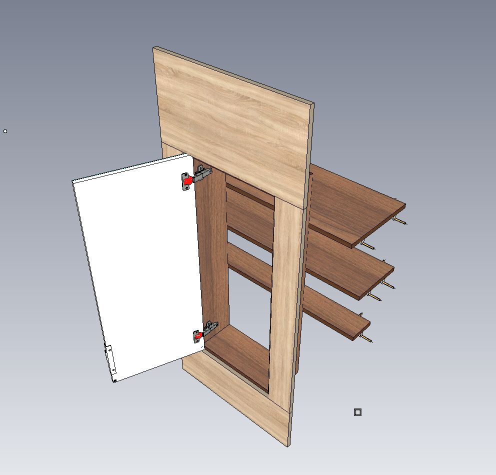

```python
       {'proto_id': 438,
 
       'colorcmmater': 22390,  # param_randomize(440)               Цвет корпуса 

        'colordbmater': 22390,  # param_randomize(440)               Цвет добора 

        'colorfsmat1': 22390,  # param_randomize(440)               Цвет фасада Прайм 

        'd': 80,  # random.choice(range(80, 300))      Глубина 

        'dbmater': 5198,  # param_randomize(330)               Материал добора 

        'decofsmatc1': 0,  # param_randomize(454)               MDF Отделка фасада 

        'dobor_dw': 0,  #                                    Размер добора снизу 
        'dobor_lw': 0,  #                                    Размер добора слева 
        'dobor_rw': 0,  #                                    Размер добора справа 
        'dobor_tw': 0,  #                                    Размер добора сверху 

        'fasrtype1': 10841,  # param_randomize(446)               Рисунок фасада 

        'fix_shelve': 10992,  # param_randomize(488)               Тип крепежа полок 

        'h': 600,  # random.choice(range(600, 1800))    Высота 

        'hantype': 24459,  # param_randomize(23)                Тип ручки 

        'hdsp_k': 16,  #                                    Толщина панелей каркаса 
        'hinge_shift': 0,  #                                    До центра чашки петли от края 
        'htwovs1_1': 0,  #                                    От низа до середины первой перемычки 
        'htwovs2_1': 0,  #                                    От верха до середины второй перемычки 
        'htwovs3_1': 0,  #                                    От низа до середины третьей перемычки 

        'n_correctors': 0,  # random.choice(range(0, 4))         Предписанное число корректоров (0-авто) 
        'n1delh': 0,  # param_randomize(367)               Низ фил выс кол-во делителей 
        'n1delh_1': 0,  # param_randomize(367)               Низ фил выс кол-во делителей 
        'n1delw': 0,  # param_randomize(368)               Низ фил шир кол-во делителей 
        'n1delw_1': 0,  # param_randomize(368)               Низ фил шир кол-во делителей 

        'openside1': 1,  # param_randomize(28)                Открывание двери 

        'polkstd1': 0,  # random.choice(range(0, 5))         Полки в нишу количество

        'polkstd1d1': 100,  #                                    Глубина полки 1 
        'polkstd1d2': 100,  #                                    Глубина полки 2 
        'polkstd1d3': 100,  #                                    Глубина полки 3 
        'polkstd1d4': 100,  #                                    Глубина полки 4 
        'polkstd1d5': 100,  #                                    Глубина полки 5 
        'polkstd1h1': 0,  #                                    Позиция высоты полки 1 
        'polkstd1h2': 0,  #                                    Позиция высоты полки 2 
        'polkstd1h3': 0,  #                                    Позиция высоты полки 3 
        'polkstd1h4': 0,  #                                    Позиция высоты полки 4 
        'polkstd1h5': 0,  #                                    Позиция высоты полки 5 
        'polkstd1w1': 0,  #                                    Ширина полки 1 
        'polkstd1w2': 0,  #                                    Ширина полки 2 
        'polkstd1w3': 0,  #                                    Ширина полки 3 
        'polkstd1w4': 0,  #                                    Ширина полки 4 
        'polkstd1w5': 0,  #                                    Ширина полки 5 

        'pusher': 21534,  # param_randomize(127)               Демпфер/Толкатель 

        'typevs1_1': 1,  # param_randomize(455)               Тип нижней филёнки 
        'typevs2_1': 1,  # param_randomize(455)               Тип средней филёнки 
        'typevs3_1': 1,  # param_randomize(455)               Тип верхней филёнки 

        'w': 500,  # random.choice(range(250, 550))     Ширина 

}
```

### ProtoId 439 РШ СУ MONO-2 Шкаф в нишу над инсталляцией

:::{important}

Для парметра `fix_shelve` Тип крепежа полок смотри
[Типы полкодержателей](https://alexandrdragunkin.github.io/arparmcatalog/prim#id)

По умолчанию передавать *Комплект Бетон (id.454)* **10992** Если 0 - значит без полкодержателя.
:::

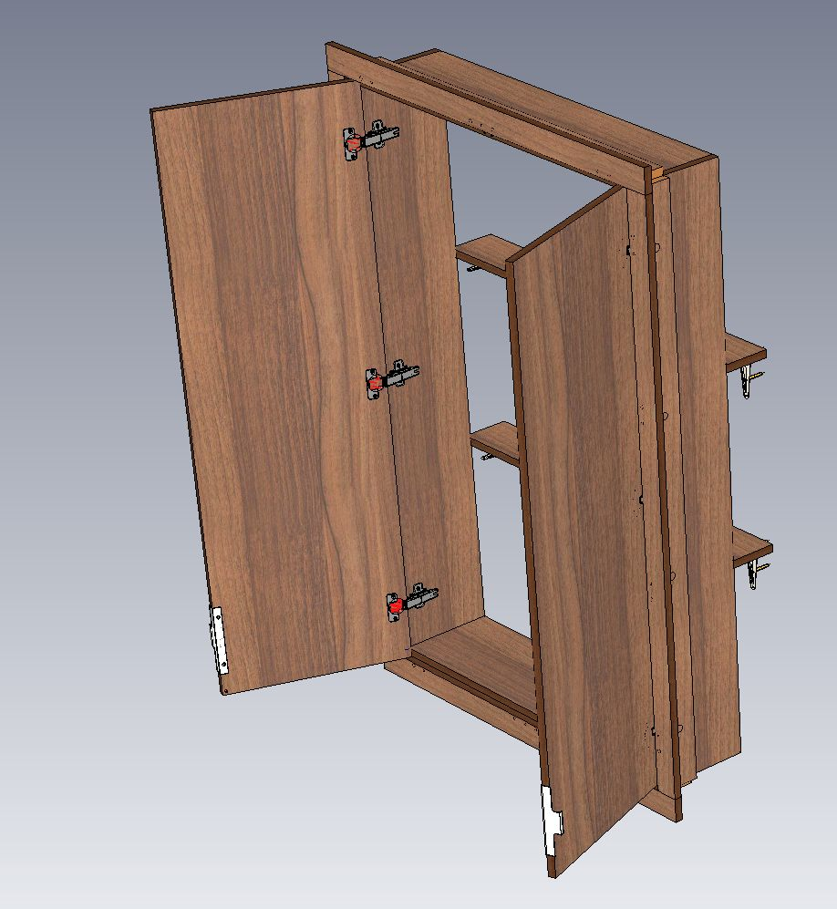

```python
       {'proto_id': 439,

        'colorcmmater': 22390,  # param_randomize(440)               Цвет корпуса 

        'colordbmater': 22390,  # param_randomize(440)               Цвет добора 

        'colorfsmat1': 22390,  # param_randomize(440)               Цвет фасада Прайм 

        'd': 80,  # random.choice(range(80, 300))      Глубина 

        'dbmater': 5198,  # param_randomize(330)               Материал добора 
        'decofsmatc1': 0,  # param_randomize(454)               MDF Отделка фасада 

        'dobor_dw': 0,  #                                    Размер добора снизу 
        'dobor_lw': 0,  #                                    Размер добора слева 
        'dobor_rw': 0,  #                                    Размер добора справа 
        'dobor_tw': 0,  #                                    Размер добора сверху 


        'fasrtype1': 10841,  # param_randomize(446)               Рисунок фасада 

        'fix_shelve': 10992,  # param_randomize(488)               Тип крепежа полок 

        'h': 600,  # random.choice(range(600, 1800))    Высота 

        'hantype': 24459,  # param_randomize(23)                Тип ручки 

        'htwovs1_1': 0,  #                                    От низа до середины первой перемычки 
        'htwovs2_1': 0,  #                                    От верха до середины второй перемычки 
        'htwovs3_1': 0,  #                                    От низа до середины третьей перемычки 

        'n1delh_1': 0,  # param_randomize(367)               Низ фил выс кол-во делителей 
        'n1delw_1': 0,  # param_randomize(368)               Низ фил шир кол-во делителей 

        'polkstd1': 0,  # random.choice(range(0, 5))         Полки в нишу 
        'polkstd1d1': 100,  #                                    Глубина полки 1 
        'polkstd1d2': 100,  #                                    Глубина полки 2 
        'polkstd1d3': 100,  #                                    Глубина полки 3 
        'polkstd1d4': 100,  #                                    Глубина полки 4 
        'polkstd1d5': 100,  #                                    Глубина полки 5 
        'polkstd1h1': 0,  #                                    Позиция высоты полки 1 
        'polkstd1h2': 0,  #                                    Позиция высоты полки 2 
        'polkstd1h3': 0,  #                                    Позиция высоты полки 3 
        'polkstd1h4': 0,  #                                    Позиция высоты полки 4 
        'polkstd1h5': 0,  #                                    Позиция высоты полки 5 
        'polkstd1w1': 0,  #                                    Ширина полки 1 
        'polkstd1w2': 0,  #                                    Ширина полки 2 
        'polkstd1w3': 0,  #                                    Ширина полки 3 
        'polkstd1w4': 0,  #                                    Ширина полки 4 
        'polkstd1w5': 0,  #                                    Ширина полки 5 

        'pusher': 21534,  # param_randomize(127)               Демпфер/Толкатель 

        'typevs1_1': 1,  # param_randomize(455)               Тип нижней филёнки 
        'typevs2_1': 1,  # param_randomize(455)               Тип средней филёнки 
        'typevs3_1': 1,  # param_randomize(455)               Тип верхней филёнки 
        
        'w': 800,  # random.choice(range(500, 1100))    Ширина 
}
```

## Корпусные шкафы, встраиваемые в нишу над инсталляцией

| Параметры                       | MONO-1   | MONO-2   | DUO-2    |
| :------------------------------ | :------- | :------- | :------- |
| Количество секций по ширине, шт | 1        | 1        | 2        |
| Количество                      | 1        | 2        | 2        |
| фасадов, шт                     |          |          |          |
| Ширина корпуса ШК, мм           | 250-550  | 500-1100 | 500-1100 |
| Глубина корпуса                 | 130-350  | 130-350  | 130-350  |
| ГК, мм                          |          |          |          |
| Высота корпуса                  | 600-1800 | 600-1800 | 600-1800 |
| ВК, мм                          |          |          |          |

### ProtoId 440 РШ СУ MONO-1 Корпусной Шкаф в нишу над инсталляцией

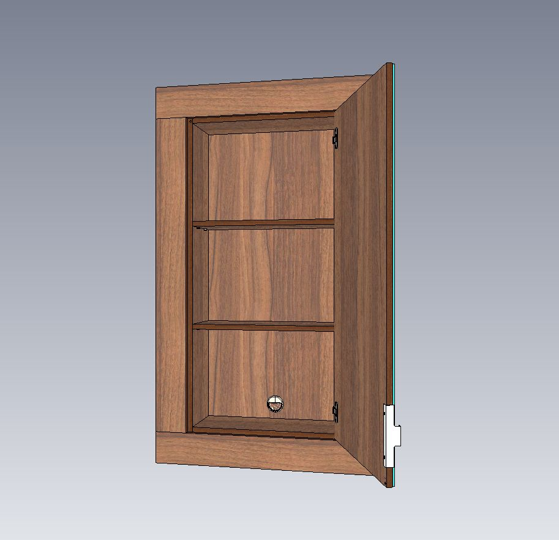

```python
       {'proto_id': 440,

        'colorcmmater': 22390,  # param_randomize(440)               Цвет корпуса 

        'colordbmater': 22390,  # param_randomize(440)               Цвет добора 

        'colorfsmat1': 22390,  # param_randomize(440)               Цвет фасада Прайм 

        'd': 200,  # random.choice(range(130, 350))     Глубина 

        'dbmater': 5198,  # param_randomize(330)               Материал добора 

        'decofsmatc1': 0,  # param_randomize(454)               MDF Отделка фасада 

        'dobor_dw': 0,  #                                    Размер добора снизу 
        'dobor_lw': 0,  #                                    Размер добора слева 
        'dobor_rw': 0,  #                                    Размер добора справа 
        'dobor_tw': 0,  #                                    Размер добора сверху 

        'h': 600,  # random.choice(range(600, 1800))    Высота 

        'handlebw': 25393,  # param_randomize(23)                Ручка задней стенки 
        'hantype': 24459,  # param_randomize(23)                Тип ручки 

        'htwovs1_1': 0,  #                                    От низа до середины первой перемычки 
        'htwovs2_1': 0,  #                                    От верха до середины второй перемычки 
        'htwovs3_1': 0,  #                                    От низа до середины третьей перемычки 
 
        'n1delh': 0,  # param_randomize(367)               Низ фил выс кол-во делителей 
        'n1delh_1': 0,  # param_randomize(367)               Низ фил выс кол-во делителей 
        'n1delw': 0,  # param_randomize(368)               Низ фил шир кол-во делителей 
        'n1delw_1': 0,  # param_randomize(368)               Низ фил шир кол-во делителей 

        'openside1': 1,  # param_randomize(28)                Открывание двери 

        'polkstd1': 0,  # random.choice(range(0, 5))         Полки в нишу 
        'polkstd1h1': 0,  #                                    Позиция высоты полки 1 
        'polkstd1h2': 0,  #                                    Позиция высоты полки 2 
        'polkstd1h3': 0,  #                                    Позиция высоты полки 3 
        'polkstd1h4': 0,  #                                    Позиция высоты полки 4 
        'polkstd1h5': 0,  #                                    Позиция высоты полки 5 


        'pusher': 21534,  # param_randomize(127)               Демпфер/Толкатель 

        'typevs1_1': 1,  # param_randomize(455)               Тип нижней филёнки 
        'typevs2_1': 1,  # param_randomize(455)               Тип средней филёнки 
        'typevs3_1': 1,  # param_randomize(455)               Тип верхней филёнки 
        'w': 500,  # random.choice(range(250, 550))     Ширина 
}
```

### ProtoId 441 РШ СУ MONO-2 Корпусной Шкаф в нишу над инсталляцией

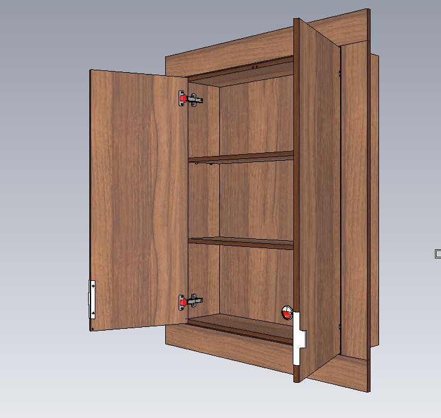

```python
       {'proto_id': 441,

        'colorcmmater': 22390,  # param_randomize(440)               Цвет корпуса 
        'colordbmater': 22390,  # param_randomize(440)               Цвет добора 

        'colorfsmat1': 22390,  # param_randomize(440)               Цвет фасада Прайм 
        'd': 200,  # random.choice(range(130, 350))     Глубина 

        'dbmater': 5198,  # param_randomize(330)               Материал добора 
        'decofsmatc1': 0,  # param_randomize(454)               MDF Отделка фасада 

        'dobor_dw': 0,  #                                    Размер добора снизу 
        'dobor_lw': 0,  #                                    Размер добора слева 
        'dobor_rw': 0,  #                                    Размер добора справа 
        'dobor_tw': 0,  #                                    Размер добора сверху 

        'fasrtype1': 10841,  # param_randomize(446)               Рисунок фасада 

        'h': 600,  # random.choice(range(600, 1800))    Высота 

        'hantype': 24459,  # param_randomize(23)                Тип ручки 

        'hinge_shift': 0,  #                                    До центра чашки петли от края 
        'htwovs1_1': 0,  #                                    От низа до середины первой перемычки 
        'htwovs2_1': 0,  #                                    От верха до середины второй перемычки 
        'htwovs3_1': 0,  #                                    От низа до середины третьей перемычки 

        'n1delh_1': 0,  # param_randomize(367)               Низ фил выс кол-во делителей 
        'n1delw_1': 0,  # param_randomize(368)               Низ фил шир кол-во делителей 


        'polkstd1': 0,  # random.choice(range(0, 5))         Полки в нишу 
        'polkstd1h1': 0,  #                                    Позиция высоты полки 1 
        'polkstd1h2': 0,  #                                    Позиция высоты полки 2 
        'polkstd1h3': 0,  #                                    Позиция высоты полки 3 
        'polkstd1h4': 0,  #                                    Позиция высоты полки 4 
        'polkstd1h5': 0,  #                                    Позиция высоты полки 5 

        'pusher': 21534,  # param_randomize(127)               Демпфер/Толкатель 

        'typevs1_1': 1,  # param_randomize(455)               Тип нижней филёнки 
        'typevs2_1': 1,  # param_randomize(455)               Тип средней филёнки 
        'typevs3_1': 1,  # param_randomize(455)               Тип верхней филёнки 

        'w': 800,  # random.choice(range(500, 1100))    Ширина 

}
```

### ProtoId 442 РШ СУ DUO-2 Корпусной Шкаф в нишу над инсталляцией

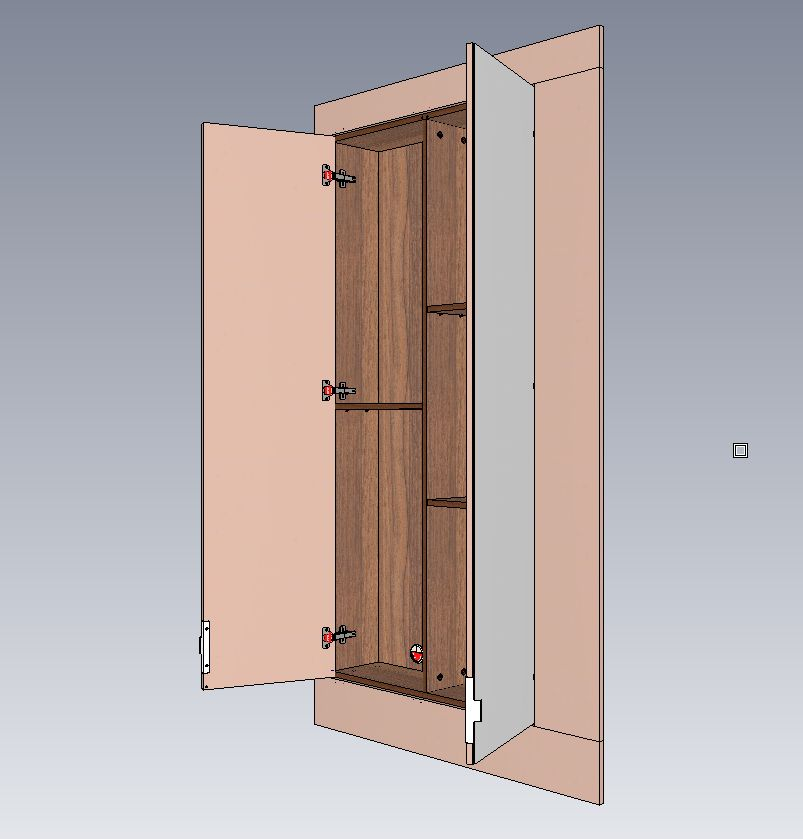

```python
       {'proto_id': 442,

        'colorcmmater': 22390,  # param_randomize(440)               Цвет корпуса 

        'colordbmater': 22390,  # param_randomize(440)               Цвет добора 

        'colorfsmat1': 22390,  # param_randomize(440)               Цвет фасада Прайм 
        'colorfsmat2': 22390,  # param_randomize(440)               Цвет фасада Прайм 

        'd': 200,  # random.choice(range(130, 350))     Глубина 

        'dbmater': 5198,  # param_randomize(330)               Материал добора 

        'decofsmatc1': 0,  # param_randomize(454)               MDF Отделка фасада 
        'decofsmatc2': 0,  # param_randomize(454)               MDF Отделка фасада 

        'dobor_dw': 0,  #                                    Размер добора снизу 
        'dobor_lw': 0,  #                                    Размер добора слева 
        'dobor_rw': 0,  #                                    Размер добора справа 
        'dobor_tw': 0,  #                                    Размер добора сверху 

        'fasrtype1': 10841,  # param_randomize(446)               Рисунок фасада 
        'fasrtype2': 10841,  # param_randomize(446)               Рисунок фасада 

        'h': 600,  # random.choice(range(600, 1800))    Высота 

        'hantype': 24459,  # param_randomize(23)                Тип ручки 

        'htwovs1_1': 0,  #                                    От низа до середины первой перемычки 
        'htwovs1_2': 0,  #                                    От низа до середины первой перемычки 
        'htwovs2_1': 0,  #                                    От верха до середины второй перемычки 
        'htwovs2_2': 0,  #                                    От верха до середины второй перемычки 
        'htwovs3_1': 0,  #                                    От низа до середины третьей перемычки 
        'htwovs3_2': 0,  #                                    От низа до середины третьей перемычки 

        'n1delh_1': 0,  # param_randomize(367)               Низ фил выс кол-во делителей 
        'n1delh_2': 0,  # param_randomize(367)               Низ фил выс кол-во делителей 
        'n1delw_1': 0,  # param_randomize(368)               Низ фил шир кол-во делителей 
        'n1delw_2': 0,  # param_randomize(368)               Низ фил шир кол-во делителей 


        'polkstd1': 0,  # random.choice(range(0, 5))         Полки в нишу 
        'polkstd1h1': 0,  #                                    Позиция высоты полки 1 
        'polkstd1h2': 0,  #                                    Позиция высоты полки 2 
        'polkstd1h3': 0,  #                                    Позиция высоты полки 3 
        'polkstd1h4': 0,  #                                    Позиция высоты полки 4 
        'polkstd1h5': 0,  #                                    Позиция высоты полки 5 

        'polkstd2': 0,  # random.choice(range(0, 5))         Полки в нишу 
        'polkstd2h1': 0,  #                                    Позиция высоты полки 1 
        'polkstd2h2': 0,  #                                    Позиция высоты полки 2 
        'polkstd2h3': 0,  #                                    Позиция высоты полки 3 
        'polkstd2h4': 0,  #                                    Позиция высоты полки 4 
        'polkstd2h5': 0,  #                                    Позиция высоты полки 5 

        'pusher': 21534,  # param_randomize(127)               Демпфер/Толкатель 

        'typevs1_1': 1,  # param_randomize(455)               Тип нижней филёнки 
        'typevs1_2': 1,  # param_randomize(455)               Тип нижней филёнки 
        'typevs2_1': 1,  # param_randomize(455)               Тип средней филёнки 
        'typevs2_2': 1,  # param_randomize(455)               Тип средней филёнки 
        'typevs3_1': 1,  # param_randomize(455)               Тип верхней филёнки 
        'typevs3_2': 1,  # param_randomize(455)               Тип верхней филёнки 
        'w': 800,  # random.choice(range(500, 1100))    Ширина 

}
```

## Навесные шкафы

| Параметры                       | MONO-1   | MONO-2   | DUO-2    |
| :------------------------------ | :------- | :------- | :------- |
| Количество секций по ширине, шт | 1        | 1        | 2        |
| Количество                      | 1        | 2        | 2        |
| фасадов, шт                     |          |          |          |
| Ширина корпуса ШК, мм           | 250-550  | 500-1100 | 500-1100 |
| Глубина корпуса                 | 130-350  | 130-350  | 130-350  |
| ГК, мм                          |          |          |          |
| Высота корпуса                  | 400-1200 | 400-1200 | 400-1200 |
| ВК, мм                          |          |          |          |

### ProtoId 443 РШ СУ MONO-1 Навесной шкаф

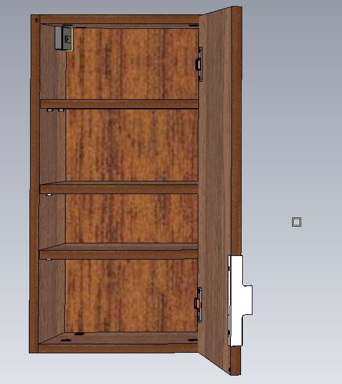

```python
{
        'proto_id': 443,

        'colorcmmater': 22390,  # param_randomize(440)               Цвет корпуса 
        'colorfsmat1': 22390,  # param_randomize(440)               Цвет фасада Прайм 
        'd': 200,  # random.choice(range(130, 350))     Глубина 
        'decofsmatc1': 0,  # param_randomize(454)               MDF Отделка фасада 

        'fasrtype1': 10841,  # param_randomize(446)               Рисунок фасада 

        'h': 600,  # random.choice(range(400, 1200))    Высота 
        'hantype': 24459,  # param_randomize(23)                Тип ручки 

        'openside1': 1,  # param_randomize(28)                Открывание двери 

        'polkstd1': 0,  # random.choice(range(0, 5))         Полки в нишу 
        'polkstd1h1': 0,  #                                    Позиция высоты полки 1 
        'polkstd1h2': 0,  #                                    Позиция высоты полки 2 
        'polkstd1h3': 0,  #                                    Позиция высоты полки 3 
        'polkstd1h4': 0,  #                                    Позиция высоты полки 4 
        'polkstd1h5': 0,  #                                    Позиция высоты полки 5 

        'pusher': 21534,  # param_randomize(127)               Демпфер/Толкатель 

        'w': 500,  # random.choice(range(250, 550))     Ширина 
    }
```

### ProtoId 444 РШ СУ MONO-2 Навесной шкаф

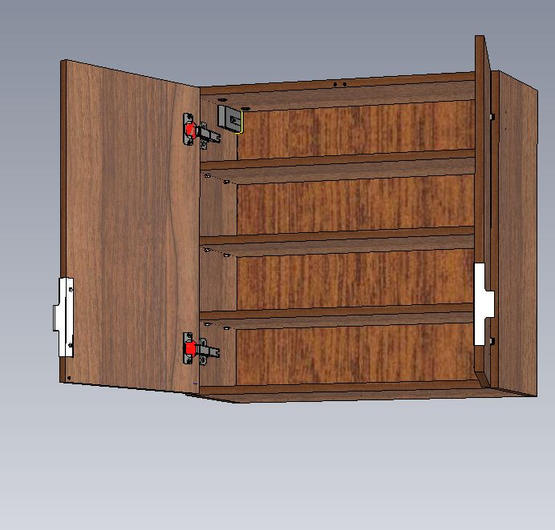

```python
{
        'proto_id': 444,

        'colorcmmater': 22390,  # param_randomize(440)               Цвет корпуса 
        'colorfsmat1': 22390,  # param_randomize(440)               Цвет фасада Прайм 
        'd': 200,  # random.choice(range(130, 350))     Глубина 
        'decofsmatc1': 0,  # param_randomize(454)               MDF Отделка фасада 


        'fasrtype1': 10841,  # param_randomize(446)               Рисунок фасада 
        'h': 600,  # random.choice(range(400, 1200))    Высота 
        'hantype': 24459,  # param_randomize(23)                Тип ручки 

       
        'htwovs1_1': 0,  #                                    От низа до середины первой перемычки 
        'htwovs2_1': 0,  #                                    От верха до середины второй перемычки 
        'htwovs3_1': 0,  #                                    От низа до середины третьей перемычки 
        
        'n1delh_1': 0,  # param_randomize(367)               Низ фил выс кол-во делителей 
        'n1delw_1': 0,  # param_randomize(368)               Низ фил шир кол-во делителей 
       
        'polkstd1': 0,  # random.choice(range(0, 5))         Полки в нишу 

        'polkstd1h1': 0,  #                                    Позиция высоты полки 1 
        'polkstd1h2': 0,  #                                    Позиция высоты полки 2 
        'polkstd1h3': 0,  #                                    Позиция высоты полки 3 
        'polkstd1h4': 0,  #                                    Позиция высоты полки 4 
        'polkstd1h5': 0,  #                                    Позиция высоты полки 5 


        'pusher': 21534,  # param_randomize(127)               Демпфер/Толкатель 

        'typevs1_1': 1,  # param_randomize(455)               Тип нижней филёнки 
        'typevs2_1': 1,  # param_randomize(455)               Тип средней филёнки 
        'typevs3_1': 1,  # param_randomize(455)               Тип верхней филёнки 
        'w': 800,  # random.choice(range(500, 1100))    Ширина 
    }
```

### ProtoId 445 РШ СУ DUO-2 Навесной шкаф

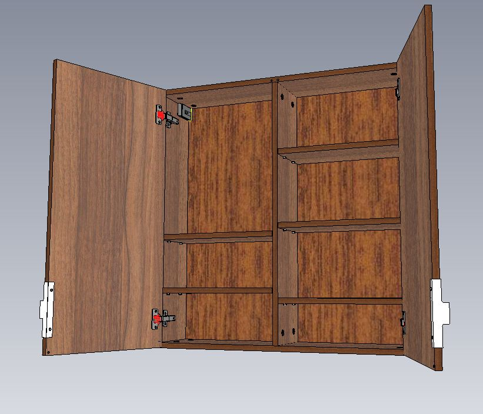

```python
{
        'proto_id': 445,

        'colorcmmater': 22390,  # param_randomize(440)               Цвет корпуса 
        'colorfsmat1': 22390,  # param_randomize(440)               Цвет фасада Прайм 
        'colorfsmat2': 22390,  # param_randomize(440)               Цвет фасада Прайм 
        'd': 200,  # random.choice(range(130, 350))     Глубина 
        'decofsmatc1': 0,  # param_randomize(454)               MDF Отделка фасада 
        'decofsmatc2': 0,  # param_randomize(454)               MDF Отделка фасада 
 
        'fasrtype1': 10841,  # param_randomize(446)               Рисунок фасада 
        'fasrtype2': 10841,  # param_randomize(446)               Рисунок фасада 
        'h': 600,  # random.choice(range(400, 1200))    Высота 
        'hantype': 24459,  # param_randomize(23)                Тип ручки 

        'htwovs1_1': 0,  #                                    От низа до середины первой перемычки 
        'htwovs1_2': 0,  #                                    От низа до середины первой перемычки 
        'htwovs2_1': 0,  #                                    От верха до середины второй перемычки 
        'htwovs2_2': 0,  #                                    От верха до середины второй перемычки 
        'htwovs3_1': 0,  #                                    От низа до середины третьей перемычки 
        'htwovs3_2': 0,  #                                    От низа до середины третьей перемычки 

        'n1delh_1': 0,  # param_randomize(367)               Низ фил выс кол-во делителей 
        'n1delh_2': 0,  # param_randomize(367)               Низ фил выс кол-во делителей 
        'n1delw_1': 0,  # param_randomize(368)               Низ фил шир кол-во делителей 
        'n1delw_2': 0,  # param_randomize(368)               Низ фил шир кол-во делителей 

        'openside1': 1,  # param_randomize(28)                Открывание правой двери  
        'openside2': 2,  # param_randomize(28)                Открывание левой двери  


        'polkstd1': 0,  # random.choice(range(0, 5))         Полки в нишу 

        'polkstd1h1': 0,  #                                    Позиция высоты полки 1 
        'polkstd1h2': 0,  #                                    Позиция высоты полки 2 
        'polkstd1h3': 0,  #                                    Позиция высоты полки 3 
        'polkstd1h4': 0,  #                                    Позиция высоты полки 4 
        'polkstd1h5': 0,  #                                    Позиция высоты полки 5 

        'polkstd2': 0,  # random.choice(range(0, 5))         Полки в нишу 

        'polkstd2h1': 0,  #                                    Позиция высоты полки 1 
        'polkstd2h2': 0,  #                                    Позиция высоты полки 2 
        'polkstd2h3': 0,  #                                    Позиция высоты полки 3 
        'polkstd2h4': 0,  #                                    Позиция высоты полки 4 
        'polkstd2h5': 0,  #                                    Позиция высоты полки 5 

        'pusher': 21534,  # param_randomize(127)               Демпфер/Толкатель 

        'typevs1_1': 1,  # param_randomize(455)               Тип нижней филёнки 
        'typevs1_2': 1,  # param_randomize(455)               Тип нижней филёнки 
        'typevs2_1': 1,  # param_randomize(455)               Тип средней филёнки 
        'typevs2_2': 1,  # param_randomize(455)               Тип средней филёнки 
        'typevs3_1': 1,  # param_randomize(455)               Тип верхней филёнки 
        'typevs3_2': 1,  # param_randomize(455)               Тип верхней филёнки 
        'w': 800,  # random.choice(range(500, 1100))    Ширина 

    }
```

## Напольные шкафы

| Параметры                       | MONO-1   | MONO-2   | DUO-2    |
| :------------------------------ | :------- | :------- | :------- |
| Количество секций по ширине, шт | 1        | 1        | 2        |
| Количество                      | 1        | 2        | 2        |
| фасадов, шт                     |          |          |          |
| Ширина корпуса ШК, мм           | 250-550  | 500-1100 | 500-1100 |
| Глубина корпуса                 | 200-550  | 200-550  | 200-550  |
| ГК, мм                          |          |          |          |
| Высота корпуса                  | 400-2880 | 400-2880 | 400-2880 |
| ВК, мм                          |          |          |          |

### ProtoId 446 РШ СУ MONO-1 Напольный шкаф

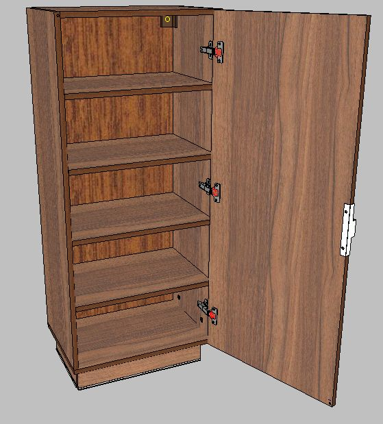

```
        'proto_id': 446,
        'colorcmmater': 22390,  # param_randomize(440)               Цвет корпуса 
        'colorfsmat1': 22390,  # param_randomize(440)               Цвет фасада Прайм 
        'd': 450,  # random.choice(range(200, 550))     Глубина 
        'decofsmatc1': 0,  # param_randomize(454)               MDF Отделка фасада 
        'door': 490,  # param_randomize(62)                Тип двери 
        'fasrtype1': 10841,  # param_randomize(446)               Рисунок фасада 
        'h': 600,  # random.choice(range(400, 2880))    Высота 
        'hantype': 24459,  # param_randomize(23)                Тип ручки 
        'polkstd1': 0,  # random.choice(range(0, 5))         Полки в нишу 
        'polkstd1h1': 0,  #                                    Позиция высоты полки 1 
        'polkstd1h2': 0,  #                                    Позиция высоты полки 2 
        'polkstd1h3': 0,  #                                    Позиция высоты полки 3 
        'polkstd1h4': 0,  #                                    Позиция высоты полки 4 
        'polkstd1h5': 0,  #                                    Позиция высоты полки 5 
        'polkstd1w1': 0,  #                                    Ширина полки 1 
        'polkstd1w2': 0,  #                                    Ширина полки 2 
        'polkstd1w3': 0,  #                                    Ширина полки 3 
        'polkstd1w4': 0,  #                                    Ширина полки 4 
        'polkstd1w5': 0,  #                                    Ширина полки 5 
        'w': 500,  # random.choice(range(250, 550))     Ширина 
```

### ProtoId 447 РШ СУ MONO-2 Напольный шкаф

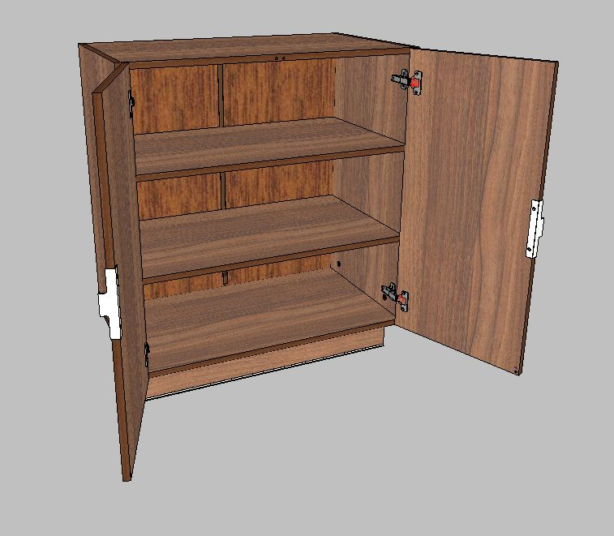

```
        'proto_id': 447,
        'colorcmmater': 22390,  # param_randomize(440)               Цвет корпуса 
        'colorfsmat1': 22390,  # param_randomize(440)               Цвет фасада Прайм 
        'd': 450,  # random.choice(range(200, 550))     Глубина 
        'decofsmatc1': 0,  # param_randomize(454)               MDF Отделка фасада 
        'fasrtype1': 10841,  # param_randomize(446)               Рисунок фасада 
        'h': 600,  # random.choice(range(400, 2880))    Высота 
        'hantype': 24459,  # param_randomize(23)                Тип ручки 
        'htwovs1_1': 0,  #                                    От низа до середины первой перемычки 
        'htwovs2_1': 0,  #                                    От верха до середины второй перемычки 
        'htwovs3_1': 0,  #                                    От низа до середины третьей перемычки 
        'n1delh_1': 0,  # param_randomize(367)               Низ фил выс кол-во делителей 
        'n1delw_1': 0,  # param_randomize(368)               Низ фил шир кол-во делителей 
        'polkstd1': 0,  # random.choice(range(0, 5))         Полки в нишу 
        'polkstd1h1': 0,  #                                    Позиция высоты полки 1 
        'polkstd1h2': 0,  #                                    Позиция высоты полки 2 
        'polkstd1h3': 0,  #                                    Позиция высоты полки 3 
        'polkstd1h4': 0,  #                                    Позиция высоты полки 4 
        'polkstd1h5': 0,  #                                    Позиция высоты полки 5 
        'pusher': 21534,  # param_randomize(127)               Демпфер/Толкатель 
        'typevs1_1': 1,  # param_randomize(455)               Тип нижней филёнки 
        'typevs2_1': 1,  # param_randomize(455)               Тип средней филёнки 
        'typevs3_1': 1,  # param_randomize(455)               Тип верхней филёнки 
        'w': 800,  # random.choice(range(500, 1100))    Ширина 
```

### ProtoId 448 РШ СУ DUO-2 Напольный шкаф

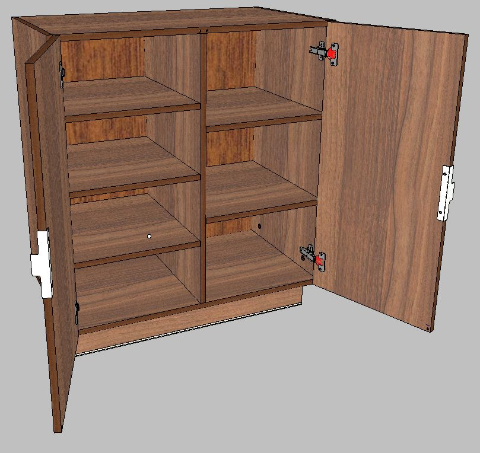

```
        'proto_id': 448,
        'colorcmmater': 22390,  # param_randomize(440)               Цвет корпуса 
        'colorfsmat1': 22390,  # param_randomize(440)               Цвет фасада Прайм 
        'colorfsmat2': 22390,  # param_randomize(440)               Цвет фасада Прайм 
        'd': 450,  # random.choice(range(200, 550))     Глубина 
        'decofsmatc1': 0,  # param_randomize(454)               MDF Отделка фасада 
        'decofsmatc2': 0,  # param_randomize(454)               MDF Отделка фасада . 
        'fasrtype1': 10841,  # param_randomize(446)               Рисунок фасада 
        'fasrtype2': 10841,  # param_randomize(446)               Рисунок фасада 
        'h': 600,  # random.choice(range(400, 2880))    Высота 
        'hantype': 24459,  # param_randomize(23)                Тип ручки 
        'htwovs1_1': 0,  #                                    От низа до середины первой перемычки 
        'htwovs1_2': 0,  #                                    От низа до середины первой перемычки 
        'htwovs2_1': 0,  #                                    От верха до середины второй перемычки 
        'htwovs2_2': 0,  #                                    От верха до середины второй перемычки 
        'htwovs3_1': 0,  #                                    От низа до середины третьей перемычки 
        'htwovs3_2': 0,  #                                    От низа до середины третьей перемычки 
        'n1delh_1': 0,  # param_randomize(367)               Низ фил выс кол-во делителей 
        'n1delh_2': 0,  # param_randomize(367)               Низ фил выс кол-во делителей 
        'n1delw_1': 0,  # param_randomize(368)               Низ фил шир кол-во делителей 
        'n1delw_2': 0,  # param_randomize(368)               Низ фил шир кол-во делителей 
        'polkstd1': 0,  # random.choice(range(0, 5))         Полки в нишу 
        'polkstd1h1': 0,  #                                    Позиция высоты полки 1 
        'polkstd1h2': 0,  #                                    Позиция высоты полки 2 
        'polkstd1h3': 0,  #                                    Позиция высоты полки 3 
        'polkstd1h4': 0,  #                                    Позиция высоты полки 4 
        'polkstd1h5': 0,  #                                    Позиция высоты полки 5 
        'polkstd2': 0,  # random.choice(range(0, 5))         Полки в нишу 
        'polkstd2h1': 0,  #                                    Позиция высоты полки 1 
        'polkstd2h2': 0,  #                                    Позиция высоты полки 2 
        'polkstd2h3': 0,  #                                    Позиция высоты полки 3 
        'polkstd2h4': 0,  #                                    Позиция высоты полки 4 
        'polkstd2h5': 0,  #                                    Позиция высоты полки 5 
        'pusher': 21534,  # param_randomize(127)               Демпфер/Толкатель 
        'typevs1_1': 1,  # param_randomize(455)               Тип нижней филёнки 
        'typevs1_2': 1,  # param_randomize(455)               Тип нижней филёнки 
        'typevs2_1': 1,  # param_randomize(455)               Тип средней филёнки 
        'typevs2_2': 1,  # param_randomize(455)               Тип средней филёнки 
        'typevs3_1': 1,  # param_randomize(455)               Тип верхней филёнки 
        'typevs3_2': 1,  # param_randomize(455)               Тип верхней филёнки 
        'w': 800,  # random.choice(range(500, 1100))    Ширина 

```