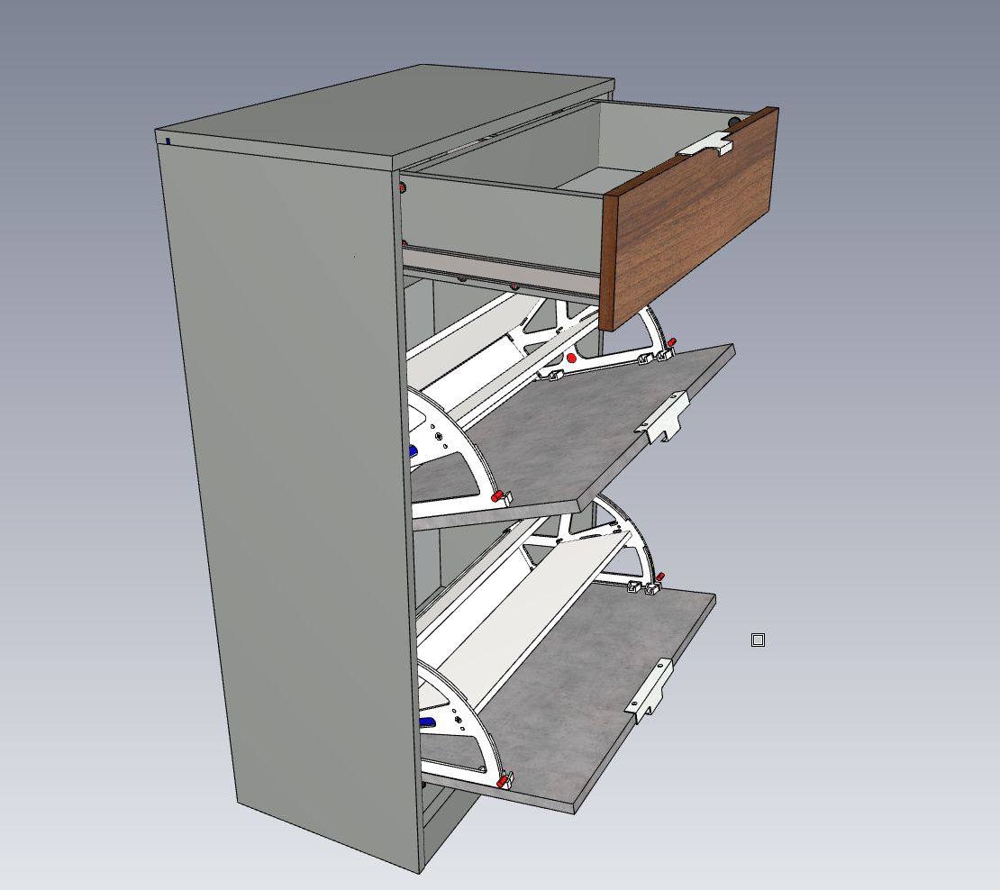
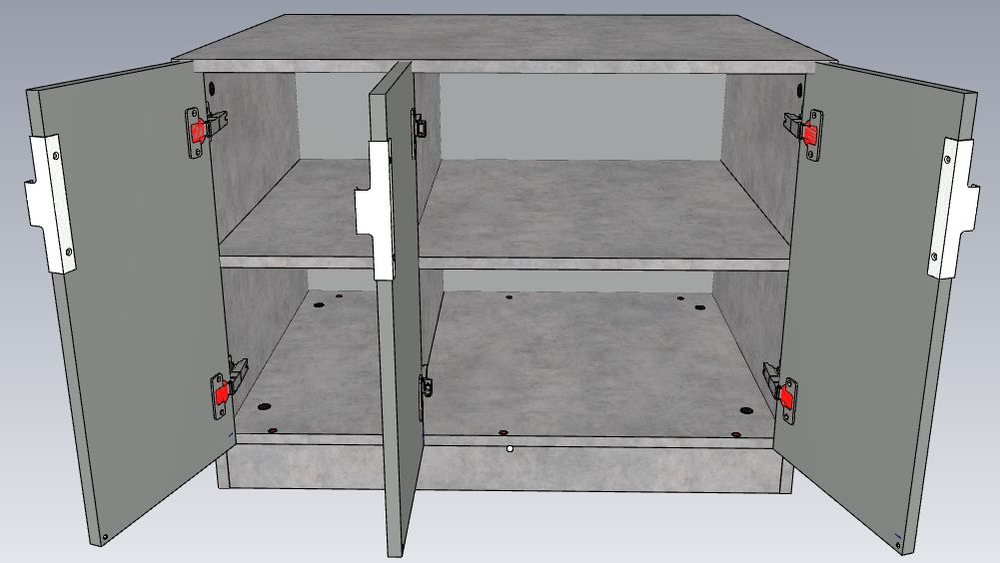

# Мебель параметрического каталога

## ProtoID 311 Терминал 

    'proto_id': 311,                                                                                     
    'band': 6793,  # param_randomize(18)                Тип кромки корпуса                               
    'colorcmmater': 22390,  # param_randomize(440)               Цвет корпуса                            
    'count': 5,  #                                    Число полок                                        
    'd': 413,  # random.choice(range(402, 900))     Глубина                                              
    'h': 2058,  # random.choice(range(2058, 2700))   Высота                                              
    'hcok': 100,  # random.choice(range(41, 250))      Высота цоколя                                     
    'prmater': 0,  # param_randomize(330)               Материал                                         
    'rshcomplect': 11165,  # param_randomize(474)               Набор для РШ (ключ инструкци    крепежи) 
    'symmetry': 1,  # random.choice(range(0,1)           Признак симметрии 0- Левый 1-правый                        |
    'w': 400,  # random.choice(range(200, 600))     Ширина                                               

## Антресоли

| Параметры                       | MONO-1   | MONO-2   | DUO-2    | DUO-3   левый | DUO-3   правый | DUO-4     | TRIO-3   | TRIO-4    | TRIO-5    | TRIO-6    |
| :------------------------------ | :------- | :------- | :------- | :------------ | :------------- | :-------- | :------- | :-------- | :-------- | :-------- |
| Количество секций по ширине, шт | 1        | 1        | 2        | 2             | 2              | 2         | 3        | 3         | 3         | 3         |
| Количество                      |          |          |          |               |                |           |          |           |           |           |
| фасадов, шт                     | 1        | 2        | 2        | 3             | 3              | 4         | 3        | 4         | 5         | 6         |
| Ширина корпуса ШК, мм           | 250-600  | 500-1000 | 500-1200 | 750-1500      | 750-1500       | 1000-2000 | 750-1800 | 1000-2000 | 1250-2500 | 1500-2790 |
| Глубина корпуса                 |          |          |          |               |                |           |          |           |           |           |
| ГК, мм                          | 150-800  | 150-800  | 150-800  | 150-800       | 150-800        | 150-800   | 150-800  | 150-800   | 150-800   | 150-800   |
| Высота корпуса                  |          |          |          |               |                |           |          |           |           |           |
| ВК, мм                          | 400-1200 | 400-1200 | 400-1200 | 400-1200      | 400-1200       | 400-1200  | 400-1200 | 400-1200  | 400-1200  | 400-1200  |

### ProtoId 400  РШ Антресоль MONO-1

    'proto_id': 400,
    'colorcmmater': param_randomize(dYAD.colorcmmater),  # Цвет корпуса
    'colorfsmat1': param_randomize(dYAD.colorcmmater),  # Цвет фасада Прайм
    'd': random.choice(range(150, 800)),  # Глубина
    'decofsmatc1': 0.0,  # MDF Отделка фасада
    'fasrtype1': 10841.0,  # Рисунок фасада
    'h': random.choice(range(400, 1200)),  # Высота
    'hantype': 24459.0,  # Тип ручки
    'pusher': 21534,  # param_randomize(127)               Демпфер/Толкатель для "без ручки" Hettich 16904
    'n1delh_1': 0,  # param_randomize(367)               Низ фил выс кол-во делителей
    'openside1': 1.0,  # Открывание двери
    'polkstd1': 0.0,  # Полки в нишу
    'w': random.choice(range(250, 600)),  # Ширина

### ProtoId 401  РШ Антресоль MONO-2

    'proto_id': 401,
    'colorcmmater': param_randomize(dYAD.colorcmmater),  # Цвет корпуса
    'colorfsmat1': param_randomize(dYAD.colorcmmater),  # Цвет фасада Прайм
    'd': random.choice(range(150, 800)),  # Глубина
    'decofsmatc1': 0.0,  # MDF Отделка фасада
    'fasrtype1': 10841.0,  # Рисунок фасада
    'h': random.choice(range(400, 1200)),  # Высота
    'hantype': 24459.0,  # Тип ручки
    'polkstd1': 0.0,  # Полки в нишу
    'w': random.choice(range(500, 1000)),  # Ширина
    'pusher': 21534,  # param_randomize(127)               Демпфер/Толкатель для "без ручки" Hettich 16904
    'n1delh_1': 0,  # param_randomize(367)               Низ фил выс кол-во делителей

### ProtoId 402 РШ Антресоль DUO-2

    'proto_id': 402,
    'colorcmmater': param_randomize(dYAD.colorcmmater),  # Цвет корпуса
    'colorfsmat1': param_randomize(dYAD.colorcmmater),  # Цвет фасада Прайм
    'colorfsmat2': param_randomize(dYAD.colorcmmater),  # Цвет фасада Прайм
    'd': random.choice(range(150, 800)),  # Глубина
    'decofsmatc1': 0.0,  # MDF Отделка фасада
    'decofsmatc2': 0.0,  # MDF Отделка фасада
    'fasrtype1': 10841.0,  # Рисунок фасада
    'fasrtype2': 10841.0,  # Рисунок фасада
    'h': random.choice(range(400, 1200)),  # Высота
    'hantype': 24459.0,  # Тип ручки
    'polkstd1': 0.0,  # Полки в нишу справа
    'polkstd2': 0.0,  # Полки в нишу слева
    'w': random.choice(range(500, 1200)),  # Ширина
    'pusher': 21534,  # param_randomize(127)               Демпфер/Толкатель для "без ручки" Hettich 16904
    'n1delh_1': 0,  # param_randomize(367)               Низ фил выс кол-во делителей 
    'n1delh_2': 0,  # param_randomize(367)               Низ фил выс кол-во делителей     

### ProtoId 403 РШ Антресоль DUO-3 левый

    'proto_id': 403,
    'colorcmmater': param_randomize(dYAD.colorcmmater),  # Цвет корпуса
    'colorfsmat1': param_randomize(dYAD.colorcmmater),  # Цвет фасада Прайм
    'colorfsmat2': param_randomize(dYAD.colorcmmater),  # Цвет фасада Прайм
    'd': random.choice(range(150, 800)),  # Глубина
    'decofsmatc1': 0.0,  # MDF Отделка фасада
    'decofsmatc2': 0.0,  # MDF Отделка фасада
    'fasrtype1': 10841.0,  # Рисунок фасада
    'fasrtype2': 10841.0,  # Рисунок фасада
    'h': random.choice(range(400, 1200)),  # Высота
    'hantype': 24459.0,  # Тип ручки
    'polkstd1': 0.0,  # Полки в нишу справа
    'polkstd2': 0.0,  # Полки в нишу слева
    'w': random.choice(range(500, 1500)),  # Ширина
    'pusher': 21534,  # param_randomize(127)               Демпфер/Толкатель для "без ручки" Hettich 16904
    'n1delh_1': 0,  # param_randomize(367)               Низ фил выс кол-во делителей 
    'n1delh_2': 0,  # param_randomize(367)               Низ фил выс кол-во делителей   

### ProtoId 404 РШ Антресоль DUO-3 правый

    'proto_id': 404,
    'colorcmmater': param_randomize(dYAD.colorcmmater),  # Цвет корпуса
    'colorfsmat1': param_randomize(dYAD.colorcmmater),  # Цвет фасада Прайм
    'colorfsmat2': param_randomize(dYAD.colorcmmater),  # Цвет фасада Прайм
    'd': random.choice(range(150, 800)),  # Глубина
    'decofsmatc1': 0.0,  # MDF Отделка фасада
    'decofsmatc2': 0.0,  # MDF Отделка фасада
    'fasrtype1': 10841.0,  # Рисунок фасада
    'fasrtype2': 10841.0,  # Рисунок фасада
    'h': random.choice(range(400, 1200)),  # Высота
    'hantype': 24459.0,  # Тип ручки
    'polkstd1': 0.0,  # Полки в нишу справа
    'polkstd2': 0.0,  # Полки в нишу слева
    'w': random.choice(range(500, 1500)),  # Ширина
    'pusher': 21534,  # param_randomize(127)               Демпфер/Толкатель для "без ручки" Hettich 16904
    'n1delh_1': 0,  # param_randomize(367)               Низ фил выс кол-во делителей 
    'n1delh_2': 0,  # param_randomize(367)               Низ фил выс кол-во делителей   

### ProtoId 405 РШ Антресоль DUO-4

    'proto_id': 405,
    'colorcmmater': param_randomize(dYAD.colorcmmater),  # Цвет корпуса
    'colorfsmat1': param_randomize(dYAD.colorcmmater),  # Цвет фасада Прайм
    'colorfsmat2': param_randomize(dYAD.colorcmmater),  # Цвет фасада Прайм
    'd': random.choice(range(150, 800)),  # Глубина
    'decofsmatc1': 0.0,  # MDF Отделка фасада
    'decofsmatc2': 0.0,  # MDF Отделка фасада
    'fasrtype1': 10841.0,  # Рисунок фасада
    'fasrtype2': 10841.0,  # Рисунок фасада
    'h': random.choice(range(400, 1200)),  # Высота
    'hantype': 24459.0,  # Тип ручки
    'polkstd1': 0.0,  # Полки в нишу справа
    'polkstd2': 0.0,  # Полки в нишу слева
    'w': random.choice(range(1000, 2000)),  # Ширина
    'pusher': 21534,  # param_randomize(127)               Демпфер/Толкатель для "без ручки" Hettich 16904
    'n1delh_1': 0,  # param_randomize(367)               Низ фил выс кол-во делителей 
    'n1delh_2': 0,  # param_randomize(367)               Низ фил выс кол-во делителей   

### ProtoId 406 РШ Антресоль TRIO-3

    'proto_id': 406,
    'colorcmmater': param_randomize(dYAD.colorcmmater),  # Цвет корпуса
    'colorfsmat1': param_randomize(dYAD.colorcmmater),  # Цвет фасада Прайм
    'colorfsmat2': param_randomize(dYAD.colorcmmater),  # Цвет фасада Прайм
    'colorfsmat3': param_randomize(dYAD.colorcmmater),  # Цвет фасада Прайм
    'd': random.choice(range(150, 800)),  # Глубина
    'decofsmatc1': 0.0,  # MDF Отделка фасада справа
    'decofsmatc2': 0.0,  # MDF Отделка фасада середина
    'decofsmatc3': 0.0,  # MDF Отделка фасада слева
    'fasrtype1': 10841.0,  # Рисунок фасада справа
    'fasrtype2': 10841.0,  # Рисунок фасада середина
    'fasrtype3': 10841.0,  # Рисунок фасада слева
    'h': random.choice(range(400, 1200)),  # Высота
    'hantype': 24459.0,  # Тип ручки
    'polkstd1': 0.0,  # Полки в нишу справа
    'polkstd2': 0.0,  # Полки в нишу середина
    'polkstd3': 0.0,  # Полки в нишу слева
    'w': random.choice(range(750, 1800)),  # Ширина
    'pusher': 21534,  # param_randomize(127)               Демпфер/Толкатель для "без ручки" Hettich 16904
    'n1delh_1': 0,  # param_randomize(367)               Низ фил выс кол-во делителей 
    'n1delh_2': 0,  # param_randomize(367)               Низ фил выс кол-во делителей   
    'n1delh_3': 0,  # param_randomize(367)               Низ фил выс кол-во делителей   

### ProtoId 407  РШ Антресоль TRIO-4

    'proto_id': 407,
    'colorcmmater': param_randomize(dYAD.colorcmmater),  # Цвет корпуса
    'colorfsmat1': param_randomize(dYAD.colorcmmater),  # Цвет фасада Прайм
    'colorfsmat2': param_randomize(dYAD.colorcmmater),  # Цвет фасада Прайм
    'colorfsmat3': param_randomize(dYAD.colorcmmater),  # Цвет фасада Прайм
    'd': random.choice(range(150, 800)),  # Глубина
    'decofsmatc1': 0.0,  # MDF Отделка фасада справа
    'decofsmatc2': 0.0,  # MDF Отделка фасада середина
    'decofsmatc3': 0.0,  # MDF Отделка фасада слева
    'fasrtype1': 10841.0,  # Рисунок фасада справа
    'fasrtype2': 10841.0,  # Рисунок фасада середина
    'fasrtype3': 10841.0,  # Рисунок фасада слева
    'h': random.choice(range(400, 1200)),  # Высота
    'hantype': 24459.0,  # Тип ручки
    'polkstd1': 0.0,  # Полки в нишу справа
    'polkstd2': 0.0,  # Полки в нишу середина
    'polkstd3': 0.0,  # Полки в нишу слева
    'w': random.choice(range(1000, 2000)),  # Ширина
    'pusher': 21534,  # param_randomize(127)               Демпфер/Толкатель для "без ручки" Hettich 16904
    'n1delh_1': 0,  # param_randomize(367)               Низ фил выс кол-во делителей 
    'n1delh_2': 0,  # param_randomize(367)               Низ фил выс кол-во делителей   
    'n1delh_3': 0,  # param_randomize(367)               Низ фил выс кол-во делителей   

### ProtoId 408  РШ Антресоль TRIO-5

    'proto_id': 408,
    'colorcmmater': param_randomize(dYAD.colorcmmater),  # Цвет корпуса
    'colorfsmat1': param_randomize(dYAD.colorcmmater),  # Цвет фасада Прайм
    'colorfsmat2': param_randomize(dYAD.colorcmmater),  # Цвет фасада Прайм
    'colorfsmat3': param_randomize(dYAD.colorcmmater),  # Цвет фасада Прайм
    'd': random.choice(range(150, 800)),  # Глубина
    'decofsmatc1': 0.0,  # MDF Отделка фасада справа
    'decofsmatc2': 0.0,  # MDF Отделка фасада середина
    'decofsmatc3': 0.0,  # MDF Отделка фасада слева
    'fasrtype1': 10841.0,  # Рисунок фасада справа
    'fasrtype2': 10841.0,  # Рисунок фасада середина
    'fasrtype3': 10841.0,  # Рисунок фасада слева
    'h': random.choice(range(400, 1200)),  # Высота
    'hantype': 24459.0,  # Тип ручки
    'polkstd1': 0.0,  # Полки в нишу справа
    'polkstd2': 0.0,  # Полки в нишу середина
    'polkstd3': 0.0,  # Полки в нишу слева
    'w': random.choice(range(1250, 2500)),  # Ширина
    'pusher': 21534,  # param_randomize(127)               Демпфер/Толкатель для "без ручки" Hettich 16904
    'n1delh_1': 0,  # param_randomize(367)               Низ фил выс кол-во делителей 
    'n1delh_2': 0,  # param_randomize(367)               Низ фил выс кол-во делителей   
    'n1delh_3': 0,  # param_randomize(367)               Низ фил выс кол-во делителей   

### ProtoId 409  РШ Антресоль TRIO-6

    'proto_id': 409,
    'colorcmmater': param_randomize(dYAD.colorcmmater),  # Цвет корпуса
    'colorfsmat1': param_randomize(dYAD.colorcmmater),  # Цвет фасада Прайм
    'colorfsmat2': param_randomize(dYAD.colorcmmater),  # Цвет фасада Прайм
    'colorfsmat3': param_randomize(dYAD.colorcmmater),  # Цвет фасада Прайм
    'd': random.choice(range(150, 800)),  # Глубина
    'decofsmatc1': 0.0,  # MDF Отделка фасада справа
    'decofsmatc2': 0.0,  # MDF Отделка фасада середина
    'decofsmatc3': 0.0,  # MDF Отделка фасада слева
    'fasrtype1': 10841.0,  # Рисунок фасада справа
    'fasrtype2': 10841.0,  # Рисунок фасада середина
    'fasrtype3': 10841.0,  # Рисунок фасада слева
    'h': random.choice(range(400, 1200)),  # Высота
    'hantype': 24459.0,  # Тип ручки
    'polkstd1': 0.0,  # Полки в нишу справа
    'polkstd2': 0.0,  # Полки в нишу середина
    'polkstd3': 0.0,  # Полки в нишу слева
    'w': random.choice(range(1500, 2790)),  # Ширина
    'pusher': 21534,  # param_randomize(127)               Демпфер/Толкатель для "без ручки" Hettich 16904
    'n1delh_1': 0,  # param_randomize(367)               Низ фил выс кол-во делителей 
    'n1delh_2': 0,  # param_randomize(367)               Низ фил выс кол-во делителей   
    'n1delh_3': 0,  # param_randomize(367)               Низ фил выс кол-во делителей   

## Комоды

  | Параметры                       | MONO-1   | DUO-2 левый | DUO-2 правый | TRIO-3    |
  | :------------------------------ | :------- | :---------- | :----------- | :-------- |
  | Количество секций по ширине, шт | 1        | 2           | 2            | 3         |
  | Количество                      |          |             |              |           |
  | фасадов по ширине, шт           | 1        | 2           | 2            | 3         |
  | Ширина корпуса           ШК, мм | 500-800  | 800-1200    | 800-1200     | 1200-1600 |
  | Глубина корпуса                 |          |             |              |           |
  | ГК, мм*                         | 300-800  | 300-800     | 300-800      | 300-800   |
  | Высота корпуса                  |          |             |              |           |
  | ВК, мм                          | 600-1100 | 600-1100    | 600-1100     | 600-1100  |

Зависимость числа ящиков от высоты корпуса

  | Высота корпуса комода, мм | Кол-во ящиков, шт |
  | :------------------------ | :---------------- |
  |                           |                   |
  | 600 - 614                 | 2                 |
  | 600 - 878                 | 3                 |
  | 662 - 1008                | 4                 |
  | 806 - 1100                | 5                 |

## ProtoId 422 РШ Комод MONO-1

    'proto_id': 422,
    'blockbox1': 3,  # random.choice(range(2, 5))         Количество ящиков
    'bxtype': 10804,  # param_randomize(475)               Тип ящика
    'colorcmmater': 22390,  # param_randomize(440)               Цвет корпуса
    'colorfsmat1': 22390,  # param_randomize(440)               Цвет фасада Прайм
    'd': 600,  # random.choice(range(300, 800))     Глубина
    'decofsmatc1': 0,  # param_randomize(454)               MDF Отделка фасада
    'fasrtype1': 10841,  # param_randomize(446)               Рисунок фасада
    'h': 600,  # random.choice(range(600, 1100))    Высота
    'hantype': 24459,  # param_randomize(23)                Тип ручки
    'hcok': 70,  # random.choice(range(70, 250))      Высота цоколя
    'w': 500,  # random.choice(range(500, 800))     Ширина
    'pusher': 21534,  # param_randomize(127)               Демпфер/Толкатель для "без ручки" Hettich 16904

### ProtoId 423 РШ Комод DUO-2 левый

    'proto_id': 423,
    'blockbox1': 0,  # random.choice(range(0, 5))         Количество ящиков
    'blockbox2': 3,  # random.choice(range(2, 5))         Количество ящиков
    'bxtype': 10804,  # param_randomize(475)               Тип ящика
    'colorcmmater': 22390,  # param_randomize(440)               Цвет корпуса
    'colorfsmat1': 22390,  # param_randomize(440)               Цвет фасада Прайм
    'colorfsmat2': 22390,  # param_randomize(440)               Цвет фасада Прайм
    'd': 600,  # random.choice(range(300, 800))     Глубина
    'decofsmatc1': 0,  # param_randomize(454)               MDF Отделка фасада
    'decofsmatc2': 0,  # param_randomize(454)               MDF Отделка фасада
    'fasrtype1': 10841,  # param_randomize(446)               Рисунок фасада
    'fasrtype2': 10841,  # param_randomize(446)               Рисунок фасада
    'h': 600,  # random.choice(range(600, 1100))    Высота
    'hantype': 24459,  # param_randomize(23)                Тип ручки
    'hcok': 70,  # random.choice(range(70, 250))      Высота цоколя
    'polkstd1': 0,  # random.choice(range(0, 5))         Полки в нишу
    'polkstd2': 0,  # random.choice(range(0, 0))         Полки в нишу
    'w': 900,  # random.choice(range(800, 1200))    Ширина
    'pusher': 21534,  # param_randomize(127)               Демпфер/Толкатель для "без ручки" Hettich 16904
    'n1delh_1': 0,  # param_randomize(367)               Низ фил выс кол-во делителей 
    'n1delh_2': 0,  # param_randomize(367)               Низ фил выс кол-во делителей   

### ProtoId 424 РШ Комод DUO-2 правый

    'proto_id': 424,
    'blockbox1': 3,  # random.choice(range(2, 5))         Количество ящиков
    'blockbox2': 0,  # random.choice(range(0, 0))         Количество ящиков
    'bxtype': 10804,  # param_randomize(475)               Тип ящика
    'colorcmmater': 22390,  # param_randomize(440)               Цвет корпуса
    'colorfsmat1': 22390,  # param_randomize(440)               Цвет фасада Прайм
    'colorfsmat2': 22390,  # param_randomize(440)               Цвет фасада Прайм
    'd': 600,  # random.choice(range(300, 800))     Глубина
    'decofsmatc1': 0,  # param_randomize(454)               MDF Отделка фасада
    'decofsmatc2': 0,  # param_randomize(454)               MDF Отделка фасада
    'fasrtype1': 10841,  # param_randomize(446)               Рисунок фасада
    'fasrtype2': 10841,  # param_randomize(446)               Рисунок фасада
    'h': 600,  # random.choice(range(600, 1100))    Высота
    'hantype': 24459,  # param_randomize(23)                Тип ручки
    'hcok': 70,  # random.choice(range(70, 250))      Высота цоколя
    'polkstd1': 0,  # random.choice(range(0, 5))         Полки в нишу
    'polkstd2': 0,  # random.choice(range(0, 0))         Полки в нишу
    'w': 900,  # random.choice(range(800, 1200))    Ширина
    'pusher': 21534,  # param_randomize(127)               Демпфер/Толкатель для "без ручки" Hettich 16904
    'n1delh_1': 0,  # param_randomize(367)               Низ фил выс кол-во делителей 
    'n1delh_2': 0,  # param_randomize(367)               Низ фил выс кол-во делителей   

### ProtoId 425 РШ Комод TRIO-3

    'proto_id': 425,
    'blockbox1': 0,  # random.choice(range(0, 0))         Количество ящиков
    'blockbox2': 0,  # random.choice(range(2, 5))         Количество ящиков
    'blockbox3': 0,  # random.choice(range(0, 0))         Количество ящиков
    'bxtype': 10804,  # param_randomize(475)               Тип ящика
    'colorcmmater': 22390,  # param_randomize(440)               Цвет корпуса
    'colorfsmat1': 22390,  # param_randomize(440)               Цвет фасада Прайм
    'colorfsmat2': 22390,  # param_randomize(440)               Цвет фасада Прайм
    'colorfsmat3': 22390,  # param_randomize(440)               Цвет фасада Прайм
    'd': 600,  # random.choice(range(300, 800))     Глубина
    'decofsmatc1': 0,  # param_randomize(454)               MDF Отделка фасада
    'decofsmatc2': 0,  # param_randomize(454)               MDF Отделка фасада
    'decofsmatc3': 0,  # param_randomize(454)               MDF Отделка фасада
    'fasrtype1': 10841,  # param_randomize(446)               Рисунок фасада
    'fasrtype2': 10841,  # param_randomize(446)               Рисунок фасада
    'fasrtype3': 10841,  # param_randomize(446)               Рисунок фасада
    'h': 600,  # random.choice(range(600, 1100))    Высота
    'hantype': 24459,  # param_randomize(23)                Тип ручки
    'hcok': 70,  # random.choice(range(70, 250))      Высота цоколя
    'polkstd1': 0,  # random.choice(range(0, 5))         Полки в нишу
    'polkstd2': 0,  # random.choice(range(0, 0))         Полки в нишу
    'polkstd3': 0,  # random.choice(range(0, 5))         Полки в нишу
    'w': 1300,  # random.choice(range(1200, 1600))   Ширина
    'pusher': 21534,  # param_randomize(127)               Демпфер/Толкатель для "без ручки" Hettich 16904
    'n1delh_1': 0,  # param_randomize(367)               Низ фил выс кол-во делителей 
    'n1delh_2': 0,  # param_randomize(367)               Низ фил выс кол-во делителей   
    'n1delh_3': 0,  # param_randomize(367)               Низ фил выс кол-во делителей

## РШ Обувницы

  | Параметры                        | обувница MONO-1 с одним механизмом | обувница MONO-1 с двумя механизмами | обувница   MONO-1 с одним механизмом и ящиком | обувница MONO-1 с двумя механизмами и ящиком |
  | :------------------------------- | :--------------------------------- | :---------------------------------- | :-------------------------------------------- | :------------------------------------------- |
  | Количество секций по ширине, шт  | 1                                  | 1                                   | 1                                             | 1                                            |
  | Количество фасадов по ширине, шт | 1                                  | 1                                   | 1                                             | 1                                            |
  | Количество цвета/дизайна фасадов | 1                                  | 1                                   | 2                                             | 2                                            |
  | Ширина корпуса ШК, мм            | 500-800                            | 500-800                             | 500-800                                       | 500-800                                      |
  | Глубина корпуса  ГК, мм          | 320                                | 320                                 | 320                                           | 320                                          |
  | Высота корпуса  ВК, мм           | 447-507                            | 805-925                             | 590-650                                       | 948-1068                                     |

### ProtoId 427 РШ Обувница MONO-1-1

    'proto_id': 427,
    'colorcmmater': 22393,  # param_randomize(440)               Цвет корпуса 
    'colorfsmat1': 22378,  # param_randomize(440)               Цвет фасада Прайм 
    'd': 320,  # random.choice(range(300, 800))     Глубина 
    'decofsmatc1': 0,  # param_randomize(454)               MDF Отделка фасада 
    'fasrtype1': 10841,  # param_randomize(446)               Рисунок фасада 
    'h': 500,  # random.choice(range(400, 600))     Высота 
    'hantype': 24459,  # param_randomize(23)                Тип ручки 
    'hcok': 70,  # random.choice(range(70, 250))      Высота цоколя 
    'w': 600,  # random.choice(range(500, 800))     Ширина 

### ProtoId 428 РШ Обувница MONO-1-2

    'proto_id': 428,
    'colorcmmater': 22378,  # param_randomize(440)               Цвет корпуса 
    'colorfsmat1': 22393,  # param_randomize(440)               Цвет фасада Прайм 
    'd': 320,  # random.choice(range(300, 800))     Глубина 
    'decofsmatc1': 0,  # param_randomize(454)               MDF Отделка фасада 
    'fasrtype1': 10841,  # param_randomize(446)               Рисунок фасада 
    'h': 808,  # random.choice(range(800, 950))     Высота 
    'h_carga': 138,  # random.choice(range(0, 300))       Размер царги 
    'hantype': 24459,  # param_randomize(23)                Тип ручки 
    'hcok': 70,  # random.choice(range(70, 250))      Высота цоколя 
    'w': 600,  # random.choice(range(500, 800))     Ширина 

### ProtoId 429 РШ Обувница MONO-1-1-ящик

    'proto_id': 429,
    'colorcmmater': 22378,  # param_randomize(440)               Цвет корпуса 
    'colorfsmat1': 22393,  # param_randomize(440)               Цвет фасада Прайм 
    'colorfsmat2': 22393,  # param_randomize(440)               Цвет фасада Прайм 
    'd': 320,  # random.choice(range(300, 800))     Глубина 
    'decofsmatc1': 0,  # param_randomize(454)               MDF Отделка фасада 
    'decofsmatc2': 0,  # param_randomize(454)               MDF Отделка фасада 
    'fasrtype1': 10841,  # param_randomize(446)               Рисунок фасада 
    'fasrtype2': 10841,  # param_randomize(446)               Рисунок фасада 
    'h': 808,  # random.choice(range(580, 700))     Высота 
    'h_carga': 138,  # random.choice(range(0, 300))       Размер царги 
    'hantype': 24459,  # param_randomize(23)                Тип ручки 
    'hcok': 70,  # random.choice(range(70, 250))      Высота цоколя 
    'w': 600,  # random.choice(range(500, 800))     Ширина 

### ProtoId 430  РШ Обувница MONO-1-2-ящик

    'proto_id': 430,
    'colorcmmater': 22378,  # param_randomize(440)               Цвет корпуса 
    'colorfsmat1': 22393,  # param_randomize(440)               Цвет фасада Прайм 
    'colorfsmat2': 22393,  # param_randomize(440)               Цвет фасада Прайм 
    'd': 320,  # random.choice(range(300, 800))     Глубина 
    'decofsmatc1': 0,  # param_randomize(454)               MDF Отделка фасада 
    'decofsmatc2': 0,  # param_randomize(454)               MDF Отделка фасада 
    'fasrtype1': 10841,  # param_randomize(446)               Рисунок фасада 
    'fasrtype2': 10841,  # param_randomize(446)               Рисунок фасада 
    'h': 808,  # random.choice(range(940, 1200))     Высота 
    'h_carga': 138,  # random.choice(range(0, 300))       Размер царги 
    'hantype': 24459,  # param_randomize(23)                Тип ручки 
    'hcok': 70,  # random.choice(range(70, 250))      Высота цоколя 
    'w': 600,  # random.choice(range(500, 800))     Ширина 

## Тумбы

| Параметры                       | DUO-2    | DUO-3 левый | DUO-3 правый |
| :------------------------------ | :------- | :---------- | :----------- |
| Количество секций по ширине, шт | 2        | 2           | 2            |
| Количество                      |          |             |              |
| фасадов, шт                     | 2        | 3           | 3            |
| Ширина корпуса ШК, мм           | 500-1200 | 750-1500    | 750-1500     |
| Глубина корпуса                 |          |             |              |
| ГК, мм*                         | 150-800  | 150-800     | 150-800      |
| Высота корпуса                  |          |             |              |
| ВК, мм                          | 440      | 440         | 440          |

### ProtoId 431  РШ Тумба DUO-2

    'proto_id': 431,
    'colorcmmater': 22390,  # param_randomize(440)               Цвет корпуса 
    'colorfsmat1': 22390,  # param_randomize(440)               Цвет фасада Прайм 
    'colorfsmat2': 22390,  # param_randomize(440)               Цвет фасада Прайм 
    'd': 600,  # random.choice(range(150, 800))     Глубина 
    'fasrtype1': 10841,  # param_randomize(446)               Рисунок фасада 
    'fasrtype2': 10841,  # param_randomize(446)               Рисунок фасада 
    'h': 440,  # random.choice(range(400, 1200))    Высота 
    'hantype': 24459,  # param_randomize(23)                Тип ручки 
    'hcok': 70,  # random.choice(range(70, 250))      Высота цоколя 
    'polkstd1': 0,  # random.choice(range(0, 5))         Полки в нишу 
    'polkstd2': 0,  # random.choice(range(0, 5))         Полки в нишу 
    'w': 800,  # random.choice(range(500, 1200))    Ширина 
    'pusher': 21534,  # param_randomize(127)               Демпфер/Толкатель для "без ручки" Hettich 16904
    'n1delh_1': 0,  # param_randomize(367)               Низ фил выс кол-во делителей 
    'n1delh_2': 0,  # param_randomize(367)               Низ фил выс кол-во делителей   

### ProtoId 432 РШ Тумба DUO-3 левый

    'proto_id': 432,
    'colorcmmater': 22390,  # param_randomize(440)               Цвет корпуса 
    'colorfsmat1': 22390,  # param_randomize(440)               Цвет фасада Прайм 
    'colorfsmat2': 22390,  # param_randomize(440)               Цвет фасада Прайм 
    'd': 600,  # random.choice(range(150, 800))     Глубина 
    'fasrtype1': 10841,  # param_randomize(446)               Рисунок фасада 
    'fasrtype2': 10841,  # param_randomize(446)               Рисунок фасада 
    'h': 440,  # random.choice(range(400, 1200))    Высота 
    'hantype': 24459,  # param_randomize(23)                Тип ручки 
    'hcok': 70,  # random.choice(range(70, 250))      Высота цоколя 
    'polkstd1': 0,  # random.choice(range(0, 5))         Полки в нишу 
    'polkstd2': 0,  # random.choice(range(0, 5))         Полки в нишу 
    'w': 800,  # random.choice(range(750, 1500))    Ширина 
    'pusher': 21534,  # param_randomize(127)               Демпфер/Толкатель для "без ручки" Hettich 16904
    'n1delh_1': 0,  # param_randomize(367)               Низ фил выс кол-во делителей 
    'n1delh_2': 0,  # param_randomize(367)               Низ фил выс кол-во делителей   

### ProtoId 433  РШ Тумба DUO-3 правый

    'proto_id': 433,
    'colorcmmater': 22390,  # param_randomize(440)               Цвет корпуса 
    'colorfsmat1': 22390,  # param_randomize(440)               Цвет фасада Прайм 
    'colorfsmat2': 22390,  # param_randomize(440)               Цвет фасада Прайм 
    'd': 600,  # random.choice(range(150, 800))     Глубина 
    'fasrtype1': 10841,  # param_randomize(446)               Рисунок фасада 
    'fasrtype2': 10841,  # param_randomize(446)               Рисунок фасада 
    'h': 440,  # random.choice(range(400, 1200))    Высота 
    'hantype': 24459,  # param_randomize(23)                Тип ручки 
    'hcok': 70,  # random.choice(range(70, 250))      Высота цоколя 
    'polkstd1': 0,  # random.choice(range(0, 5))         Полки в нишу 
    'polkstd2': 0,  # random.choice(range(0, 5))         Полки в нишу 
    'w': 800,  # random.choice(range(750, 1500))    Ширина 
    'pusher': 21534,  # param_randomize(127)               Демпфер/Толкатель для "без ручки" Hettich 16904
    'n1delh_1': 0,  # param_randomize(367)               Низ фил выс кол-во делителей 
    'n1delh_2': 0,  # param_randomize(367)               Низ фил выс кол-во делителей   

## Панели

Стеновые панели характеризуют три основных параметра:

- **w** - ширина
- **h** - высота
- **colorcmmater** - цвет материала

для панели с крючками добавляются три параметра:

- **id_mensola** - id менсолы в зависимости от выбраного цвета
- **n_hoock** - количество крючков
- **id_fixnaves** - id крепежа для навеса

### ProtoId 434  РШ Панель с зеркалом

    'proto_id': 434,
    'colorcmmater': 22390,  # param_randomize(440)               Цвет корпуса 
    'cutsize_mirr': 1,  #                                    Подрез зеркала по стороне 
    'd': 16,  #                                    Глубина 
    'h': 1500,  # random.choice(range(150, 2000))    Высота 
    'id_fixkruk': 11236,  # param_randomize(19)                Крепеж в коробку крюк с дюбелем 
    'id_fixnaves': 11234,  # param_randomize(19)                Id Типа крепежа для навеса 
    'id_mirband': 16473,  # param_randomize(18)                Кромка зеркала 
    'id_mirror': 5251,  # param_randomize(17)                Материал зеркала 
    'w': 800,  # random.choice(range(150, 1000))    Ширина 

### ProtoId 435  РШ Панель ЛДСП с крючками

    'proto_id': 435,
    'colorcmmater': 22390,  # param_randomize(440)               Цвет корпуса 
    'd': 266,  # random.choice(range(16, 500))      Глубина 
    'h': 1500,  # random.choice(range(1000, 2000))   Высота 
    'id_fixkruk': 11236,  # param_randomize(19)                Крепеж в коробку крюк с дюбелем 
    'id_fixnaves': 11234,  # param_randomize(19)                Id Типа крепежа для навеса 
    'id_hoock': 24567,  # param_randomize(481)               ID крючка для одежды 
    'id_mensola': 24572,  # param_randomize(482)               Менсола для полки 
    'n_hoock': 3,  # random.choice(range(2, 5))         Количество крючков 
    'w': 800,  # random.choice(range(400, 1500))    Ширина 

## Примечания: Применяемые материалы

#### Крючки id_hoock

:::{important}
Дополнительно к `id_hoock` сегда нужно передавать `n_hoock` от 3 до 5 шт

Пример:

    n_hoock: 3 #  от 3 до 5 шт
:::

| Наименование                             | ID    |
| :--------------------------------------- | :---- |
| ARGUS (Леруа)                            | 24564 |
| ARGUS Крючок двухрожковый белый матовый  | 24565 |
| ARGUS Крючок двухрожковый хром матовый   | 24566 |
| ARGUS Крючок двухрожковый черный матовый | 24567 |
| ARGUS Крючок трехрожковый белый матовый  | 24568 |
| ARGUS Крючок трехрожковый хром матовый   | 24569 |
| ARGUS Крючок трехрожковый черный матовый | 24570 |

#### Менсолодержатели id_mensola

| Наименование                                               | ID    |
| :--------------------------------------------------------- | :---- |
| Менсолодержатель «Лофт-2», отделка белый бархат (матовый)  | 24571 |
| Менсолодержатель «Лофт-2», отделка черный бархат (матовый) | 24572 |

### Ручки для всех элементов каталога

| ID    | Name                                                                         | Article                    |
| :---- | :--------------------------------------------------------------------------- | :------------------------- |
| 22587 | Ручка-профиль Накладная L=1.0 m Латунь (Не используется)                     | A26-53-12-BRASS            |
| 22588 | Ручка-профиль Накладная L=1.0 m Серебро матовое                              | A26-53-12-ANA              |
| 22589 | Ручка-профиль Накладная L=1.0 m Чёрная матовая                               | A26-53-12-CZ               |
| 24317 | Ручка торцевая RT.06, L.896, отделка "Белый бархат"                          | RT.06.896.9016             |
| 24318 | Ручка торцевая RT.06, L.896, отделка "Чёрный бархат"                         | RT.06.896.9005             |
| 24319 | Ручка торцевая RT.06, L.896, отделка "Золото полуматовая"  (Не используется) | RT.06.896.1036/ML112       |
| 24459 | (МетЛаб)   Ручка торцевая (1 мм)   RT.06, L.146, отделка "Белый бархат"      | RT.06.146.9016.Alm   Леруа |
| 24460 | (МетЛаб)   Ручка торцевая (1 мм)   RT.06, L.146, отделка "Чёрный бархат"     | RT.06.146.9005.Alm   Леруа |

:::{tip}
Для элементов каталога с распашной дверью действует правило: если на сайте задан параметр «ручка Hettich», нужно передать параметр ID толкателя и обнулить ручку.

Допускается передать 'hantype': 0 без pusher

Пример параметров:

    'hantype': 0  # Тип ручки
    'pusher': 16904  # Толкатель Push to open Pin под прикручивание, длинный ход
:::

### Цвета ЛДСП-16 для корпуса

| MaterialID | MaterialName                             | Примечания                                   |
| :--------- | :--------------------------------------- | :------------------------------------------- |
| 23341      | Акация Лэйклэнд светлая                  |                                              |
| 23355      | Антрацит                                 |                                              |
| 22376      | Белый фасадный структура                 | Изменил название у меня значился как ПРЕМИУМ |
| 22377      | Белый фасадный корка                     | Изменил название у меня значился как ПРЕМИУМ |
| 23342      | Белый снег глубокая структура под дерево | Изменил название у меня значился как ПРЕМИУМ |
| 23343      | Белый снег корка                         |                                              |
| 22378      | Бетон Чикаго светло-серый                |                                              |
| 23344      | Бетонный камень                          |                                              |
| 22385      | Дуб Бардолино натуральный                |                                              |
| 23346      | Дуб Канзас коричневый                    |                                              |
| 22387      | Дуб Корбридж натуральный                 |                                              |
| 23347      | Дуб Крафт Золотой                        |                                              |
| 23345      | Дуб сонома светлый РШ                    | Изменил название добавил РШ                  |
| 23348      | Дуб термо черно-коричневый               |                                              |
| 24120      | Дымчатый зеленый                         |                                              |
| 23349      | Кашемир                                  |                                              |
| 23485      | Кремовый                                 |                                              |
| 23350      | Орех                                     |                                              |
| 22390      | Орех Дижон натуральный                   |                                              |
| 24123      | Сатин                                    |                                              |
| 23353      | Серая глина                              |                                              |
| 23351      | Серый камень                             |                                              |
| 22392      | Серый перламутровый                      |                                              |
| 22393      | Серый пыльный (убрать)                   | больше нет такого названия                   |
| 23352      | Серый шифер                              |                                              |
| 22394      | Сосна Аланд полярная                     |                                              |
| 22695      | Ясень шимо светлый                       |                                              |
| 25108      | Белый фасадный гладкий                   | новый цвет в РШ                              |
| 25092      | Венге                                    | новый цвет в РШ                              |
| 25093      | Дуб Молочный                             | новый цвет в РШ                              |
| 25094      | Дуб Феррара                              | новый цвет в РШ                              |
| 25095      | Орех Гварнери                            | новый цвет в РШ                              |
| 25096      | Орех Лион Светлый                        | новый цвет в РШ                              |
| 25097      | Пастельный Зеленый                       | новый цвет в РШ                              |
| 25098      | Сосна Аланд белая                        | новый цвет в РШ                              |
| 25099      | Шиншилла серая                           | новый цвет в РШ                              |
| 25100      | Ясень шимо темный                        | новый цвет в РШ                              |
| 25101      | Артвуд Светлый                           | новый цвет в РШ и новый материал в базе      |
| 25102      | Зелёный шалфеевый                        | новый цвет в РШ и новый материал в базе      |
| 25103      | Карат Бежевый                            | новый цвет в РШ и новый материал в базе      |
| 25104      | Орех Карини натуральный                  | новый цвет в РШ и новый материал в базе      |
| 25105      | Сумеречный Голубой                       | новый цвет в РШ и новый материал в базе      |
| 25106      | Файнлайн средне-серый                    | новый цвет в РШ и новый материал в базе      |
| 25107      | Эвкалипт тёмно-коричневый                | новый цвет в РШ и новый материал в базе      |

### Цвета ЛДСП-10 для вставок

| MaterialID | MaterialName                                  |
| :--------- | :-------------------------------------------- |
| 24115      | ЛДСП Акация Лэйклэнд светлая                  |
| 23367      | ЛДСП Антрацит                                 |
| 23369      | ЛДСП Белый снег глубокая структура под дерево |
| 23357      | ЛДСП Белый снег корка                         |
| 25150      | ЛДСП Белый фасадный гладкий                   |
| 22401      | ЛДСП Белый фасадный корка                     |
| 25151      | ЛДСП Белый фасадный структура                 |
| 22402      | ЛДСП Бетон Чикаго светло-серый                |
| 23358      | ЛДСП Бетонный камень                          |
| 25152      | ЛДСП Венге                                    |
| 22403      | ЛДСП Дуб Бардолино натуральный                |
| 22412      | ЛДСП Дуб Канзас коричневый                    |
| 22404      | ЛДСП Дуб Корбридж натуральный                 |
| 23360      | ЛДСП Дуб Крафт Золотой                        |
| 25153      | ЛДСП Дуб Молочный                             |
| 23359      | ЛДСП Дуб сонома светлый                       |
| 22405      | ЛДСП Дуб термо черно-коричневый               |
| 25154      | ЛДСП Дуб Ферара PR(1)                         |
| 25155      | ЛДСП Зелёный шалфеевый                        |
| 25156      | ЛДСП Карат Бежевый                            |
| 23362      | ЛДСП Кашемир                                  |
| 23487      | ЛДСП Кремовый                                 |
| 23363      | ЛДСП Орех                                     |
| 25157      | ЛДСП Орех Гварнери PR(1)                      |
| 22515      | ЛДСП Орех Дижон натуральный                   |
| 25158      | ЛДСП Орех Карини Натуральный                  |
| 25159      | ЛДСП Орех Лион Светлый                        |
| 24113      | ЛДСП Сатин                                    |
| 23366      | ЛДСП Серая глина                              |
| 23364      | ЛДСП Серый камень 112                         |
| 25160      | ЛДСП Серый Камень 727                         |
| 22409      | ЛДСП Серый перламутровый                      |
| 23365      | ЛДСП Серый шифер                              |
| 25161      | ЛДСП Сосна Аланд Белая                        |
| 22411      | ЛДСП Сосна Аланд полярная                     |
| 25162      | ЛДСП Файнлайн средне-серый                    |
| 25163      | ЛДСП Шиншилла серая                           |
| 25164      | ЛДСП Эвкалипт тёмно-коричневый                |
| 22517      | ЛДСП Ясень шимо светлый                       |
| 25165      | ЛДСП Ясень Шимо Темный                        |

### Вставки купе ORACAL на стекле 4 [637]

| MaterialID | MaterialName            |
| :--------- | :---------------------- |
| 22398      | Пленка Оракал 641-073   |
| 22422      | Пленка Оракал 641-072   |
| 22423      | Пленка Оракал 641-070   |
| 22424      | Пленка Оракал 641-082   |
| 22425      | Пленка Оракал 641-081   |
| 22426      | Пленка Оракал 641-063   |
| 22427      | Пленка Оракал 641-056   |
| 22428      | Пленка Оракал 641-050   |
| 22429      | Пленка Оракал 641-047   |
| 22430      | Пленка Оракал 641-312   |
| 22431      | Пленка Оракал 641-019   |
| 22432      | Пленка Ораджет 3640-010 |

### Зеркала и стёкла [636]

| MaterialID | MaterialName                                         |
| :--------- | :--------------------------------------------------- |
| 22397      | Зеркало Уади серебро                                 |
| 22417      | Зеркало серебро                                      |
| 22418      | Зеркало Бронза                                       |
| 22419      | Стекло прозрачное 4мм                                |
| 22420      | Стекло Сатинато б/ц                                  |
| 22399      | Эмаль ПУ PPL Техноколор  / RAL 7002  на стекле 4 мм  |
| 22435      | Эмаль ПУ PPL Техноколор  / RAL 6034   на стекле 4 мм |

### Типы Профиля плёнка

| MaterialID | MaterialName       |
| :--------- | :----------------- |
| 109        | Classic 751 Раздв. |
| 139        | Line Плёнка        |

#### Цвета профилей плёнка

| MaterialID | MaterialName                 |
| :--------- | :--------------------------- |
| 16956      | Black Metal                  |
| 16957      | Brass Metal                  |
| 5695       | Capo bianco                  |
| 5693       | Capo di arazzo (араццо)      |
| 16952      | Cuprum Perfect               |
| 16959      | Gold Natural                 |
| 16958      | Loft Grey Metal              |
| 16954      | Platinum Metal               |
| 13280      | Prima bella                  |
| 16955      | Red Gold Metal               |
| 16953      | Stell Cosmo Metal            |
| 14759      | Акация lucido                |
| 16745      | Акация лейкленд              |
| 5680       | Антик(сахара)                |
| 14760      | Белое дерево                 |
| 22437      | Белый Муар                   |
| 7857       | Белый арктический Soft Touch |
| 5676       | Белый лак                    |
| 14762      | Белый матовый soft touch     |
| 14763      | Бетон лофт                   |
| 5658       | Бук                          |
| 5666       | Бук структурный              |
| 7861       | Ваниль Soft Touch            |
| 5659       | Венге                        |
| 5677       | Венге античный глянец        |
| 5660       | Венге люкс                   |
| 12182      | Венге темный                 |
| 5661       | Вишня                        |
| 5667       | Вишня структурный            |
| 11941      | Глянец белый                 |
| 11942      | Глянец черный                |
| 5772       | Графит Soft Touch            |
| 5678       | Графит глянец                |
| 7858       | Грей Soft Touch              |
| 5679       | Диско                        |
| 11980      | Дуб вулкан серый             |
| 11981      | Дуб галифакс                 |
| 5668       | Дуб кремона шампань          |
| 11982      | Дуб неаполь дымчатый         |
| 14761      | Дуб небраска                 |
| 16746      | Дуб светлый фактурный        |
| 5670       | Дуб структурный              |
| 12304      | Дуб темный                   |
| 9678       | Золото (Пленка ПВХ)          |
| 5692       | Золото capo di monte         |
| 5694       | Золото crema bella           |
| 7859       | Каппучино Soft Touch         |
| 5662       | Клен                         |
| 7860       | Латте Soft Touch             |
| 5672       | Лимба пепел                  |
| 5671       | Лимба светлая                |
| 5663       | Махагон                      |
| 5673       | Махагон структурный          |
| 5664       | Орех                         |
| 5674       | Орех калифорнийский          |
| 9645       | Серебро (Пленка ПВХ)         |
| 5691       | Серебро capo di monte        |
| 9544       | Серебро браш                 |
| 5681       | Фино бронза                  |
| 7862       | Черный Soft Touch            |
| 9679       | Шампань (Пленка ПВХ)         |
| 5682       | Шелк белый                   |
| 5683       | Шелк жемчужный               |
| 5684       | Шелк золотой                 |
| 5685       | Шелк россо                   |
| 5686       | Шелк серебряный              |
| 5687       | Шелк флорентийский           |
| 5688       | Шелк черный                  |
| 5665       | Яблоня                       |
| 5675       | Яблоня структурная           |

### Типы Профиля анод

| MaterialID | MaterialName       |
| :--------- | :----------------- |
| 109        | Classic 751 Раздв. |
| 132        | Line Анод          |

#### Цвета профилей анод

| MaterialID | MaterialName          |
| :--------- | :-------------------- |
| 5655       | Золото матовое(анод)  |
| 5654       | Серебро матовое(анод) |
| 5657       | Черный матовый(анод)  |
| 5656       | Шампань матовая(анод) |

### Типы сплошных фасадов

| IValue | TValue    | Примечание                      |
| :----- | :-------- | :------------------------------ |
| 10841  | Прайм     |                                 |
| 10842  | Прайм-З   | для накладной  зеркало сдвинуто |
| 10970  | Прайм-1-З | для торцевой ручки              |

### Типы профильных фасадов для плёнки ПВХ

| IValue | TValue   |
| :----- | :------- |
| 11231  | Вальс_П  |
| 11259  | Спарта П |
| 10895  | Праймикс |

### В разработке (не смотреть)

| IValue | TValue          |
| :----- | :-------------- |
| 11261  | Вега П          |
| 11320  | Вельвет         |
| 10634  | Вертикаль 10*10 |

### Плёнки ПВХ для фасадов Валс Спарта Праймикс и пр

| ID    | Name                            | Article               | COD        |
| :---- | :------------------------------ | :-------------------- | ---------- |
| 8272  | Каппучино ZB 853-2              | ZB 853-2              | '00315339' |
| 8273  | Айс фраппе FS 303-2             | FS 303-2              | '00315335' |
| 8284  | Кварц софт ZB 813-2             | ZB 813-2              | '00315334' |
| 8285  | Лайт грей софт ZB 811-2         | ZB 811-2              | '00315333' |
| 8286  | Милк софт ZB 810-2              | ZB 810-2              | '00315337' |
| 16121 | Дуб венеция 8029-80             | 8029-80               | '00303262' |
| 16124 | Дуб сонома темный 282-15        | 282-15                | '00303264' |
| 16130 | Белая сатин 197-S1P             | 197-S1P               | '00302245' |
| 16132 | Ваниль софт 06ST                | 06ST                  | '00303267' |
| 16133 | Морская волна софт 821          | 821                   | '00303268' |
| 19882 | Белый софт тач 01ST             | 01ST                  | '00309870' |
| 19883 | Графит софт 23 софт тач         | 23 софт тач           | '00304742' |
| 20444 | Грей софт 09ST                  | 09ST                  | '00312787' |
| 23239 | Лазурное дерево A431-FGP Адилет | A431-FGP орех голубой | '00313119' |
| 23250 | Сантьяго SF-022                 | SF-022 Адилет         | '00548599' |
